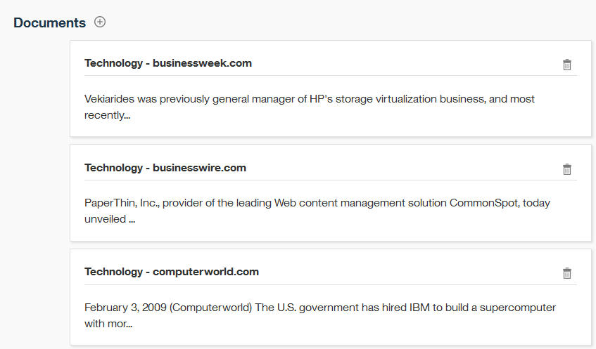

---

copyright:
  years: 2015, 2018
lastupdated: "2018-04-04"

---

{:shortdesc: .shortdesc}
{:new_window: target="_blank"}
{:tip: .tip}
{:pre: .pre}
{:codeblock: .codeblock}
{:screen: .screen}
{:javascript: .ph data-hd-programlang='javascript'}
{:java: .ph data-hd-programlang='java'}
{:python: .ph data-hd-programlang='python'}
{:swift: .ph data-hd-programlang='swift'}

Essa documentação destina-se ao {{site.data.keyword.knowledgestudiofull}} no {{site.data.keyword.cloud}}. Para ver a documentação para a versão anterior do {{site.data.keyword.knowledgestudioshort}} no {{site.data.keyword.IBM_notm}} Marketplace, [clique neste link ](https://console.bluemix.net/docs/services/knowledge-studio/tutorials-create-rule-model.html){: new_window}.
{: tip}

# Criando um modelo baseado em regra
{: #wks_tutrule_intro}

Este tutorial ajuda a entender como criar um modelo baseado em regra que pode ser usado para localizar padrões de texto que você define em documentos.
{: shortdesc}

Você construirá um modelo que pode localizar texto em documentos que corresponde ao padrão `month day, year`. Por exemplo, o modelo localizaria a referência de data *1 de maio de 2010*. Antes de definir o padrão de regra em si, você criará artefatos que ajudarão a construir o padrão, incluindo uma classe de dicionário que reconhece menções de mês e uma classe de expressão regular que reconhece menções de ano no texto.

## Aprendendo objetivos

Depois de concluir este tutorial, você saberá como executar as tarefas a seguir:

- Criar classes
- Incluir documentos para definir regras
- Associar dicionários com classes
- Definir expressões regulares para capturar sequências de caracteres
- Definir regras

A conclusão do tutorial deve levar aproximadamente 30 minutos. Se você explorar outros conceitos relacionados a este tutorial, ele poderá levar mais tempo para ser concluído.

## Antes de Começar

- Você está usando um navegador suportado. Para obter informações, veja [Requisitos do navegador](/docs/services/watson-knowledge-studio/system-requirements.html).
- Você concluiu com êxito o [Tutorial: Criando uma área de trabalho](/docs/services/watson-knowledge-studio/tutorials-create-project.html).
- Deve-se ter pelo menos um ID do usuário na função de Administrador ou de ProjectManager. Para obter informações sobre funções de usuário, veja [Montando uma equipe](/docs/services/watson-knowledge-studio/team.html).

## Resultados

Depois de criar o modelo baseado em regra, é possível usá-lo em uma das maneiras a seguir para localizar padrões de texto em documentos:

- [Pré-anote seus documentos](/docs/services/watson-knowledge-studio/preannotation.html#wks_preannotrule) antes de criar um modelo de aprendizado de máquina
- [Implemente ou exporte o modelo](/docs/services/watson-knowledge-studio/rule-annotator-model-use.html) para outros serviços ou produtos do {{site.data.keyword.watson}}

## Lição 1: incluindo um dicionário de meses
{: #wks_tutless_rule1}

Nesta lição, você aprenderá como incluir um dicionário em uma área de trabalho no {{site.data.keyword.knowledgestudioshort}}. O dicionário contém termos relacionados aos meses do ano.

### Sobre essa Tarefa

Em uma lição posterior, você definirá uma classe com base nesse dicionário. Ao criar essa classe, todos os termos nesse dicionário que estão localizados em documentos serão anotados automaticamente como uma menção do tipo de classe associado. Para obter mais informações sobre dicionários, veja [Incluindo dicionários em uma área de trabalho](/docs/services/watson-knowledge-studio/dictionaries.html#wks_projdictionaries).

### Procedimento

1. Faça download do arquivo <a target="_blank" href="https://watson-developer-cloud.github.io/doc-tutorial-downloads/knowledge-studio/dictionary-items-month.csv" download>`dictionary-items-month.csv`</a> para seu computador. Esse arquivo contém termos de dicionário em formato CSV, adequados para fazer upload em um dicionário do {{site.data.keyword.knowledgestudioshort}}.
1. Na barra lateral **Ativos e ferramentas** > **Pré-anotadores**, selecione a guia **Dicionários** e clique em **Gerenciar dicionários**.
1. Clique no botão **Criar dicionário** para incluir um dicionário.
1. No campo **Nome**, digite `Dicionário de mês` e clique em **Salvar** para criar o dicionário (vazio). O novo dicionário é criado e automaticamente aberto para edição.
1. Na área de janela de dicionário, clique em **Fazer upload**.
1. Na janela Fazer upload de entradas de dicionário, selecione o arquivo `dictionary-items-month.csv` de seu computador e, em seguida, clique em **Fazer upload**.

    Os termos no arquivo são importados para o dicionário.

## Lição 2: incluindo documentos de amostra
{: #wks_tutless_rule2}

Nesta lição, você aprenderá como incluir documentos com padrões linguísticos que ilustram os tipos de regras que você deseja definir.

### Sobre essa Tarefa

Para obter mais informações sobre como incluir documentos, veja [Incluindo documentos para definir regras](/docs/services/watson-knowledge-studio/rule-annotator-add-doc.html).

### Procedimento

1. Faça download do arquivo <a target="_blank" href="https://watson-developer-cloud.github.io/doc-tutorial-downloads/knowledge-studio/documents-new.csv" download>`documents-new.csv`</a> para o seu computador. Esse arquivo contém documentos de exemplo adequados para upload.
1. Na barra lateral, clique em **Anotação de documento** > **Regras**.
1. Clique no ícone **Incluir um documento** próximo a **Documentos**.
1. Clique na guia **Fazer upload de arquivo CSV**.
1. Clique para procurar o arquivo `documents-new.csv` que foi transferido por download para seu computador mais cedo e, em seguida, clique em **Fazer upload**.

    Um conjunto de documentos é exibido na página principal Documentos.

    

## Lição 3: criando Classes
{: #wks_tutless_rule3}

Nesta lição, você aprenderá como definir classes que usará quando definir uma regra.

### Sobre essa Tarefa

Para obter mais informações sobre classes, veja [Regras](/docs/services/watson-knowledge-studio/rule-annotator.html).

### Procedimento

1. Na página **Regras** de sua área de trabalho, clique no ícone **Incluir uma classe** próximo a **Classe** no painel lateral direito.

1. Insira `DictMonth` como o nome de classe e, em seguida, clique em **Incluir**.

    A nova classe é exibida no painel lateral Classe.

## Lição 4: associando um dicionário com uma classe
{: #wks_tutless_rule4}

Nesta lição, você aprenderá como usar um dicionário no editor de regras.

### Procedimento

1. Na barra lateral, selecione **Anotação de documento** > **Dicionários** e, em seguida, clique no **Dicionário de mês** que você criou anteriormente.

1. Na lista **Classe**, selecione `DictMonth` e, em seguida, clique em **Salvar**.

    A classe é associada ao dicionário.

    

### Resultados

Para documentos associados ao editor de regras, quaisquer referências aos termos do dicionário são anotadas como menções da classe `DictMonth`. Você verá uma prova de que essas referências foram anotadas na próxima lição.

## Lição 5: localizando anotações de classe em documentos
{: #wks_tutless_rule5}

Nesta lição, você aprenderá como localizar as anotações de classe em documentos de editor de regras.

### Procedimento

1. Na barra lateral, selecione **Anotação de documento** > **Regras**.
1. No painel Classe, localize a classe `DictMonth` que você definiu anteriormente e clique no ícone **Procurar anotações em documentos** que está próximo a ele.

    A página Localizar anotações é exibida e mostra todos os documentos que contêm referências de texto para meses.

1. Clique no documento `Technology - computerworld.com` para visualizar o documento completo. Observe que o texto `Fevereiro` é destacado, o que significa que foi anotado como uma menção da classe `DictMonth`.

## Lição 6: definindo uma expressão regular
{: #wks_tutless_rule6}

Nesta lição, você aprenderá como definir uma expressão regular.

### Sobre essa Tarefa

Você definirá uma expressão regular que pode localizar padrões de ano como *2009*.

Para obter mais informações sobre como definir expressões regulares, veja [Definindo uma regra](/docs/services/watson-knowledge-studio/rule-annotator-define-rule.html).

### Procedimento

1. Na página **Regras**, clique no ícone **Incluir uma classe** () próximo a **Classe** no painel do lado direito.
1. Insira `RegExpYear` como o nome de classe e clique em **Incluir**.
1. Na barra lateral, clique em **Regex** e, em seguida, clique no ícone **Criar uma expressão regular** próximo a **Expressões regulares**.
1. Clique no botão **Incluir entrada**.
1. No campo **Expressão regular**, insira a expressão a seguir:

    ```
    (?:(?:19|20)[0-9]{2})
    ```
    {: screen}

    > **Nota:** essa expressão regular localiza anos entre 1900 e 2099.

1. Configure **Mínimo de tokens de palavra** para `1` e **Máximo de tokens de palavra** para `1`.
1. Clique em **Incluir** para salvar a entrada de expressão regular.
1. Insira `MyYearExp` como o nome da expressão regular e, em seguida, no menu **Classe**, selecione a classe *RegExpYear* que você definiu anteriormente.
1. Clique em **Salvar**.

    Depois de salvar a expressão regular, ela é aplicada automaticamente aplicada aos documentos de amostra. As sequências de texto que seguem o padrão que você definiu na expressão regular são anotadas como menções da classe **RegExpYear**.

1. Para verificar se a expressão definida está capturando ocorrências de horário corretamente, é possível procurar menções. Clique no ícone **Procurar anotações em documentos** próximo à classe **RegExpYear** no painel lateral Classe.

    

    A página Localizar anotações é exibida. As ocorrências de menções de ano são destacadas nos documentos de amostra em que elas ocorrem.

    

## Lição 7: definindo uma regra
{: #unique_1166829415}

Nesta lição, você aprenderá como definir uma regra.

### Sobre essa Tarefa

Você já definiu uma classe baseada em dicionário para anotar menções de mês. Você também definiu uma expressão regular que localiza valores numéricos que representam um ano. Agora, você definirá uma regra que captura a sequência de um mês seguido por um número, uma vírgula e depois um ano. Você definirá uma regra para expressões de data como *21 de setembro de 2016*.

Para obter mais informações sobre como definir regras, veja [Definindo uma regra](/docs/services/watson-knowledge-studio/rule-annotator-define-rule.html).

### Procedimento

1. Na barra lateral, selecione **Anotação de documento** > **Regras** e abra o documento `Technology - computerworld.com`.
1. Selecione o texto *3 de fevereiro de 2009* no documento. Certifique-se de selecionar a vírgula também.

    

1. Clique no ícone **Incluir uma regra**.

    O editor de regras mostra uma representação do padrão de regra que você identificou.

    O texto *3 de fevereiro de 2009* está visível. Uma linha cinza que conecta as células na representação identifica quais células são atualmente parte do padrão.
    - A classe *DictMonth* faz parte do padrão de regra em vez do texto *Fevereiro*. Essa seleção é preferencial porque você deseja que o modelo localize qualquer mês que seja anotado pela classe *DictMonth* como o primeiro token no padrão de data em vez de somente o texto *Fevereiro*.
    - No término da regra, o ano *2009* já está anotado como sendo uma menção da classe *RegExpYear*. A classe *RegExpYear* faz parte do padrão de regra em vez do número 2009. Essa seleção também é preferencial porque você deseja que o modelo localize qualquer ano que seja anotado pela classe *RegExpYear* como o último token no padrão de data em vez de somente o texto específico *2009*.

    O número 3 e a vírgula (,) depois dele são mostrados como o segundo e terceiro tokens no padrão. Como o padrão está especificado atualmente, o modelo localizará somente ocorrências de datas que especificam o terceiro dia de um mês. Queremos que o modelo localize as datas que especificam qualquer dia do mês. Depois disso, mudaremos as configurações de recurso para o token de dia.

1. Acima da célula de dia `3`, clique no ícone **Texto** para abrir as configurações de recurso para o token.

    

    Atualmente, a regra está configurada para corresponder ao texto exato, `3`. Em vez disso, desejamos que corresponda a qualquer número.

1. Mude para numérico a configuração de recurso, selecionando **Tipo de caractere: numérico** e, em seguida, cancelando a seleção de **Texto: 3**.

    

    Você mudou a definição para a célula do número `3`.

    

    O ícone **Aa** indica que em vez de requerer que o número seja igual a 3 exatamente, ele pode ser qualquer número.

1. Não mude nenhuma configuração para o token de vírgula.

    Desejamos que o terceiro token no padrão seja uma vírgula, então a configuração de recurso atual de **texto: ,** é apropriada. Além de uma configuração de recurso, cada token tem uma configuração de repetição. A configuração de repetição especifica quantas vezes o token pode ser repetido no texto para que corresponda ao padrão. A configuração de repetição atual de **Necessário (exatamente 1)** também é apropriada conforme especificado.

    

1. Designe uma classe para representar o padrão `DictMonth + numeric token + comma + RegExpYear`.

    Observe as quatro células vazias que representam os quatro tokens que você selecionou do documento. Para selecionar todas as células, selecione a primeira célula e, em seguida, pressione Shift + clique em cada célula adicional. Insira `RuleDate` como o nome de classe e, em seguida, clique nele para criar a nova classe.

    

    Você definiu com êxito o padrão para a regra.

1. No campo **Nome da regra**, insira `MyDateRule` e clique em **Salvar**.

    Depois de salvar a regra, ela é aplicada automaticamente aos documentos de amostra. Se o documento `Technology - computerworld.com` ainda estiver aberto no editor de regras, você verá que o texto `February 3, 2009` no documento agora está anotado como uma menção da classe RuleDate.

    

    É possível procurar todas as ocorrências de menções de classe RuleDate nos documentos de amostra clicando no ícone **Procurar anotação em documentos** () próximo à classe `RuleDate` do painel Classe. É uma boa prática verificar se todas as datas estão sendo capturadas adequadamente para confirmar que você definiu o padrão corretamente.

    

## Lição 8: criando um modelo baseado em regra
{: #wks_tutless_rule8}

Nesta lição, você aprenderá como criar um modelo baseado em regra.

### Sobre essa Tarefa

Para obter mais informações sobre a criação de um modelo baseado em regra, veja [Criando o modelo baseado em regra](/docs/services/watson-knowledge-studio/rule-annotator-model-create.html).

### Procedimento

1. Na barra lateral, selecione **Gerenciamento de modelo** > **Versões** e clique na guia **Mapeamento de tipo de modelo baseado em regra**.

1. Mapeie a classe `RuleDate` que você definiu correspondente à entidade `DATE` do sistema de tipos.

    1. Localize a entidade **DATE** e clique em **Editar**.

        

    1. Escolha a classe `RuleDate` na lista suspensa e clique em **Salvar**.

        

1. Para executar o modelo baseado em regra, selecione a guia **Baseado em regra** e clique em **Executar este modelo**.

## Resumo do tutorial
{: #wks_tutrule_sum}

Ao aprender sobre o {{site.data.keyword.knowledgestudioshort}}, você criou um modelo baseado em regra.

### Lições aprendidas

Ao concluir este tutorial, você terá aprendido sobre os conceitos a seguir:

- Classes
- Expressões regulares
- Regras
