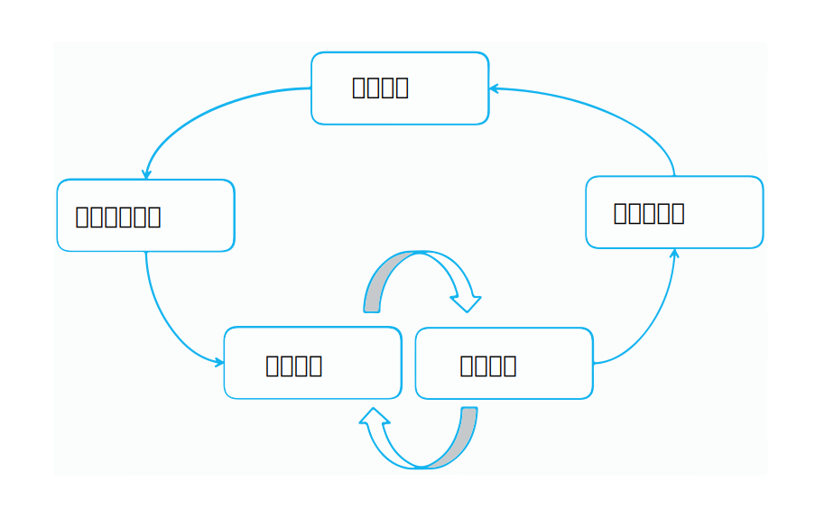

---

copyright:
  years: 2015, 2018
lastupdated: "2018-07-19"

---

{:shortdesc: .shortdesc}
{:new_window: target="_blank"}
{:tip: .tip}
{:pre: .pre}
{:codeblock: .codeblock}
{:screen: .screen}
{:javascript: .ph data-hd-programlang='javascript'}
{:java: .ph data-hd-programlang='java'}
{:python: .ph data-hd-programlang='python'}
{:swift: .ph data-hd-programlang='swift'}

本文档适用于 {{site.data.keyword.knowledgestudiofull}} on {{site.data.keyword.cloud}}。要查看 {{site.data.keyword.knowledgestudioshort}} on {{site.data.keyword.IBM_notm}} Marketplace 先前版本的文档，请[单击此链接 ](https://console.bluemix.net/docs/services/knowledge-studio/annotate-documents.html){: new_window}。
{: tip}

# 注释设置
{: #annotate-documents}

必须由了解行业知识及其语言的用户对文档进行注释。
{: shortdesc}

执行以下任务以支持人工注释者访问工作空间：

- 邀请主题专家加入您正在使用的 {{site.data.keyword.knowledgestudioshort}} 实例。
- 将人工注释者与您希望他们注释的一个或多个注释集相关联。
- 创建任务，用于分配人工注释者以对集内的文档进行注释。

    > **注意**：您将任务显式分配给人工注释者后，他们才能在登录 {{site.data.keyword.knowledgestudioshort}} 时看到您的工作空间。

用户（人工注释者）需要熟悉[注释文档](/docs/services/watson-knowledge-studio/user-guide.html)，其中包含有关如何对文档进行注释的详细信息。

## 模型生命周期
{: #wks_lifecycle}

使用 {{site.data.keyword.knowledgestudioshort}} 创建的模型是可以插入到自然语言处理 (NLP) 管道中的软件组件。

通过 {{site.data.keyword.knowledgestudioshort}}，可以创建、评估和改进新领域的模型。模型会将注释（元数据）添加到出现在自然语言内容中的文本。注释用于标识领域内容中相关实体的提及项、这些实体之间的关系以及这些提及项如何指代同一实体；应用程序可以使用注释来自动分析和处理文本。应用程序用户能够在自然语言上下文中抽取含义、发现洞察和获取答案，从而受益于此级别的分析。

模型的创建是一个迭代的多步骤过程，涉及多个阶段：知识管理、参考标准生成、模型开发、模型评估和运行时部署。

### 端到端领域适应
{: #wks_lifecycle__wks_lifecycleS6}

下图概述了这五个模型开发阶段之间的交互以及每个阶段发生的典型活动。

 图 2. 模型开发的五个阶段和每个阶段所发生活动的摘要。

### 知识管理
{: #wks_lifecycle__wks_lifecycleS1}

此阶段（在 {{site.data.keyword.knowledgestudioshort}} 外部执行）是指选择、收集、保留和维护与特定领域相关的内容的过程。管理可使数据增值；它将数据转换为可信的信息和知识。

### 参考标准生成
{: #wks_lifecycle__wks_lifecycleS2}

此阶段是指使用 {{site.data.keyword.knowledgestudioshort}} 工具和最佳实践来生成已检查数据的集合，这些数据可用于使 {{site.data.keyword.watson}} 解决方案适应特定领域。这种已检查数据称为*参考标准*或*黄金标准文档*，其准确性至关重要，因为参考标准中的不准确之处与依赖于该参考标准的应用程序的不准确之处相关。

指导 {{site.data.keyword.watson}} 学习有关新领域的内容时，一个基本的部分涉及为其提供有关领域内容中的相关实体、这些实体之间的关系以及实体如何相互指代的知识。收集这些知识包含以下活动：

- 请求领域主题专家创建以下资源，或确定可以针对您的领域进行复用或修改的现有资源：

  - 注释准则和示例，用于帮助人工注释者了解如何对领域内容中的词和段落进行注释。
  - 类型系统，用于定义可以通过文本分析在领域内容中发现的特定于领域的类型（对象）和功能（数据分类）。类型系统可控制人工注释者可以向文档添加的注释类型。
  - 术语字典，其中的术语被视为领域内容中的等效术语。

- 创建对于领域内容具有代表性的文档语料库。
- 根据添加到 {{site.data.keyword.knowledgestudioshort}} 工作空间的字典对文档进行预注释。创建机器学习模型后，可以使用该模型对添加到语料库的新文档进行预注释。预注释是在提供机器学习模型进行注释之前，机器对文档注释到尽可能多的程度的过程。预注释通过将一些人工注释创建操作替换为仅验证机器注释的正确性，可以减少人工注释的工作量。
- 在人工注释者之间划分文档，然后由人工注释者使用 {{site.data.keyword.knowledgestudiofull}} 参考标准编辑器工具将注释手动添加到小型文档集。
- 比较人工注释结果并解决冲突。在此阶段中需要进行裁定，以确保准确、一致注释的文档升级为参考标准，从而可用于培训和测试机器学习模型。

### 模型开发
{: #wks_lifecycle__wks_lifecycleS3}

此阶段是指使用 {{site.data.keyword.knowledgestudioshort}} 工具来创建模型。在确定参考标准后，可以使用人工注释结果来对用于自动向文档的大型集合（例如，包含数百万个文档的集合）添加注释的算法进行培训。

### 模型评估
{: #wks_lifecycle__wks_lifecycleS4}

此阶段是指使用 {{site.data.keyword.knowledgestudioshort}} 工具来优化模型并提高性能。模型生成的结果会根据参考标准文档的测试集合进行评估。*准确性分析*用于识别注释错误的原因。*空余空间分析*可帮助评估哪些错误需要重点关注，以及模型优化可以产生最大影响的地方。可以反复进行调整以提高性能，直到达到令人满意的准确度。

### 模型部署
{: #wks_lifecycle__wks_lifecycleS5}

此阶段是指导出使模型能够在机器学习运行时环境中运行的组件，并使模型可供其他 {{site.data.keyword.watson}} 认知应用程序访问。例如，可以部署机器学习模型以供 {{site.data.keyword.nlufull}} 服务或 {{site.data.keyword.discoveryfull}} 服务使用，或者导出模型以在 {{site.data.keyword.ibmwatson_notm}} Explorer 中使用。

## 创建注释任务
{: #wks_hatask}

要使人工注释者可以开始向文档添加注释，注释过程管理者必须先创建注释任务。

### 关于本任务
{: #wks_hatask_about}

注释任务指定要对哪些文档进行注释。要比较人工注释者的执行情况并了解他们应用注释准则的一致程度，您必须至少在任务中包含两个人工注释者。此外，必须有一定百分比的文档出现在添加到任务的所有注释集内（创建注释集时指定重叠百分比）。

#### 重要信息
{: #wks_hatask_important}

- 注释任务是一个时间性概念，存在的目的是允许人工注释者对隔离空间中的文本进行注释。它还用于确保仅将核准的注释升级为参考标准。
- 一个注释集一次只能包含在一个活动任务中。要将一个任务中的注释集添加到其他任务，必须先删除该注释集在其中处于活动状态的任务。
- 如果删除人工注释者的用户帐户，也会影响其注释。系统将删除文档中已分配给该用户但未升级为参考标准的所有注释。
- 在创建人工注释任务后，如果类型系统或参考标准编辑器设置发生更改，那么必须决定是否将更改传播到该任务。类型系统更改可能会影响注释；人工注释者可能需要复查并更新其文档。
- 如果字典发生更改，这些更改不会反映在当前注释任务中。要将资源更改应用于参考标准，必须创建新的注释任务。
- 每个工作空间最多可以有 256 个注释任务。

### 过程
{: #wks_hatask_procedure}

要创建注释任务，请执行以下操作：

1. 以 {{site.data.keyword.knowledgestudioshort}} 管理员身份登录，然后选择工作空间。
1. 选择**机器学习模型** > **注释任务**页面。
1. 单击**添加任务**。指定任务的描述性名称，然后选择必须完成该任务的日期。
1. 单击**创建**。这将显示可用注释集的列表，以及分配给这些注释集的人工注释者的姓名。
1. 选择要包含在任务中的每个注释集，然后单击**创建任务**。

    注释集名称旁边的复选标记看起来像是缺省情况下选中了所有注释集，但其实不然。必须显式选择要包含的注释集。
    {: tip}

### 后续步骤
{: #wks_hatask_next}

创建任务后，可以返回到**机器学习模型** > **注释任务**页面以查看每个人工注释者的进度。此外还可以完成以下任务：

- 检查注释集之间重叠的已核准文档，以解决注释冲突。
- 打开任务以向其添加注释集。确保添加的注释集包含与原始注释集内的文档重叠的文档。

在主导航的**设置**选项卡中，可以指定以下信息：

- 指定用于在参考标准编辑器中使用颜色和键盘快捷键的首选项。
- 指定注释者间一致性阈值，然后打开一个任务来查看多个人工注释者对相同文档进行注释的一致程度。
- 指定用于将注释准则连接到参考标准编辑器的 URL。

## 配置参考标准编辑器首选项
{: #wks_hapref}

项目经理可以指定用于在参考标准编辑器中使用颜色和键盘快捷键的首选项。

### 过程
{: #wks_hapref_procedure}

要指定用于使用参考标准编辑器的可视首选项，请执行以下操作：

1. 以 {{site.data.keyword.knowledgestudioshort}} 管理员身份登录，然后选择工作空间。
2. 在左侧导航中，选择**设置** > **文档注释设置**。
3. 选择**实体类型**或**关系类型**选项卡。
4. 选择要更改的实体类型或关系类型，然后单击**编辑键盘快捷键和颜色**。对于每种类型，可以定义：

    - 键盘快捷键，表示用户可以输入 `<key>` 以将类型标签应用于突出显示的文本。例如，如果将 `o` 定义为 `ORGANIZATION` 的键盘快捷键，那么用户可以选择文本，然后按 `o` 键将 `ORGANIZATION` 实体类型应用于突出显示的文本。如果分配了大写字母，那么用户必须按 `Shift+<key>`.
    - 文本颜色。确保文本颜色与背景色形成对比，以便文本在进行标注后可见。
    - 背景色。这是标签的颜色，在对实体进行注释之后应用于实体。

    注释文档时，人工注释者可以使用键盘快捷键来快速添加注释。此外，注释标签和文本颜色有助于人工注释者在将注释添加到文档后立即识别出类型。
    - 如果有您不希望人工注释者分配给提及项的实体或关系类型，那么可以向参考标准编辑器隐藏这些类型，这将缩短并简化用户看到的类型选项列表。要执行此操作，请取消选中相应类型的**活动**复选框。

    分配新的快捷键和颜色时，可以预览更改。

5. 还可以更改缺省的选择内容突出显示颜色。突出显示颜色是在人工注释者选择文本后在文本周围显示的边框的颜色。缺省颜色是浅蓝色，但您可以在**选择内容突出显示**选项卡上更改颜色，以便更容易识别所选文本的边界。

#### 相关任务
{: #wks_hapref_related}

[修改类型系统而不丢失人工注释](/docs/services/watson-knowledge-studio/improve-ml.html#wks_projtypesysmod)

## 设置 IAA 阈值
{: #wks_haiaathresh}

为了帮助决定是接受还是拒绝注释文档集，您可以指定注释者间一致性阈值。该阈值可帮助您根据系统计算的 IAA 分数来比较注释者间一致性优劣。

### 关于本任务
{: #wks_haiaathresh_about}

要比较不同的人工注释者如何对相同文档进行注释，请指定求值阈值。如果一个人工注释者所做的注释与另一个人工注释者所做的注释差异之大导致分数较低，那么这意味着这两个注释者不一致。这种不一致需要进行调查并予以解决。

### 过程
{: #wks_haiaathresh_procedure}

要设置注释者间一致性阈值，请执行以下操作：

1. 以 {{site.data.keyword.knowledgestudioshort}} 管理员身份登录，然后选择工作空间。
1. 选择**设置** > **IAA 设置**选项卡。
2. 指定 0 和 1 之间的值（例如 `.5` 或 `.8`），然后单击**保存**。

## 连接到注释准则
{: #wks_haguidelines}

为项目创建注释准则后，可以配置 {{site.data.keyword.knowledgestudioshort}} 以连接到这些准则。为了帮助选择要应用的正确注释，人工注释者可以在注释文档时复查这些准则。如果管理员在解决重叠文档中的注释冲突时需要帮助，也可以复查这些准则。

### 过程
{: #wks_haguidelines_procedure}

要将参考标准编辑器和裁定工具连接到注释准则，请执行以下操作：

1. 以 {{site.data.keyword.knowledgestudioshort}} 管理员身份登录，然后选择工作空间。
1. 选择**设置** > **注释准则**选项卡。
1. 指定托管准则位置的 URL。
1. 单击**保存**。系统会将参考标准编辑器和裁定工具连接到注释准则。根据创建准则时授予用户的访问许可权，人工注释者和工作空间管理员或许能够在打开这些准则后对其进行更新，例如添加澄清和示例。

### 注释准则
{: #wks_guidelines}

对于如何记录准则并没有规定的格式，但重要的是准则包含详细示例。人工注释者需要了解哪个实体类型要应用于给定上下文的提及项，并且知道哪些关系类型对于给定的提及项对有效。从领域内容中提取的示例通常是传达选择正确注释选项的最佳方法。

注释准则并不是静态的。随着项目的发展，您可能会发现准则中有不准确地捕获到的提及项和关系的实例。您还可能会发现多个人工注释者之间存在不一致，他们以不同的方式解释准则。通过在出现相应情况时更新准则，可以帮助随时间变化提高注释的准确性和一致性。

要使文档能够被视为参考标准，必须先解决不同人工注释者对相同文档进行注释的方式所产生的任何冲突。解决冲突的主要方法是讨论引起混淆的原因，从而帮助人工注释者从错误中吸取教训。改进和澄清准则可帮助减少冲突数量，并帮助确保准确、一致注释的文档升级为参考标准。

为了帮助管理准则，您可能希望将可能会变成长文档的内容划分成多个部分，例如实体注释准则、关系注释准则以及提及项指代方式注释准则。在一个区域所做的更改必须进行评估，并与在其他区域所做的更改进行协调。例如，如果添加了实体类型，请复查关系类型注释准则，并指定新的实体类型可以如何与其他实体类型相关联。

### 注释准则示例
{: #wks_guidelinesexample}

大多数注释准则需要大量详细信息和示例，以确保人工注释者能以一致方式对文本进行注释。

此处提供的示例是一个简单的准则，专为包含交通事件报告的小型领域而创建。

#### 任务目标
{: #wks_guidelinesexample__annotgoals}

- 作为项目成员，请熟悉手动注释和机器学习模型优化的迭代过程。
- 使用参考标准编辑器对汽车领域中的文档进行注释，然后使用注释来培训机器学习模型。对实体类型和关系类型进行注释，并根据需要指代实体。

#### 准则表示法
{: #wks_guidelinesexample__annotnotation}

- 方括号 [ ] 指示对少于整个带引号文本的内容进行注释时要注释的范围。

    根据需要包含否定含义，例如 `[no injuries]ACCIDENT_OUTCOME`。类型系统不使用实体类来表示否定。

#### 实体类型
{: #wks_guidelinesexample__annottype}

类型系统不使用实体子类型或角色，也不使用提及项类型或类。

<table summary="此表描述实体类型。">
<caption>表 1. 实体类型</caption>
  <tr>
    <th style="vertical-align:bottom; text-align:left" width="24%" id="d1735e810">实体类型</th>
    <th style="vertical-align:bottom; text-align:left" width="38%" id="d1735e812">准则</th>
    <th style="vertical-align:bottom; text-align:left" width="38%" id="d1735e814">示例</th>
  </tr>
  <tr>
    <td headers="d1735e810">
      
ACCIDENT_OUTCOME

    </td>
    <td headers="d1735e812">
      
事故的后果。适用于人类（例如 death）和汽车（例如 dented）。
可以包含“towed”和“air bag deployment”作为严重损坏的指示，包含“transported
to hospital"（但不包含 funeral home）作为受伤严重程度的指示。可以包含否定。

    </td>
    <td headers="d1735e814">
      
“[casualty]”、“[injury]”、“sustained [total loss]”、“[no injuries]”、“[towed] due to
[disabling damage]”、[not towed]、“air bag did [not deploy]”（air bag 本身必须必须是 PART_OF_CAR，通过 sufferedFrom 与此 ACCIDENT_OUTCOME 相关）以及严重程度指示。

    </td>
  </tr>
  <tr>
    <td headers="d1735e810">
      
CONDITION

    </td>
    <td headers="d1735e812 ">
      
天气或道路情况；现场中可能会影响事故发生可能性的一个方面，可能每天都不同，但与汽车或驾驶员无关。

      
可以为驾驶员错误或机械故障，并且必须显示为有问题。应该排除 STRUCTURE。

    </td>
    <td headers="d1735e814">
      
“dry”、“rainy”、“construction”、“heavy traffic”、“daylight”，但不能是“grassy”或“intoxicated”。

“flat tire”、“overcorrected”（针对转向装置）、“asleep”、“intoxicated”、“[failed to
negotiate]CONDITION a [curve]STRUCTURE”、“[departed] the lane”或 shoulder，但不是“attempting to
pass”（除非此短语附带有“without enough room”或类似内容），也不是“departing the road”，这是 INCIDENT。

    </td>
  </tr>
  <tr>
    <td headers="d1735e810">
      
INCIDENT

    </td>
    <td headers="d1735e812">
      
实际提及碰撞，或者汽车动作明确不当且可能具有破坏性，例如行驶至道路之外，或者其他一些具有破坏性的事件，例如汽车着火。

      
不要相互指代不同的动作（如“impacted”、“pushed rearward”和“came to final rest”），即便这些动作密切关联。

      
从范围中排除 STRUCTURE；例如，“[came to rest]INCIDENT in a [ditch]STRUCTURE”或“[remaining in contact]INCIDENT with
the [guardrail]STRUCTURE”。

    </td>
    <td headers="d1735e814">
      
 “crash”、“impacted”、“overturned”、“contacted”、“against”、“pushed”、“passenger was
[ejected]”、“rolled over a quarter turn”- quarter turn 指示的是严重程度，但也属于 INCIDENT，而不属于 ACCUTIENT_OUTCOME（不对车辆旋转进行注释）。

      
“came to final rest”表示车辆不属于的位置（例如，路堤）或因碰撞而移动，或者“departed
the roadway”（不仅仅是偏离车道，偏离车道可能是偏离路面的原因）。

    </td>
  </tr>
  <tr>
    <td headers="d1735e810">
      
MANUFACTURER

    </td>
    <td headers="d1735e812">
      
制造车辆的公司。

    </td>
    <td headers="d1735e814">
      
Toyota、Mazda、General Motors

    </td>
  </tr>
  <tr>
    <td headers="d1735e810">
      
MODEL

    </td>
    <td headers="d1735e812">
      
特定类型的汽车，由特定制造商制造。排除任何额外术语/裁切线指示符，如“LX”或“SE”（例如，只对短语“Xterra SE”注释“Xterra”）。

    </td>
    <td headers="d1735e814">
      
Camry

    </td>
  </tr>
  <tr>
    <td headers="d1735e810">
      
MODEL_YEAR

    </td>
    <td headers="d1735e812">
      
作为汽车名称一部分的车型年份。

    </td>
    <td headers="d1735e814">
      
'99、2001

    </td>
  </tr>
  <tr>
    <td headers="d1735e810">
      
PART_OF_CAR

    </td>
    <td headers="d1735e812">
      
车辆内部或外部的部件，与是否在事件中具体涉及无关。排除此类部件的功能列表。包括对部件在汽车中位置的指示，或对仅指汽车一部分而不涉及特定部件的指示。

可以是复数。可以包含车辆中位置的指定，例如“[driver airbag]”、“[RF door]”（指右前车门）、“[RR] passenger”、“[LF and RF air bags]”、“[first row passive/automatic restraints]”、“[safety system] with EDR capabilities”。

      
包括拖船、油船等，但半挂车（具有不同的年份/车型/制造商）除外。

    </td>
    <td headers="d1735e814">
      
横截面、前平面、轮胎、方向盘、气囊等

    </td>
  </tr>
  <tr>
    <td headers="d1735e810">
      
PERSON

    </td>
    <td headers="d1735e812">
      
报告中事故现场中描述的任何人（可能是车辆的驾驶员或乘客/乘坐者、行人或目击者）。

      
不要对形容词进行注释，所以不要注释“a [69-year-old] drove”，而是注释“a 69-year-old [male] drove”。可以是复数，例如“LR and RF [occupants]”。排除在事件发生之后到达的人员。

      
在没有“animal”实体类型的情况下，请使用 PERSON 来标记碰撞中涉及/导致碰撞的野生动物，因为它们的移动能力相比 STRUCTURE，更像 PERSON。

      
注：“passenger airbag”是 PART_OF_CAR；但并不意味着有人在场。

    </td>
    <td headers="d1735e814">
      
驾驶员、乘坐者、患者、儿童

    </td>
  </tr>
  <tr>
    <td headers="d1735e810">
      
STRUCTURE

    </td>
    <td headers="d1735e812">
      
道路上、道路附近或属于道路一部分的结构。包括可能与事故形态相关的特定道路形容词；省略其他形容词。

    </td>
    <td headers="d1735e814">
     
[two-lane, two-way road]、[left lane]、eastbound [lane]、2-foot [ditch]、[right lane line]、[exit ramp]、[pole]、[tree]、steep descending [embankment]

    </td>
  </tr>
  <tr>
    <td headers="d1735e810">
      
VEHICLE

    </td>
    <td headers="d1735e812">
      
对除 MODEL、MANUFACTURER 和 MODEL_YEAR 以外的车辆内容的引用。可以是复数，在这种情况下，不太可能使用指代，也不存在任何部分和组的关系。

      
例如，仅考虑属于现场的车辆；排除稍后来救援的抢险车。自行车是 VEHICLE。

    </td>
    <td headers="d1735e814">
      
“the [truck]”、“the [car]”、“[V1]'s”

    </td>
  </tr>
</table>

#### 关系类型
{: #wks_guidelinesexample__annotreltype}

类型系统使用关系类型，而不使用关系类或关系的其他属性。否定不通过关系类进行编码，而是通过提及项的范围（例如，[no occupants]PERSON were [hospitalized]ACCIDENT_OUTCOME），这两个提及项通过关系类型 sufferedFrom 链接。

<table summary="此表描述关系类型。">
<caption>表 2. 关系类型</caption>
  <tr>
    <th style="vertical-align:bottom; text-align:left" width="33%" id="d1735e923">
第一次提及项的可能实体类型</th>
    <th style="vertical-align:bottom; text-align:center" width="19%" id="d1735e925">
关系类型</th>
    <th style="vertical-align:bottom; text-align:left" width="48%" id="d1735e927">
第二次提及项的可能实体类型</th>
  </tr>
  <tr>
    <td headers="d1735e923">
VEHICLE、MODEL、MANUFACTURER [<b>2</b>]</td>
    <td style="text-align:center" headers="d1735e925">
hasProperty</td>
    <td headers="d1735e927">
MANUFACTURER、MODEL、MODEL_YEAR</td>
  </tr>
  <tr>
    <td headers="d1735e923">
PERSON</td>
    <td style="text-align:center" headers="d1735e925">
occupantOf</td>
    <td headers="d1735e927">
VEHICLE、MODEL、MANUFACTURER、MODEL_YEAR [<b>1</b>]、PART_OF_CAR、STRUCTURE</td>
  </tr>
  <tr>
    <td headers="d1735e923">
PERSON、PART_OF_CAR、STRUCTURE、VEHICLE、MODEL、MANUFACTURER、MODEL_YEAR [<b>1</b>]</td>
    <td style="text-align:center" headers="d1735e925">
sufferedFrom</td>
    <td headers="d1735e927">
ACCIDENT_OUTCOME</td>
  </tr>
  <tr>
    <td headers="d1735e923">
VEHICLE</td>
    <td style="text-align:center" headers="d1735e925">
driveUnder</td>
    <td headers="d1735e927">
CONDITION、ACCIDENT_CAUSE</td>
  </tr>
  <tr>
    <td headers="d1735e923">
PART_OF_CAR</td>
    <td style="text-align:center" headers="d1735e925">
locatedOn</td>
    <td headers="d1735e927">
VEHICLE、MODEL、MANUFACTURER、MODEL_YEAR [<b>1</b>]</td>
  </tr>
  <tr>
    <td headers="d1735e923">
ACCIDENT_OUTCOME</td>
    <td style="text-align:center" headers="d1735e925">
outcomeOf</td>
    <td headers="d1735e927">
INCIDENT</td>
  </tr>
  <tr>
    <td headers="d1735e923">
INCIDENT</td>
    <td style="text-align:center" headers="d1735e925">
causedBy</td>
    <td headers="d1735e927">
      CONDITION, ACCIDENT_CAUSE <strong>（提示：需要因果关系的文本证据）</strong>
    </td>
  </tr>
  <tr>
    <td headers="d1735e923">
INCIDENT</td>
    <td style="text-align:center" headers="d1735e925">
impactPoint</td>
    <td headers="d1735e927">
      
事故中撞到或涉及的 PERSON、PART_OF_CAR、STRUCTURE、VEHICLE、MANUFACTURER、MODEL 或
MODEL_YEAR [<b>1</b>]。

      
针对 STRUCTURE 的 impactPoint 不包括仅指定不涉及该 STRUCTURE 的碰撞的位置，因此不适用于在 [intersection]STRUCTURE 碰撞的两辆车，但适用于撞上 [embankment]STRUCTURE 的车辆。

    </td>
  </tr>
</table>

#### 表注释
{: #table_notes}

1.  表示法 VEHICLE/MODEL/MANUFACTURER/MODEL_YEAR 是指车辆的提及项。最后三项分别针对文本中表述“the Accord”、“the Honda”或（可能比较罕见）“the '99”等类似内容的情况。四种实体类型存在优先顺序，因此在“the driver of the '99 Honda Accord”中，关系将是 driver（作为 PERSON）occupantOf Accord（作为 MODEL），在这种情况下，Accord 具有与 Honda 和 '99 的 hasProperty 关系。
1.  只有当 MODEL 和 MANUFACTURER 作为名词出现时（指代车辆），才能作为 hasProperty 的第一个自变量。MODEL 可具有与 MANUFACTURER 和 MODEL_YEAR 的 hasProperty 关系，如“the '99 Honda Accord drove”中所示。MANUFACTURER 只能具有与 MODEL_YEAR 的 hasProperty 关系，如“the '99 Honda drove”中所示。
