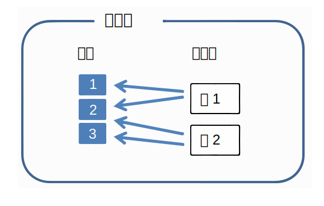
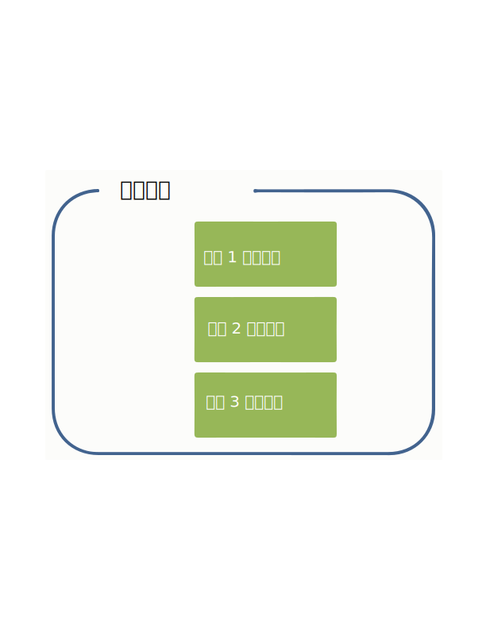
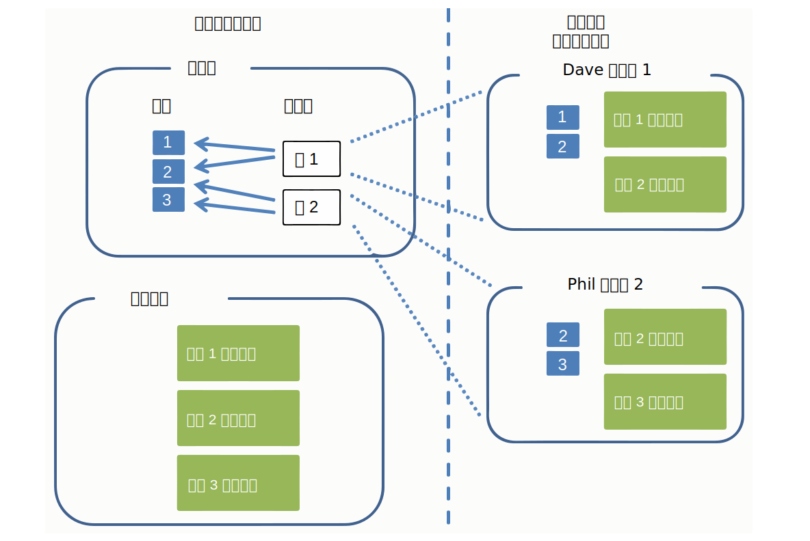
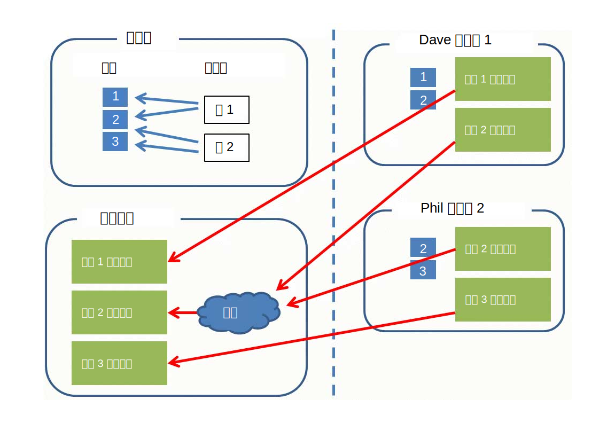

---

copyright:
  years: 2015, 2018
lastupdated: "2018-04-04"

---

{:shortdesc: .shortdesc}
{:new_window: target="_blank"}
{:tip: .tip}
{:pre: .pre}
{:codeblock: .codeblock}
{:screen: .screen}
{:javascript: .ph data-hd-programlang='javascript'}
{:java: .ph data-hd-programlang='java'}
{:python: .ph data-hd-programlang='python'}
{:swift: .ph data-hd-programlang='swift'}

本文档适用于 {{site.data.keyword.cloud}} 上的 {{site.data.keyword.knowledgestudiofull}}。要查看 {{site.data.keyword.IBM_notm}} Marketplace 上先前版本的 {{site.data.keyword.knowledgestudioshort}} 文档，请[单击此链接 ](https://console.bluemix.net/docs/services/knowledge-studio/documents-for-annotation.html){: new_window}。
{: tip}

# 添加文档以进行注释
{: #documents-for-annotation}

要培训机器学习模型，必须将包含主题知识的文档（例如，期刊文章或其他特定于行业的文本）添加到工作空间。
{: shortdesc}

## 关于本任务

要为基于规则的模型定义规则，请添加或上传文档，通过这些文档，可以提取模式以定义为规则。有关更多信息，请参阅[添加用于定义规则的文档](/docs/services/watson-knowledge-studio/rule-annotator-add-doc.html)。此部分仅描述如何添加文档以进行注释。

## 文档
{: #wks_sampledoc}

要培训机器学习模型，您需要收集对于领域内容具有代表性并且对应用程序价值很高的文档。

尽量确保您的培训文档对于您的领域的相关内容真正具有代表性；即，这些文档包含可以进行注释的许多相关提及项。要选择最佳文档，请遵循以下准则：

- 尽量提供一组总大小约 300,000 字的文档。对于复杂类型系统，请提供更多字数，而对于较简单的系统，请提供较少字数。
- 将每个文档限制为一页或两页内容（最好每个文档少于 2,000 字但接近 1,000 字）。此外，在模型开发的早期阶段，将每个文档限制为只有几个段落也是一种良好的做法。人类注释者可以标记长文档中的提及项和关系，但尝试跨多个页面标记指代可能会遇到不便。
- 确保文档中的数据在所有可能的实体类型、子类型和角色以及这些项之间的关系中分布。最终目标是文档集合中的每种实体类型至少有 50 个注释，每种关系类型也至少有 50 个注释。
- 同样，文档应该代表应用程序将涵盖的主题广度，但对于出现频率有偏差的实体类型和关系类型，请尝试至少获取每种类型的 50 个范例，对于其中包含的提及项往往是短语的实体类型，请尝试获取更多范例。
- 为培训创建的集合必须至少包含 10 个已注释文档。

准备好创建和培训模型时，可以将添加到工作空间的文档划分为用作培训数据、测试数据和盲区数据的多个集合。不同的数据集对于评估模型性能很重要。

可以通过以下方式添加文档：

- UTF-8 格式的两列 CSV 文件
- UTF-8 格式的文本文件
- 包含从 {{site.data.keyword.knowledgestudioshort}} 工作空间下载的文档的 ZIP 文件
- 包含 UIMA CAS XMI 格式文件的 ZIP 文件

### CSV 文件
{: #wks_sampledoc__wks_samplecsv}

可以从本地机器上传包含样本文本的两列 CSV 文件。请一次上传一个 CSV 文件。CSV 文件中的第一列指定文档的文件名。文件中的第二列包含文档文本。有关所需格式的示例，请参阅教程样本文件中的 <a href="https://watson-developer-cloud.github.io/doc-tutorial-downloads/knowledge-studio/documents-new.csv" download>`documents-new.csv`</a> 文件。

### 来自其他 Watson Knowledge Studio 工作空间的文档
{: #wks_sampledoc__wks_samplecorpus}

如果先前从 {{site.data.keyword.knowledgestudioshort}} 工作空间下载了文档，那么可以上传已下载的 `ZIP` 文件。通过一个选项，可以指定是否要将参考标准注释包含在导入的文件中。

对文档进行注释后，已注释文档将以 `JSON` 格式存储。这些文件中的标记语言显示如何对原始文档文本进行解析和记号化，并包含人类注释者添加的所有注释的元素。要随时间推移提高模型准确性，可以将这些文件上传到其他工作空间，从而保留所有现有注释。人类注释者可以在这些文档中修改、删除和添加注释，也可以绕过人工注释而直接使用这些文件来创建培训、测试和盲区文档集，以评估和提高模型性能。

### UIMA CAS XMI 文件
{: #wks_sampledoc__samplexmi}

为了帮助培训模型，可以上传由 UIMA 分析引擎预注释的文档。预注释的文件必须为 UIMA 公共分析结构的 XMI 序列化 (UIMA CAS XMI) 格式，并组合成 ZIP 文件。例如，可以上传已在 {{site.data.keyword.IBM_notm}} {{site.data.keyword.watson}} Explorer 集合中注释的文档。

人类注释者可以在这些文档中修改、删除和添加注释，也可以绕过人工注释而直接使用这些文件来创建培训、测试和盲区文档集，以评估和提高模型性能。有关如何创建这些文件以及上传这些文件的需求的详细信息，请参阅[上传预注释的文档](/docs/services/watson-knowledge-studio/preannotation.html#wks_uima)。

### 使数据匿名

如果要构建针对数据优化的模型，但出于隐私原因又不想将数据按原样上传到 {{site.data.keyword.knowledgestudioshort}}，那么可以先去除文档中的所有个人可标识信息 (PII)，然后使用这些匿名化的文档来培训模型。不要编辑这些信息或将其整个替换为变量。为了获得最佳结果，请将真实信息替换为相同类型的虚构信息。

例如，如果要保护的 PII 是客户名称，那么不要编辑每个名称或将每个名称替换为变量（例如 *USER_NAME*），而是将每个名称替换为使用各种典型名称语法样式的虚构名称，例如 *Jane Doe*、*Mr. Smith*、*Dietrich* 或 *Dr. Jones, PhD*。请考虑编写一个脚本，用于连接各种名字和姓氏，连接头衔和姓氏，以及单独添加姓氏，以创建可插入到文档中来替换真实用户名实例的虚构名称。目标是尽可能逼真地模拟源文档中的真实值。如果在文档中使用了相同文本 (USER_NAME) 或编辑了文本，那么您基本上是将模型培训为预期所有名称都具有相同的值或对所有名称进行编辑。模型在运行时用于新文档，并且遇到采用各种变异形式的从未见过的名称时，您希望模型能够将其识别为名称。

## 向工作空间添加文档
{: #wks_projadd}

要培训模型，必须将对于领域内容具有代表性的文档添加到工作空间。

### 关于本任务

最佳做法是从相对较小的文档集合开始。使用这些文档来培训人类注释者（如果工作空间涉及人工注释）并优化注释准则。小型文档可帮助人类注释者识别整个文档中的指代链。随着注释准确性的提高，可以向语料库添加更多文档，从而加大培训工作的深度。

### 过程

要向工作空间添加文档，请执行以下操作：

1. 以 {{site.data.keyword.knowledgestudioshort}} 管理员或项目经理身份登录，然后选择工作空间。
1. 选择**资产和工具** > **文档** > **文档集**选项卡。
1. 单击**上传文档集**以将文档添加到语料库。
1. 上传下列其中一种格式的文档。一次只能上传一种类型的文件。

    <table border="1" frame="hsides" rules="rows" cellpadding="4" cellspacing="0" summary="此表中的每一行都描述选择的一个选项。" class="simpletable choicetable choicetableborder">
      <thead><tr><th id="d31095e284-option" valign="bottom" align="left" class="ncol thleft thbot">选项</th>
          <th id="d31095e284-desc" valign="bottom" align="left" class="ncol thleft thbot">描述</th></tr></thead>
      <tbody><tr class="strow chrow"><td valign="top" headers="d31095e284-option" id="d31095e286" class="stentry choption ncol">
<strong>CSV 文件</strong>
</td>
          <td valign="top" headers="d31095e284-desc d31095e286" class="stentry chdesc ncol">
拖动包含样本文档的单个 CSV 文件，或单击以在本地系统上找到该文件，然后单击<b>上传</b>。CSV 文件中的第一列指定文档的文件名。文件中的第二列包含文档文本。CSV 文件必须为 UTF-8 格式。
</td>
        </tr>
        <tr class="strow chrow"><td valign="top" headers="d31095e284-option" id="d31095e294" class="stentry choption ncol">
<strong>文本文件</strong>
</td>
          <td valign="top" headers="d31095e284-desc d31095e294" class="stentry chdesc ncol">
从本地系统拖动一个或多个文本文件，或者单击以找到并选择这些文件，然后单击<b>上传</b>。文本文件必须为 UTF-8 格式。
</td>
        </tr>
        <tr class="strow chrow"><td valign="top" headers="d31095e284-option" id="d31095e302" class="stentry choption ncol">
<strong>DOCXML 文件</strong>
</td>
          <td valign="top" headers="d31095e284-desc d31095e302" class="stentry chdesc ncol">
从本地系统拖动一个或多个 <code>DOCXML</code> 文件，或者单击以找到并选择这些文件，然后单击<b>上传</b>。<code>DOCTXML</code> 文件必须是已从其他机器学习模型下载的文档，并且必须为 UTF-8 格式。这些文档在上传时不会重新记号化。
</td>
        </tr>
        <tr class="strow chrow"><td valign="top" headers="d31095e284-option" id="d31095e316" class="stentry choption ncol">
<strong>ZIP 文件</strong>
</td>
          <td valign="top" headers="d31095e284-desc d31095e316" class="stentry chdesc ncol">
如果先前从 Watson Knowledge Studio 工作空间下载了文档，请拖动包含已下载文档的 <code>ZIP</code> 文件，或者单击以找到并选择该文件。如果要包含在下载之前添加到文档的注释，请确保在单击<b>上传</b>之前选择包含参考标准的选项。将仅导入在下载文档之前升级为参考标准的注释。

<b>限制</b>：导入已注释文档时，会将其重新记号化。此过程可能会更改 Watson Knowledge Studio 视为其中语句边界的内容。因为注释是按语句定义的，所以某些注释在此过程中可能会失效。从其他工作空间上传文档后，请快速复查注释以解决任何不一致情况。

            
在上传参考标准注释之前，必须将类型系统从原始工作空间上传到当前工作空间。有关详细信息，请参阅[从其他工作空间上传资源 ](exportimport.html){: new_window}。

            
如果先前下载了 UIMA CAS XMI 格式的已注释文档，那么可以上传包含已分析内容的 <code>ZIP</code> 文件。指定这就是要上传的内容类型后，单击<b>上传</b>。有关如何创建这些文件以及上传这些文件的需求的详细信息，请参阅[上传预注释的文档 ](preannotation.html#wks_uima){: new_window}。

          </td>
        </tr>
      </tbody>
    </table>

1. 添加文档后，单击文档名称以预览文档，并验证内容是否看起来正常。例如，验证文本文件是否为 UTF-8 格式，文档中是否没有任何变音符或字符规范化问题，然后检查是否有不恰当的语句中断。如果存在问题，那么可能需要在将文件添加到语料库之前，先对这些文件进行预处理。您希望在开始字典或人工注释之前，文档尽可能没有问题且格式正确。

### 后续步骤

在开始任何人工注释任务之前，请先将语料库划分为多个文档集，并将文档集分配给人类注释者。

## 创建和分配注释集
{: #wks_projdocsets}

添加文档后，将文档划分为多个集合，以便可以由多个人类注释者对其进行注释。要查看注释者间一致性分数，必须至少分配两个人类注释者，并指定一定百分比的文档在各集合之间重叠。

### 开始之前

- 必须上传文档集之后，才能将其划分为注释集。
- 必须在 {{site.data.keyword.knowledgestudioshort}} 中为将在此工作空间中处理文档的所有人类注释者创建用户帐户。

### 关于本任务

> **注意**：如果使用的是 Google Chrome 浏览器，那么无法通过从文件夹中选择大量文件（例如，超过 300 个）来上传这些文件。变通方法是使用 Firefox 浏览器，或者选择较少的文件数，并多次上传文件。

可以为每个工作空间创建最多 1,000 个注释集。

### 过程

要创建注释集，请执行以下操作：

1. 以 {{site.data.keyword.knowledgestudioshort}} 管理员或项目经理身份登录，然后选择工作空间。
1. 选择**资产和工具** > **文档** > **注释集**选项卡。
1. 单击**创建注释集**。

    1. 对于基本集，请选择要划分为注释集的文档集合，即语料库中的所有文档或先前已分配给文档集的文档。

    1. 对于重叠值，请指定要包含在每个注释集内的文档的百分比。除非两个或更多人类注释者对相同文档进行注释，否则无法计算注释者间一致性分数。例如，如果为包含 30 个文档的语料库指定 20% 的重叠值，并且将该语料库划分为 3 个文档集，那么所有人类注释者都将对 6 个文档 (20%) 进行注释。其余 24 个文档会分配给 3 个人类注释者（每人 8 个）。因此，每个注释者将收到 14 个要注释的文档 (6+8)。

    > **注**：计划用于培训机器学习模型的注释集必须至少包含 10 个已注释文档。

    1. 从人类注释者列表中选择用户名。

        > **注**：如果您有免费套餐预订，请将您自己与注释集相关联。您无法添加其他用户并为其分配人类注释者角色。但是，通过添加您自己，您可以承担人类注释者角色，并测试真实的人类注释者将如何与参考标准编辑器进行交互来注释文档。

    1. 命名注释集。

        作为随工作空间进展而评估人类注释者工作的良好做法，您可能希望创建注释集名称以标识分配给该注释集的人类注释者。创建注释集之后，即无法更改注释集名称。

1. 分配将在此工作空间上工作的所有人类注释者完成之后，请单击**生成**以创建注释集。人类注释者登录到参考标准编辑器时，只能看到分配给自己的注释集。

**相关任务**：

[组建团队](/docs/services/watson-knowledge-studio/team.html)

## 删除文档
{: #wks_projdelete}

如果您确定某个文档不代表对模型有用的标准行业文本，那么可以除去该文档。

### 过程

要删除文档，请完成以下步骤；

1. 以 {{site.data.keyword.knowledgestudioshort}} 管理员身份登录，然后选择工作空间。
1. 选择**资产和工具** > **文档** > **文档集**选项卡。
1. 找到要除去的文档，然后单击**删除**。
1. 无法删除已包含在与注释任务关联的注释集内的文档。如果文档是注释集的一部分，但尚未与任务相关联，那么可以通过遵循前面的步骤来删除该文档。

    如果文档与注释任务相关联，请执行下列其中一项任务：
    - 如果人类注释者尚未开始对文档进行注释，请删除注释任务，然后删除文档。要删除注释任务，请打开**资产和工具** > **文档** > **任务**选项卡，找到与该文档关联的注释任务，单击该任务上的**显示菜单**图标，然后单击**删除**。在此之后，可以重新创建注释任务并关联相同的注释集，现在该注释集内已减少一个文档。
    - 如果人类注释者已开始对文档进行注释，请不要删除该任务，否则将丢失人类注释者的工作。您可以指示他们继续工作，但忽略集内不需要的文档。让他们完成其他所有注释工作，然后完成将该集添加到参考标准的过程。添加后，但在任何人运行机器学习模型之前，删除不需要的文档。您并不希望使用未注释的文档对模型进行培训，因为对于机器学习模型而言，未注释的内容与已注释的内容同等重要。现在，您可以从**资产和工具** > **文档** > **文档集**选项卡中删除当前属于参考标准的不需要的文档。

## 数据模型
{: #wks_datamodel}

本主题中的图概括了 {{site.data.keyword.knowledgestudioshort}} 系统中文档的流程以及语料库、注释任务和参考标准中文档之间的差异。

语料库包含已划分为文档集的文档：

- 文档只不过是一些文本字符串。
- 文档集是指向一组文档的指针。文档集不包含文档本身的副本。
- 某些文档集可以指向单个文档，您可以通过在创建注释集时指定的重叠参数来控制这种设置。

 图 1. 此图说明了指向三个文档的两个文档集。文档在两个集之间进行分配。

参考标准包含添加到文档中的注释（提及项、关系和指代提及项）。参考标准对于每个文档均是单一的。

 图 2. 此图说明了参考标准由添加到文档 1、文档 2、文档 3 等的注释组成。

创建注释任务时，将为添加到该任务的注释集内的每个文档创建注释的副本。人类注释者对文档进行注释。这些注释彼此隔离，并且与参考标准隔离。注释任务是一个时间性概念，存在的目的是允许人类注释者对隔离空间中的文本进行注释。相比之下，参考标准是永久、单一的。

 图 2. 此图说明了项目经理创建注释集并将其分配给注释任务。人类注释者 Dave 和 Phil 对集内分配给他们的文档进行注释。

项目经理核准注释任务中的注释集之后，与其他注释集不重叠的文档中的注释将成为参考标准。对于注释集之间重叠的文档（在本示例中由文档 2 代表），项目经理必须对冲突进行裁定并解决冲突。重叠文档中的注释在通过裁定进行核准后，才能成为参考标准。

然后，参考标准用于培训和测试机器学习模型，也可以用作下一次模型开发迭代的基础。要在新迭代中使用参考标准，必须创建新的注释任务。

 图 3. 此图说明了两个人类注释者添加的注释如何成为参考标准。其中一个文档（标记为文档 2）由这两个人类注释者进行注释。此重叠文档中的注释必须经过裁定后，才能成为参考标准。
