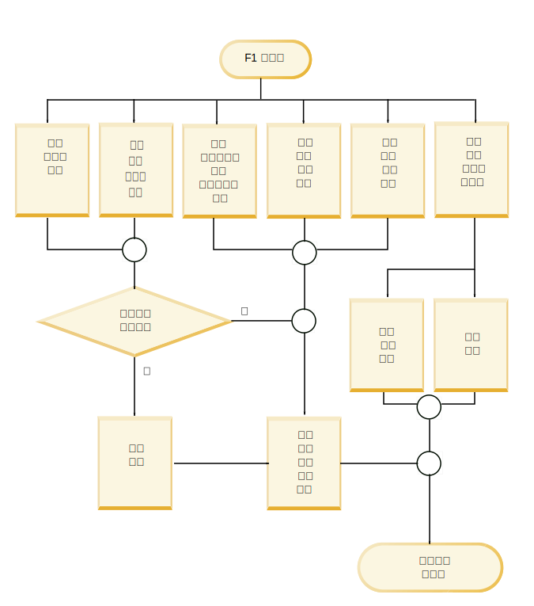
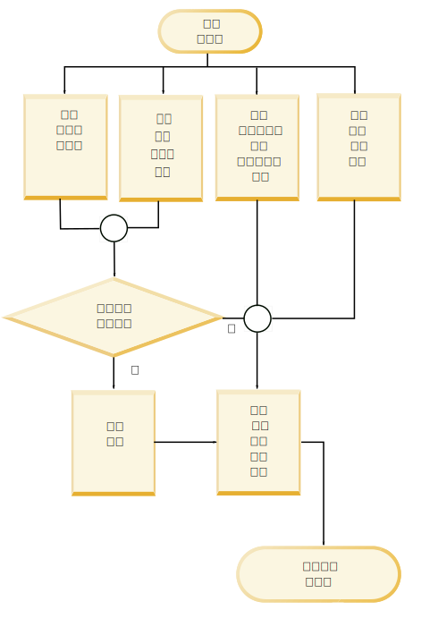

---

copyright:
  years: 2015, 2018
lastupdated: "2018-04-04"

---

{:shortdesc: .shortdesc}
{:new_window: target="_blank"}
{:tip: .tip}
{:pre: .pre}
{:codeblock: .codeblock}
{:screen: .screen}
{:javascript: .ph data-hd-programlang='javascript'}
{:java: .ph data-hd-programlang='java'}
{:python: .ph data-hd-programlang='python'}
{:swift: .ph data-hd-programlang='swift'}

本文档适用于 {{site.data.keyword.cloud}} 上的 {{site.data.keyword.knowledgestudiofull}}。要查看 {{site.data.keyword.IBM_notm}} Marketplace 上先前版本的 {{site.data.keyword.knowledgestudioshort}} 文档，请[单击此链接 ](https://console.bluemix.net/docs/services/knowledge-studio/evaluate-ml.html){: new_window}。
{: tip}

# 分析机器学习模型性能
{: #evaluate-ml}

复查已培训模型添加的注释，以确定是否必须对模型进行任何调整来提高该模型在文档中查找有效实体提及项、关系提及项和指代的能力。
{: shortdesc}

## 关于本任务

可以通过查看实体类型、关系类型和指代提及项的统计信息摘要来分析性能。还可以分析*混淆矩阵*中提供的统计信息。混淆矩阵帮助您将机器学习模型添加的注释与参考标准中的注释进行比较。

模型统计信息提供了以下度量值：

- **F1 分数**

    此度量同时考虑精度和召回率来计算分数。F1 分数可以解释为精度和召回率值的加权平均值，其中 F1 分数的最佳值为 1，最差值为 0。请参阅[分析 F1 分数低的问题](/docs/services/watson-knowledge-studio/evaluate-ml.html#evaluate-mllowf1)。

- **精度**

    此度量指定在与人类注释者输出进行比较时，机器学习模型输出中准确内容所占的比例。确定精度的方式是正确标注的注释数除以机器学习模型添加的注释总数。实体类型 A 的精度分数为 1.0 表示标注为实体类型 A 的每个提及项都确实属于该分类。精度分数低有助于识别机器学习模型创建了不正确注释的位置。该分数并不会表明机器学习模型漏掉了多少由人类注释者标注为实体类型 A 的其他提及项；召回率分数会反映该信息。请参阅[分析精度分数低的问题](/docs/services/watson-knowledge-studio/evaluate-ml.html#evaluate-mllowp)。

- **召回率**

    此度量指定应该由给定标签注释且实际使用该标签注释的提及项数 - 即*正确的*提及项就是人类注释者在相同文档中识别到的提及项。确定召回率的方式是正确标注的注释数除以应该创建的注释数。召回率分数为 1.0 表示应该标注为实体类型 A 的每个提及项都已正确标注。召回率分数低有助于识别机器学习模型未能创建应该创建的注释的位置。该分数并不会表明有多少其他提及项已标注为实体类型 A，但不应该如此标注；精度分数会反映该信息。请参阅[分析召回率分数低的问题](/docs/services/watson-knowledge-studio/evaluate-ml.html#evaluate-mllowr)。

- **占注释总数的百分比**

    此参考标准的度量表明，在测试文档集内注释为任何实体类型或关系类型的总字数中，有多少字是使用给定实体类型或关系类型注释的。此统计信息不可用于已指代的提及项。此值可以帮助您了解参考标准中一种类型的提及项相对于其他类型的普遍程度。

- **语料库密度百分比（按字数）**

    此参考标准的度量表明，在总字数（无论是已注释还是未注释）中，有多少字是使用给定实体类型或关系类型注释的。此统计信息不可用于已指代的提及项。此值可以帮助您了解领域文档中此类型的提及项相对于其他所有字的普遍程度。

- **包含类型的文档的百分比**

    此参考标准的度量表明包含给定实体类型或关系类型的文档数。此统计信息不可用于已指代的提及项。此值可以帮助您评估集内的文档是否充分代表该领域。如果关键实体类型的百分比较低，那么您可能会希望添加具有未充分代表类型的提及项的更多文档。

## 过程

要查看指示模型培训效果的性能统计信息，请执行以下操作：

1. 以 {{site.data.keyword.knowledgestudioshort}} 管理员或项目经理身份登录，然后选择工作空间。
1. 选择**模型管理** > **性能**。
1. 对于提及项、关系或指代，选择**详细统计信息**链接。
1. 在**摘要**视图中，指定是要评估测试数据还是培训数据，然后指定要查看其统计信息的注释类型：实体类型、关系类型或指代的提及项。请注意，很少会对盲区数据进行分析，请在您对测试数据分数相对有信心时再分析盲区数据。在滚动浏览数据时，会对分数较低的项进行标记并突出显示，以指示需要对其进行调查和改进。三角形警告图标指示 F1 值小于固定值 0.5。

    例如，某些实体类型的 F1 分数很高的原因可能是，文档是通过预注释以及由人类注释者进行注释的。但是，其他实体类型的 F1 分数很低的原因可能是，由于措辞存在差异以及人类注释者对文本或注释准则的解释存在差异，因此机器学习模型更难以识别模式并应用正确的注释。

1. 在测试数据的**混淆矩阵**视图中，指定要查看其统计信息的注释类型：实体类型或关系类型。对于每种实体类型或关系类型：

    - 矩阵中的每一行显示参考标准（人类注释者添加的实体类型和关系类型）。
    - 矩阵中的每一列显示解译结果（机器学习模型添加的注释记号）。
    - 每个单元格中的数字表示每个提及项的注释记号数，而不表示提及项的出现次数。

        记号用于划定文本字符串。记号大致对应于字。一个提及项可以包含多个记号。例如，*Barack Obama* 是包含两个记号的提及项。在 PERSON 行或列中，值 2 将用于表示文档中 *Barack Obama* 的单个提及项。记号计数仅大致对应于字数，因为在某些情境中记号的计数方式不同。例如，语句末尾的标点符号会视为记号，而缩略词通常会展开为两个记号。

    - 标注为 **O** 的列标识了本应由机器学习模型注释为交叉行中标识的类型（人工注释），但却并未注释为任何类型的记号。
    - 文档集内没有给定类型的注释时，将显示值 **N/A**。例如，如果已针对参考标准进行注释或注释为测试数据的文档集内没有 PERSON 提及项，那么 PERSON 实体类型的分数为 N/A。

    例如，以下混淆矩阵示例说明机器学习模型在用于处理交通事件的文档上运行的结果。

    <table cellpadding="4" cellspacing="0" summary="事件报告混淆矩阵示例" border="1" class="simpletable"><tr class="sthead"><th valign="bottom" align="left" id="d15356e164" class="stentry thleft thbot">实体类型</th>
        <th valign="bottom" align="left" id="d15356e166" class="stentry thleft thbot">MANUFACTURER</th>
        <th valign="bottom" align="left" id="d15356e168" class="stentry thleft thbot">MODEL</th>
        <th valign="bottom" align="left" id="d15356e170" class="stentry thleft thbot">O</th>
      </tr>
      <tr class="strow"><td valign="top" headers="d15356e164" class="stentry">
MANUFACTURER
</td>
        <td valign="top" headers="d15356e166" class="stentry">
515
</td>
        <td valign="top" headers="d15356e168" class="stentry">
5
</td>
        <td valign="top" headers="d15356e170" class="stentry">
44
</td>
      </tr>
    </table>
    {: #evaluate-ml__datasimpletable_yms_hff_cw}

    在此矩阵中，可以了解到以下情况：
    - 模型将 515 个记号正确识别为 MANUFACTURER 实体类型的提及项。
    - 模型将 5 个记号错误标注为 MODEL 类型的提及项，这些记号本应标注为 MANUFACTURER。
    - 有 44 个记号包含 MANUFACTURER 类型的提及项，但模型未能将其注释为任何实体类型。

    评估模型性能并查看解译结果时，可以首先调查标注不正确或完全漏掉的记号。

## 性能改进备忘单
{: #evaluate-ml_cheat}

使用此备忘单可帮助您确定为提高机器学习模型性能而可以执行的步骤。

很难制定会在不同领域中适用的规则来提高性能分数，其中类型系统复杂性、培训文档的适当性、人类注释者的技能以及其他因素都会影响结果。但是，下表可帮助您进行初始评估，并执行步骤来提高性能，尤其是在模型开发和测试的早期阶段。

下表建议了针对最常见机器学习模型性能问题的解决办法。

<table cellpadding="4" cellspacing="0" summary="该表在第一列中列出了常见问题，并在第一行中给出了建议解决办法。X 标记指示哪个解决办法适用于哪个问题。" border="1" class="simpletable"><tr class="sthead"><th valign="bottom" align="left" id="d15356e221" class="stentry thleft thbot">问题</th>
<th valign="bottom" align="left" id="d15356e223" class="stentry thleft thbot">添加字典</th>
<th valign="bottom" align="left" id="d15356e225" class="stentry thleft thbot">编辑文档集</th>
<th valign="bottom" align="left" id="d15356e227" class="stentry thleft thbot">添加特定于类型的文档</th>
<th valign="bottom" align="left" id="d15356e229" class="stentry thleft thbot">对语料库进行更多注释</th>
<th valign="bottom" align="left" id="d15356e231" class="stentry thleft thbot">修正人工注释</th>
<th valign="bottom" align="left" id="d15356e233" class="stentry thleft thbot">改进人类注释者准则</th>
<th valign="bottom" align="left" id="d15356e235" class="stentry thleft thbot">更新类型系统</th>
<th valign="bottom" align="left" id="d15356e237" class="stentry thleft thbot">进一步调查</th>
</tr>
<tr class="strow"><td valign="top" headers="d15356e221" class="stentry">
F1 分数低
</td>
<td valign="top" headers="d15356e223" class="stentry">
X
</td>
<td valign="top" headers="d15356e225" class="stentry">
X
</td>
<td valign="top" headers="d15356e227" class="stentry">
X
</td>
<td valign="top" headers="d15356e229" class="stentry">
X
</td>
<td valign="top" headers="d15356e231" class="stentry">
X
</td>
<td valign="top" headers="d15356e233" class="stentry">
X
</td>
<td valign="top" headers="d15356e235" class="stentry">
X
</td>
<td valign="top" headers="d15356e237" class="stentry">
X
</td>
</tr>
<tr class="strow"><td valign="top" headers="d15356e221" class="stentry">
精度分数低
</td>
<td valign="top" headers="d15356e223" class="stentry">

</td>
<td valign="top" headers="d15356e225" class="stentry">

</td>
<td valign="top" headers="d15356e227" class="stentry">

</td>
<td valign="top" headers="d15356e229" class="stentry">
X
</td>
<td valign="top" headers="d15356e231" class="stentry">
X
</td>
<td valign="top" headers="d15356e233" class="stentry">
X
</td>
<td valign="top" headers="d15356e235" class="stentry">
X
</td>
<td valign="top" headers="d15356e237" class="stentry">
X
</td>
</tr>
<tr class="strow"><td valign="top" headers="d15356e221" class="stentry">
召回率分数低
</td>
<td valign="top" headers="d15356e223" class="stentry">
X
</td>
<td valign="top" headers="d15356e225" class="stentry">
X
</td>
<td valign="top" headers="d15356e227" class="stentry">
X
</td>
<td valign="top" headers="d15356e229" class="stentry">
X
</td>
<td valign="top" headers="d15356e231" class="stentry">

</td>
<td valign="top" headers="d15356e233" class="stentry">

</td>
<td valign="top" headers="d15356e235" class="stentry">

</td>
<td valign="top" headers="d15356e237" class="stentry">

</td>
</tr>
<tr class="strow"><td valign="top" headers="d15356e221" class="stentry">
注释百分比低
</td>
<td valign="top" headers="d15356e223" class="stentry">

</td>
<td valign="top" headers="d15356e225" class="stentry">
X
</td>
<td valign="top" headers="d15356e227" class="stentry">
X
</td>
<td valign="top" headers="d15356e229" class="stentry">
X
</td>
<td valign="top" headers="d15356e231" class="stentry">

</td>
<td valign="top" headers="d15356e233" class="stentry">

</td>
<td valign="top" headers="d15356e235" class="stentry">

</td>
<td valign="top" headers="d15356e237" class="stentry">

</td>
</tr>
<tr class="strow"><td valign="top" headers="d15356e221" class="stentry">
密度低
</td>
<td valign="top" headers="d15356e223" class="stentry">

</td>
<td valign="top" headers="d15356e225" class="stentry">
X
</td>
<td valign="top" headers="d15356e227" class="stentry">
X
</td>
<td valign="top" headers="d15356e229" class="stentry">
X
</td>
<td valign="top" headers="d15356e231" class="stentry">

</td>
<td valign="top" headers="d15356e233" class="stentry">

</td>
<td valign="top" headers="d15356e235" class="stentry">

</td>
<td valign="top" headers="d15356e237" class="stentry">

</td>
</tr>
<tr class="strow"><td valign="top" headers="d15356e221" class="stentry">
相关类型的文档很少
</td>
<td valign="top" headers="d15356e223" class="stentry">

</td>
<td valign="top" headers="d15356e225" class="stentry">

</td>
<td valign="top" headers="d15356e227" class="stentry">
X
</td>
<td valign="top" headers="d15356e229" class="stentry">
X
</td>
<td valign="top" headers="d15356e231" class="stentry">

</td>
<td valign="top" headers="d15356e233" class="stentry">

</td>
<td valign="top" headers="d15356e235" class="stentry">
X
</td>
<td valign="top" headers="d15356e237" class="stentry">

</td>
</tr>
<tr class="strow"><td valign="top" headers="d15356e221" class="stentry">
分类不正确
</td>
<td valign="top" headers="d15356e223" class="stentry">
X
</td>
<td valign="top" headers="d15356e225" class="stentry">

</td>
<td valign="top" headers="d15356e227" class="stentry">

</td>
<td valign="top" headers="d15356e229" class="stentry">

</td>
<td valign="top" headers="d15356e231" class="stentry">

</td>
<td valign="top" headers="d15356e233" class="stentry">

</td>
<td valign="top" headers="d15356e235" class="stentry">
X
</td>
<td valign="top" headers="d15356e237" class="stentry">

</td>
</tr>
<tr class="strow"><td valign="top" headers="d15356e221" class="stentry">
漏掉的注释
</td>
<td valign="top" headers="d15356e223" class="stentry">
X
</td>
<td valign="top" headers="d15356e225" class="stentry">

</td>
<td valign="top" headers="d15356e227" class="stentry">

</td>
<td valign="top" headers="d15356e229" class="stentry">
X
</td>
<td valign="top" headers="d15356e231" class="stentry">

</td>
<td valign="top" headers="d15356e233" class="stentry">

</td>
<td valign="top" headers="d15356e235" class="stentry">

</td>
<td valign="top" headers="d15356e237" class="stentry">

</td>
</tr>
<tr class="strow"><td valign="top" headers="d15356e221" class="stentry">
测试与培训结果之间有差距
</td>
<td valign="top" headers="d15356e223" class="stentry">

</td>
<td valign="top" headers="d15356e225" class="stentry">
X
</td>
<td valign="top" headers="d15356e227" class="stentry">

</td>
<td valign="top" headers="d15356e229" class="stentry">

</td>
<td valign="top" headers="d15356e231" class="stentry">

</td>
<td valign="top" headers="d15356e233" class="stentry">

</td>
<td valign="top" headers="d15356e235" class="stentry">

</td>
<td valign="top" headers="d15356e237" class="stentry">

</td>
</tr>
<tr class="strow"><td valign="top" headers="d15356e221" class="stentry">
测试培训数据的 F1 分数低
</td>
<td valign="top" headers="d15356e223" class="stentry">

</td>
<td valign="top" headers="d15356e225" class="stentry">

</td>
<td valign="top" headers="d15356e227" class="stentry">

</td>
<td valign="top" headers="d15356e229" class="stentry">

</td>
<td valign="top" headers="d15356e231" class="stentry">
X
</td>
<td valign="top" headers="d15356e233" class="stentry">
X
</td>
<td valign="top" headers="d15356e235" class="stentry">

</td>
<td valign="top" headers="d15356e237" class="stentry">
X
</td>
</tr>
</table>

 {: #evaluate-ml_cheat__datasimpletable_nhm_5ym_cw}

### 解决办法描述

- **添加字典**

    字典包含给定实体类型的示例表面形式。如果培训统计信息表明相关类型的注释在培训数据中不经常出现，那么可能需要添加新字典或向现有字典添加更多条目。如果您知道该实体类型对于该领域至关重要并且确实经常出现，那么遗漏情况可能指示机器学习模型未识别到培训数据中*存在*的与该类型关联的表面形式。提供更多表面形式示例有助于解决此问题。

- **编辑文档集**

确保您有足够的总体培训数据。要进行学习，机器学习模型需要充分的内容。目标是提供约 300,000 字的信息。（您可以在源文档上运行字数统计工具来检查字数。）如果培训集太小，请向语料库添加文档。只有少量文档来执行每种重要的实体类型或关系是不够的；您需要能说明这些类型在典型领域文献中如何使用的大量文档。
  - 确保用于测试和培训的文档种类相似。例如，不要将来自一个数据源的文档用作测试数据集，将来自另一个数据源的文档用作培训数据集。不同的数据源可能会以完全不同的方式来表示实体和关系类型的信息。最好在这两个数据集内使用来自所有数据源的文档组合，以获取行业文献中可用的最全面的使用示例集。如果测试运行的总体性能分数与培训运行的分数相差很大，这可能是由于用于这两个运行的数据集内存在不一致情况。
  - 不要把时间浪费在格式不正确的文档上。添加到语料库的文本文档必须为 UTF-8 格式。如果将文档从其他格式转换为使用 UTF-8 编码，那么您可能会看到变音符和其他字符规范化问题。这种不正确的格式可能会导致记号表示不准确。如果用于表示提及项的字记号在各文档之间不一致，会削弱该示例的效力并对机器学习产生负面影响。

- **添加特定于类型的文档**

    如果您只有较低百分比的文档包含特定类型，那么这可能意味着语料库不具有充分代表性。机器学习模型需要大量示例进行学习。向语料库添加更多文档可能会有帮助。如果类型系统和文档确实代表领域，那么您应该会看到任何随机选择的文档都包含各类型的合理子集。尽管不一定在所有情况下都如此，但此情况表明您应该调查语料库中的类型系统和文档质量。您可能需要找到更多领域文档，以便更好地执行表现不佳的类型。如果召回率分数较低，这通常指示需要添加更多文档。

- **对语料库进行更多注释**

    如果机器学习模型很难找到特定类型的实例，那么可能是因为参考标准未包含足够的类型用法示例。有时，人类注释者可能会认真彻底地标注实体类型提及项，但在对关系类型和指代进行注释时可能没那么认真。对于语料库密度百分比很低的任何关键类型，您可能希望专注于在源文档中找到这些类型的更多注释。不过，就算提及项的准确性差强人意，也不用太担心指代和关系的准确性。因为除非实体提及项首先是准确的，否则实体之间的关系提及项以及实体的指代是不可能准确的。

- **修正人工注释**

    检查培训数据是否一致且进行了完全注释。机器学习模型会从参考标准注释中进行学习。例如，如果语句中包含短语 Obama family，并且您在一个语句中将“Obama”标注为 PERSON，在另一个语句中将“Obama family”标注为 PEOPLE，那么这种不一致意味着机器学习模型无法学习到正确的注释。同样，如果在一个语句中将“Obama”标注为 PERSON，而在另一个语句中根本未对此姓名进行标注，那么注释工作就不完整，并且机器学习模型将得不到恰当的培训。此类型的不一致和部分标注有时也称为*类型混淆*。在大多数情况下，仅仅是让多个人类注释者复查一组重叠文档的行为，就会导致发生与类型混淆相关的错误。请注意解决文档冲突期间出现的问题，因为这些问题可能提供了对类型系统本身更深层问题的洞察。如果类型系统没有可进一步改进或优化的空间，那么可能需要更新注释准则并包含示例。您可以提供常见错误的说明以及有关如何在一组给定情况下正确地对提及项进行注释的说明。

    另一个指示注释不一致的标志是虽然有足够的注释，但语料库的密度很低。如果在领域文献中有意义的提及项经常出现，但该提及项在文档集内注释为不同类型，可能会影响密度。

    低精度通常指示需要提高注释一致性。为此，请复查注释准则，更好地培训人类注释者，并确保人类注释者在协同工作，而不是各自为政。

    检查注释者间一致性分数。此分数用于度量同一文档上不同注释者输出的一致程度，是很有价值的数字。此分数不仅指示将用于培训机器学习模型的参考标准文档的质量，还指示机器学习模型性能的上限。基于这些文档进行培训的模型不太可能超越人类可以达到的最佳一致性。例如，如果性能持续保持在 75 而不升高，请查看注释者间一致性结果。如果注释者间一致性分数为 80，请采取措施以更好地培训人类注释者，并确保在裁定期间（根据注释准则）正确解决冲突。如果人类注释者无法就某个内容应该如何标注达成一致，那么机器学习模型不太可能会应用正确的标签。

- **改进人类注释者准则**

    明确、全面的注释者准则是协调、成功的注释开发工作的关键部分。人类注释者的工作十分艰巨。在开始使用领域文档之前，很难预料分配实体和关系类型时可能存在的细微差别。这些准则可以在人类注释者评估文档时，为他们提供合理性检查。准则应该是一个有效的不断变化的文档，尤其是在注释过程开始时。准则提供关键反馈循环，因为人类注释者可以捕获在对几个文档进行注释时所学习到的内容，然后在自己或其他人对另外几个文档进行注释时，可以向准则添加新的提示和注意点，等等。请确保包含决策困难的示例及其首选解决方法。确定需要添加到注释准则的内容的最佳方法是仔细复查文档冲突。真实的人类注释者出现分歧的真实注释示例以及如何解决分歧的真实示例，对于人类注释者处理新文档的注释有莫大的帮助。

- **更新类型系统**

    出于以下原因，可能需要更新类型系统：
  - 包含培训数据的文档引用的概念是领域中的重要类型，但并未在类型系统的任何位置表示这些概念。这表明您可能需要添加用于捕获缺失概念或关系的类型。请注意，不要尝试为字段中的每个概念或领域文档中出现的每个实体定义类型；类型系统应仅限于最基本的类型。
  - 例如注释者一直在误用某个现有类型。如果某个类型一直引起混淆，那么可能需要对其重命名或将其除去（如果是冗余类型4）。
  - 人类注释者从不使用某个现有类型，因为文档中从未引用过该类型。如果该类型不太可能在此领域中的文献中使用，请从类型系统中将其除去。
  - 人类注释者对文档进行注释时，两种类型通常会互换使用。请考虑这两种类型是否可以合并为一种类型来准确地表示概念或关系。例如，如果类型系统包含 PERSON 和 PEOPLE（通常可互换使用），那么最好使用名为 PERSONPEOPLE 的一种类型来涵盖这两种情况，而不使用两种单独的类型。

    > **注意**：更新类型系统时请谨慎。如果在人类注释者评估与旧类型系统关联的文档集之后对系统进行更新，那么人类注释者必须重新评估这些文档集。请确保需要进行的更改足够重要，值得此类返工。

- **进一步调查**

    如果类型系统、字典和源文档都是完整的，并且人工注释已顺利完成，但机器学习模型仍然表现不佳，那么可能是在模型培训过程中发生了问题。例如，对培训数据进行测试时，应该始终看到较高的总体分数（超过 95%）。

## 分析 F1 分数低的问题
{: #evaluate-mllowf1}

调优机器学习模型的性能，以解决 F1 分数低的问题。

### 症状

F1 分数的最佳值为 1，最差值为 0。F1 分数低指示精度和召回率都较差。机器学习模型生成错误的注释，并且找不到应该找到的注释。

### 原因

出于多种原因，会发生 F1 分数低的情况，具体取决于领域、类型系统复杂性、培训文档的适当性、人类注释者的技能以及其他因素。

### 解决问题

通过执行下列一个或多个步骤，然后重新培训模型，调优机器学习模型的性能：

1. 识别准确性低的常见类型。

    > **注**：分析关系时，请查看关系类型本身的 F1 分数和参与关系的两个实体中每个实体的 F1 分数。

1. 识别通常易混淆类型。通过查看混淆矩阵中非对角的数字，可以找到此信息。
1. 在机器学习模型具有较高置信度的位置复查错误。
1. 在混淆矩阵中查找假负和假正模式。
1. 如果某些类型在培训数据中不经常出现，请添加包含这些类型的培训数据。

    可以通过检查该类型的百分比统计信息（有三种：注释百分比、语料库密度百分比和文档百分比）来确定出现的频率。

1. 如果某些类型的 F1 分数较低，请复查适用于这些类型的注释准则是否明确。
1. 为培训数据中不经常出现的类型添加字典。

 图 1. 如何解决 F1 分数低的问题

## 分析精度分数低的问题
{: #evaluate-mllowp}

调优机器学习模型的性能，以解决精度分数低的问题。在较高级别，精度低指示需要提高注释一致性。

### 症状

精度分数的最佳值为 1，最差值为 0。精度分数低指示机器学习模型生成了不正确的注释。

### 原因

出于多种不同原因，会发生精度分数低的问题，具体取决于领域、类型系统复杂性、培训文档的适当性、人类注释者的技能以及其他因素。

### 解决问题

通过执行下列一个或多个步骤，然后重新培训模型，调优机器学习模型的性能：

1. 识别精度低的常见类型。
1. 识别通常易混淆类型。通过查看混淆矩阵中非对角的数字，可以找到此信息。
1. 在机器学习模型具有较高置信度的位置复查错误。
1. 在混淆矩阵中查找假负模式。
1. 如果某些类型的精度分数较低，请复查适用于这些类型的注释准则是否明确。

图 2. 如何解决精度分数低的问题

## 分析召回率分数低的问题
{: #evaluate-mllowr}

调优机器学习模型的性能，以解决召回率分数低的问题。在较高级别，召回率分数低指示需要添加更多培训数据。

### 症状

召回率分数的最佳值为 1，最差值为 0。召回率分数低指示机器学习模型无法创建应该创建的注释。

### 原因

出于多种不同原因，会发生召回率分数低的问题，具体取决于领域、类型系统复杂性、培训文档的适当性、人类注释者的技能以及其他因素。

### 解决问题

通过执行下列一个或多个步骤，然后重新培训模型，调优机器学习模型的性能：

1. 识别召回率分数低的常见类型。
1. 识别通常易混淆类型。通过查看混淆矩阵中非对角的数字，可以找到此信息。
1. 在机器学习模型具有较高置信度的位置复查错误。
1. 在混淆矩阵中查找假正模式。
1. 如果某些类型的召回率分数较低，请复查适用于这些类型的注释准则是否明确。

图 3. 如何解决召回率分数低的问题