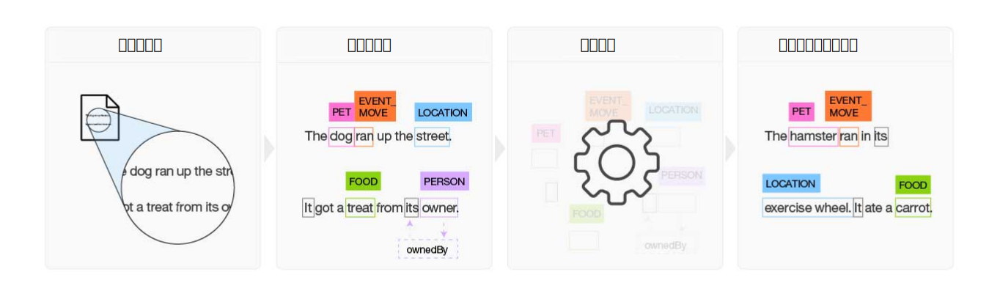

---

copyright:
  years: 2015, 2018
lastupdated: "2018-04-04"

---

{:shortdesc: .shortdesc}
{:new_window: target="_blank"}
{:tip: .tip}
{:pre: .pre}
{:codeblock: .codeblock}
{:screen: .screen}
{:javascript: .ph data-hd-programlang='javascript'}
{:java: .ph data-hd-programlang='java'}
{:python: .ph data-hd-programlang='python'}
{:swift: .ph data-hd-programlang='swift'}

本文档适用于 {{site.data.keyword.cloud}} 上的 {{site.data.keyword.knowledgestudiofull}}。要查看 {{site.data.keyword.IBM_notm}} Marketplace 上先前版本的 {{site.data.keyword.knowledgestudioshort}} 文档，请[单击此链接 ](https://console.bluemix.net/docs/services/knowledge-studio/index.html){: new_window}。
{: tip}

# 关于
{: #wks_overview_full}

使用 {{site.data.keyword.knowledgestudiofull}} 可创建机器学习模型，用于了解特定于您行业的语言细微差别、含义和关系，也可创建基于规则的模型，用于根据定义的规则在文档中查找实体。
{: shortdesc}

要成为给定行业或领域的主题专家，{{site.data.keyword.watson}} 必须受到培训。您可以通过 {{site.data.keyword.knowledgestudioshort}} 来帮助执行培训 {{site.data.keyword.watson}} 的任务。

## 构建机器学习模型

{{site.data.keyword.knowledgestudioshort}} 提供了多个易于使用的工具，用于对非结构化领域文献进行注释，并使用这些注释来创建定制机器学习模型以理解领域的语言。模型的准确性通过迭代测试进行改进，最终生成的算法可以从模型看到的模式进行学习，并在新文档的大型集合中识别这些模式。您可以将完成的机器学习模型部署到其他 {{site.data.keyword.watson}} 基于云的产品和认知解决方案，以查找并抽取关系和实体的提及项，包括实体指代。

 图 1. 机器学习模型构建过程概览图

1. 团队根据一组特定于领域的源文档来创建类型系统，以用于为将使用该模型的应用程序的相关信息定义实体类型和关系类型。
1. 包含两个或更多人类注释者的组对一小组源文档进行注释，以标注表示实体类型的词，标识其中文本识别到实体提及项之间关系的关系类型，以及定义指代来识别指同一事物（即，同一实体）的不同提及项。解决了注释中的任何不一致情况后，会构建一组最佳注释的文档，这些文档即构成参考标准。
1. {{site.data.keyword.knowledgestudioshort}} 使用参考标准来培训模型。
1. 已培训的模型用于在从未见过的新文档中查找实体、关系和指代。

有关更多详细信息，请参阅[创建机器学习模型](/docs/services/watson-knowledge-studio/ml-annotator.html)。

## 构建基于规则的模型

{{site.data.keyword.knowledgestudioshort}} 提供了一个规则编辑器，用于简化在文档中查找和捕获公共模式作为规则的过程。然后，可以创建识别规则模式的模型，并部署该模型以用于其他服务。

有关更多详细信息，请参阅[创建基于规则的模型](/docs/services/watson-knowledge-studio/rule-annotator.html)。

## Watson 服务集成
{: #wks_watsoninteg}

将领域工件和模型在 {{site.data.keyword.knowledgestudiofull}} 和其他 {{site.data.keyword.watson}} 服务之间共享。

使用 {{site.data.keyword.knowledgestudioshort}} 执行以下任务： 

- 使用 {{site.data.keyword.nlushort}} 服务在文档中自动查找实体并对实体进行注释，从而引导注释。人类注释者开始对文档进行注释时，可以看到已由该服务做出的注释，并且可以复查这些注释并在其中添加内容。有关详细信息，请参阅[使用 {{site.data.keyword.nlushort}} 对文档进行预注释](/docs/services/watson-knowledge-studio/preannotation.html#wks_preannotnlu)。
- 上传 [UIMA CAS XMI 格式](/docs/services/watson-knowledge-studio/preannotation.html#wks_uimaweximport)的已分析文档。例如，可以上传从 {{site.data.keyword.IBM_notm}} {{site.data.keyword.watson}} Explorer 内容分析集合或 [{{site.data.keyword.IBM_notm}} {{site.data.keyword.watson}} Explorer Content Analytics Studio](/docs/services/watson-knowledge-studio/preannotation.html#wks_uimawexstudio) 中导出的 UIMA CAS XMI 文件。
- 部署[机器学习](/docs/services/watson-knowledge-studio/publish-ml.html#wks_madiscovery)或[基于规则的](/docs/services/watson-knowledge-studio/rule-annotator-model-use.html#wks_rule_discovery)模型，以用于 {{site.data.keyword.watson}} {{site.data.keyword.discoveryshort}} 服务。
- 部署[机器学习](/docs/services/watson-knowledge-studio/publish-ml.html#wks_manlu)或[基于规则的](/docs/services/watson-knowledge-studio/rule-annotator-model-use.html#wks_rule_nlu)模型，以用于 {{site.data.keyword.nlushort}} 服务。
- [导出机器学习模型](/docs/services/watson-knowledge-studio/publish-ml.html#wks_maexport)以在 {{site.data.keyword.IBM_notm}} {{site.data.keyword.watson}} Explorer 中使用。
- [导出基于规则的模型 PEAR 文件](/docs/services/watson-knowledge-studio/rule-annotator-model-use.html#wks_rule_export)以在 {{site.data.keyword.IBM_notm}} {{site.data.keyword.watson}} Explorer 中使用。
