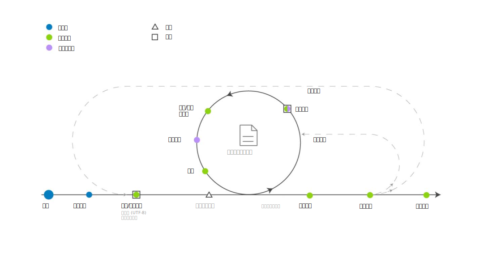

---

copyright:
  years: 2015, 2018
lastupdated: "2018-07-19"

---

{:shortdesc: .shortdesc}
{:new_window: target="_blank"}
{:tip: .tip}
{:pre: .pre}
{:codeblock: .codeblock}
{:screen: .screen}
{:javascript: .ph data-hd-programlang='javascript'}
{:java: .ph data-hd-programlang='java'}
{:python: .ph data-hd-programlang='python'}
{:swift: .ph data-hd-programlang='swift'}

本文档适用于 {{site.data.keyword.knowledgestudiofull}} on {{site.data.keyword.cloud}}。要查看 {{site.data.keyword.knowledgestudioshort}} on {{site.data.keyword.IBM_notm}} Marketplace 先前版本的文档，请[单击此链接 ](https://{DomainName}/docs/services/knowledge-studio/ml-annotator.html){: new_window}。
{: tip}

# 机器学习模型创建工作流程
{: #ml_annotator}

创建机器学习模型，以对您可用于识别新文档中相关实体、指代和关系的模型进行培训。
{: shortdesc}

了解用于在 {{site.data.keyword.knowledgestudioshort}} 中创建机器学习模型的典型工作流程。

所有步骤都由项目经理执行，但*注释文档*步骤除外，该步骤由人工注释者执行。因为人工注释者通常是主题专家，所以在创建工作空间资源（例如，类型系统）期间，还可向他们咨询。

 图 1. 用于开发机器学习模型的工作流程

<table summary="创建和优化模型">
<caption>表 1. 创建和优化工作流程</caption>
  <tr>
    <th style="vertical-align:bottom; text-align:left" id="d14771e70">步骤</th>
    <th style="vertical-align:bottom; text-align:left" id="d14771e72">描述</th>
  </tr>
  <tr>
    <td style="vertical-align:top; text-align:left" headers="d14771e70">
      
创建工作空间

    </td>
    <td style="vertical-align:top; text-align:left" headers="d14771e72">
      
请参阅[创建工作空间](/docs/services/watson-knowledge-studio/create-project.html)。工作空间包含用于创建模型的资源，包括：

      <dl>
        <dt>类型系统</dt>
        <dd>
          
上传或创建类型系统，并定义人工注释者在对文本进行注释时可以应用的实体类型和关系类型。模型流程管理者通常与您的领域的主题专家一起工作，以定义类型系统。请参阅[建立类型系统](/docs/services/watson-knowledge-studio/typesystem.html)

        </dd>
        <dt>源文档</dt>
        <dd>
          
通过将对于领域内容具有代表性的样本文档上传到工作空间来创建语料库。请参阅[添加文档以进行注释](/docs/services/watson-knowledge-studio/documents-for-annotation.html)。将语料库划分为文档集，指定在所有文档集之间共享的文档的百分比，然后将文档集分配给人工注释者。请参阅[创建和分配注释集](/docs/services/watson-knowledge-studio/documents-for-annotation.html#wks_projdocsets)。

        </dd>
        <dt>字典</dt>
        <dd>
          
上传或创建用于对文本进行注释的字典。可以选择手动添加字典条目，或从文件上传条目，然后编辑条目。请参阅[创建字典](/docs/services/watson-knowledge-studio/dictionaries.html)。

        </dd>
      </dl>
    </td>
  </tr>
  <tr>
    <td style="vertical-align:top; text-align:left" headers="d14771e70">
      
<strong>可选</strong>：对文档进行预注释

    </td>
    <td style="vertical-align:top; text-align:left" headers="d14771e72">
      
根据工作空间字典中的术语、{{site.data.keyword.nlushort}} 类型的提及项或基于定义的规则，对文档进行预注释。请参阅[引导注释](/docs/services/watson-knowledge-studio/preannotation.html#wks_preannotate)。

    </td>
  </tr>
  <tr>
    <td style="vertical-align:top; text-align:left" headers="d14771e70">
      
注释文档

    </td>
    <td style="vertical-align:top; text-align:left" headers="d14771e72">
      <ol>
        <li>
          
项目经理将注释任务分配给人工注释者，配置注释者间一致性阈值，并提供人工注释者要遵循的注释准则。请参阅[创建注释任务](/docs/services/watson-knowledge-studio/annotate-documents.html#wks_hatask)。

        </li>
        <li>
          
人工注释者使用参考标准编辑器对文档进行手动注释。人工注释者识别领域内容中相关的提及项，然后使用实体类型对其进行标注。人工注释者还会识别提及项之间的关系（例如，Mary is an employee of IBM）以及提及项如何指代同一实体（例如，出现“she”以指示 Mary）。请参阅[注释文档](/docs/services/watson-knowledge-studio/user-guide.html)。

        </li>
      </ol>
    </td>
  </tr>
  <tr>
    <td style="vertical-align:top; text-align:left" headers="d14771e70">
      
裁定和升级文档

    </td>
    <td style="vertical-align:top; text-align:left" headers="d14771e72">
      
接受或拒绝由人工注释者生成的参考标准，并对任何注释差异进行裁定以解决冲突。评估人工注释工作的准确性和一致性可能是高级人工注释者或主题经验比项目经理更丰富的用户的职责。请参阅[裁定](/docs/services/watson-knowledge-studio/build-groundtruth.html#wks_haperform)。

    </td>
  </tr>
  <tr>
    <td style="vertical-align:top; text-align:left" headers="d14771e70">
      
培训模型

    </td>
    <td style="vertical-align:top; text-align:left" headers="d14771e72">
      
创建机器学习模型。请参阅[创建机器学习模型](/docs/services/watson-knowledge-studio/train-ml.html#wks_madocsets)。

    </td>
  </tr>
  <tr>
    <td style="vertical-align:top; text-align:left" headers="d14771e70">
      
评估模型

    </td>
    <td style="vertical-align:top; text-align:left" headers="d14771e72">
      
评估模型的准确性。请参阅[评估模型添加的注释](/docs/services/watson-knowledge-studio/train-ml.html#wks_matest)。根据模型的准确性，此步骤可能会导致需要一再重复先前的步骤，直至达到最佳准确性为止。有关根据常见性能问题要更新的内容的构想，请参阅[分析机器学习模型性能](/docs/services/watson-knowledge-studio/evaluate-ml.html)。

    </td>
  </tr>
  <tr>
    <td style="vertical-align:top; text-align:left" headers="d14771e70">
      
发布模型

    </td>
    <td style="vertical-align:top; text-align:left" headers="d14771e72">
      
导出或部署模型。请参阅[使用机器学习模型](/docs/services/watson-knowledge-studio/publish-ml.html)。

    </td>
  </tr>
</table>
