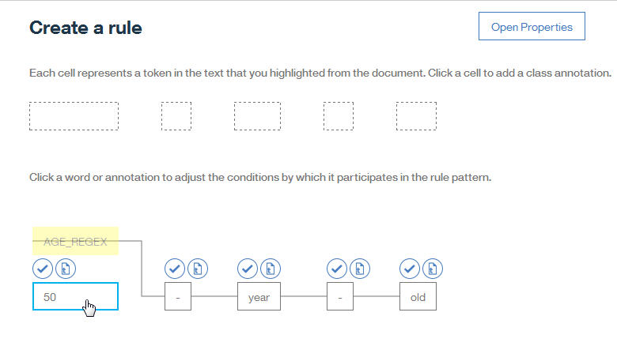

---

copyright:
  years: 2015, 2018
lastupdated: "2018-04-04"

---

{:shortdesc: .shortdesc}
{:new_window: target="_blank"}
{:tip: .tip}
{:pre: .pre}
{:codeblock: .codeblock}
{:screen: .screen}
{:javascript: .ph data-hd-programlang='javascript'}
{:java: .ph data-hd-programlang='java'}
{:python: .ph data-hd-programlang='python'}
{:swift: .ph data-hd-programlang='swift'}

本文档适用于 {{site.data.keyword.cloud}} 上的 {{site.data.keyword.knowledgestudiofull}}。要查看 {{site.data.keyword.IBM_notm}} Marketplace 上先前版本的 {{site.data.keyword.knowledgestudioshort}} 的文档，请[单击此链接 ](https://console.bluemix.net/docs/services/knowledge-studio/rule-annotator-define-rule.html){: new_window}。
{: tip}

# 定义规则
{: #wks_rule_creation}

使用规则编辑器来定义规则。
{: shortdesc}

## 关于本任务

避免多个用户同时编辑规则、类和正则表达式，因为这可能会导致意外的覆盖或重复。

## 过程

要定义规则，请完成以下步骤：

1. 以 {{site.data.keyword.knowledgestudioshort}} 管理员或项目经理身份登录，然后打开**规则**页面。
1. 单击“文档”旁边的加号 (+) 以添加文档。

    有关详细信息，请参阅[添加用于定义规则的文档](/docs/services/watson-knowledge-studio/rule-annotator-add-doc.html)。

    例如，可以添加一个名为 `My Document` 的文档并包含以下单行文本：

    ```
    A 50-year-old driver was driving the 2017 Example Horizon.
    ```
    {: screen}

1. 如果计划定义正则表达式或添加字典，请创建要与其关联的类。

    1. 在**类**面板中，单击“类”旁边的加号 (+)。
    1. 添加类名。

        如果要将该类与正则表达式或字典相关联，请考虑将类命名为您可识别其源的内容。例如，如果计划使用正则表达式来为语句中的数字定义模式，那么可以创建名为 AGE_REGEX 的类。如果计划使用字典对语句中的汽车制造商进行注释，那么可以添加名为 MANUFACTURR_DICT 的类。

        请记住以下命名规则：
        - 类名中的第一个字符必须是字母。
        - 在添加到类的值中，仅使用以下字母数字 ASCII 字符和下划线字符：A 到 Z、a 到 z 和 0 到 9。
        - 名称不能包含空格。
        - 名称长度不能超过 64 个字符。

1. 可选：要在文档中对类快速进行注释，可以使用规则编辑器关联字典。对于文档中与字典中的条目相匹配的术语，会自动使用相应的类进行注释。

    1. 单击面板中的**字典**选项卡。

        这将显示已创建的所有字典。

        如果尚未添加字典，请从主导航栏中打开**字典**选项卡以添加字典。有关更多信息，请参阅[创建字典](/docs/services/watson-knowledge-studio/dictionaries.html)。

    1. 单击某个字典，为其定义类关联，然后单击**保存**。

        例如，如果您有一个包含组织名称的字典，那么可以将其与规则相关联，并为其分配 ORGANIZATION_DICT 类。样本文档中出现的任何组织名称都会作为 ORGANIZATION_DICT 类的实例进行注释。

    如果日后要从规则编辑器中除去字典关联，那么可以除去相应的类映射。要执行此操作，请选择下拉列表顶部的空选项。

1. 可选：要定义正则表达式来帮助构造规则，请从导航中单击**正则表达式**。

    1. 单击“正则表达式”旁边的加号 (+) 以添加正则表达式。
    1. 对正则表达式命名。例如，MyAgeRegex。

        名称长度不能超过 64 个字符。

    1. 将表达式与类相关联。例如，AGE_REGEX。
    1. 单击**添加条目**。
    1. 添加表达式。

        例如，要捕获表示年龄（最高年龄为 99）的数字，可以指定 `[0-9]{1,2}`。要捕获时间的表达式（如 *12:30 AM*），可以指定以下正则表达式：

        ```
        (1[0-2]|0?[1-9]):([0-5][0-9])(\s+[AaPp][Mm])?
        ```
        {: screen}

        您可以选择更改最小和最大词记号数。在英语中，记号通常等同于语句中用空格分隔的单词。但是，记号并不总是与单词一一对应；其他文本元素在某些情况下会视为记号。例如，术语 *50-year-old* 中的每个连字符都会计为一个记号，这意味着此术语中使用的记号总数为 5。再例如，文本 *12:30 PM* 包含 4 个记号 (`12 | : | 30 | PM`)。

        单击**添加**。

    1. 如果要添加更多表达式，请重复上述两个步骤。
    1. 单击**保存**。

    正则表达式编辑器会关闭，并且会显示文档。您应该会看到为正则表达式（应用于要与其匹配的文本）定义的类。如果没有看到，请检查表达式。可能需要对表达式进行修改，使其与您要查找的文本相匹配。

    

1. 要定义规则，请单击导航中的**规则**。
1. 打开包含要作为规则捕获的模式的文档。例如，如果创建了名为 `My Document` 的文档，并且该文档中的样本文本包含短语 `50-year-old`，请打开该文档。
1. 在文档的文本中，选择说明要捕获的模式的字符。例如，可以选择以下词和连字符 (-)：

    ```
    50-year-old
    ```
    {: screen}

    选择字符后，可以添加规则。

1. 单击**规则**面板中的加号 (+)。

    规则编辑器会将选择的文本表示为两层单元格。您将在顶层中的单元格中对底层记号的类进行注释。您将在底层单元格中定义记号参与模式时所依据的条件。

    

1. 定义每个令牌参与模式时依据的条件。

    在底层单元格中，单击第一个记号以复查其条件。如果要指示可以在模式中的当前位置使用任何记号，那么单击**打开属性**，然后选择**允许任何记号**。单击**关闭属性**。如果记号是正则表达式（例如，示例中的 `AGE_REGEX`），那么**允许任何记号**不可用。

    > **注**：每个单元格的重复设置小于或等于 1 时，可以参与模式的最大组单元格数为 15。组单元格包括单个记号、注释或允许任何记号的记号。模式中允许的最大记号总数为 20。在定义模式时，请考虑每个单元格的重复设置。例如，每个单元格的重复设置小于或等于 1 时，可以定义包含 15 个记号的模式。但是，如果每个记号的重复设置大于或等于 1，那么可以在模式中定义的记号数不能超过 4 个，因为每个记号会重复最多 5 次。4 个记号重复 5 次即达到允许的最大值 20。

    要指示需要特定类型的记号，可以定义以下类型的条件设置：
    - **重复设置**：指定模式中必须包含当前记号的次数。可以更改重复设置，但每个记号只能指定一个重复设置。下表中描述了这些选项。

    <table cellpadding="4" cellspacing="0" summary="" border="1" class="simpletable">
      <tr class="sthead">
        <th valign="bottom" align="left" id="d27028e471" class="stentry thleft thbot">设置选项</th>
        <th valign="bottom" align="left" id="d27028e473" class="stentry thleft thbot">描述</th>
      </tr>
      <tr class="strow">
        <td valign="top" headers="d27028e471" class="stentry">
          <p class="p wrapper">必需（恰好为 1）</p>
        </td>
        <td valign="top" headers="d27028e473" class="stentry">
          <p class="p wrapper">此记号在模式中必须存在一次。缺省情况下将应用此选项，但可以进行更改。</p></td>
      </tr>
      <tr class="strow">
        <td valign="top" headers="d27028e471" class="stentry">
          <p class="p wrapper">重复 1 次或更多次</p>
        </td>
        <td valign="top" headers="d27028e473" class="stentry">
          <p class="p wrapper">此记号在模式中必须存在至少一次，并且可以重复多次。</p>
        </td>
      </tr>
      <tr class="strow">
        <td valign="top" headers="d27028e471" class="stentry">
          <p class="p wrapper">重复 0 次或更多次</p>
        </td>
        <td valign="top" headers="d27028e473" class="stentry">
          <p class="p wrapper">此记号在模式中可以重复多次（可选），但重复不是必需的。</p>
        </td>
      </tr>
      <tr class="strow">
        <td valign="top" headers="d27028e471" class="stentry">
          <p class="p wrapper">出现 0 或 1 次</p>
        </td>
        <td valign="top" headers="d27028e473" class="stentry">
          <p class="p wrapper">此记号是可选的。</p>
        </td>
      </tr>
      <tr class="strow">
        <td valign="top" headers="d27028e471" class="stentry">
          <p class="p wrapper">高级：_定制_</p>
        </td>
        <td valign="top" headers="d27028e473" class="stentry">
          <p class="p wrapper">此记号在模式中必须重复此处指定的次数。要定义定制重复设置，请单击<b>打开属性</b>，选择**高级**，然后选择要定义的确切重复次数或重复范围。</p>
          <p class="note">
            一个记号允许的最大重复次数为 5。</p>
        </td>
      </tr>
    </table>

    - **功能设置**：必须至少定义一个功能设置。可以添加更多功能，以增加要使文本与此模式匹配所必须满足的条件数。下表中描述了这些选项。

    <table cellpadding="4" cellspacing="0" summary="" border="1" class="simpletable">
      <tr class="sthead">
        <th valign="bottom" align="left" id="d27028e512" class="stentry thleft thbot">设置选项</th>
        <th valign="bottom" align="left" id="d27028e514" class="stentry thleft thbot">添加的条件</th>
      </tr>
      <tr class="strow">
        <td valign="top" headers="d27028e512" class="stentry">
          <p class="p wrapper">文本</p>
        </td>
        <td valign="top" headers="d27028e514" class="stentry">
          <p class="p wrapper">必须与此记号中的文本完全匹配。缺省情况下将应用此选项。可以除去此选项，但仅当添加了其他设置作为条件或应用“任何记号”设置时才可除去。</p>
        </td>
      </tr>
      <tr class="strow">
        <td valign="top" headers="d27028e512" class="stentry">
          <p class="p wrapper">长度</p>
        </td>
        <td valign="top" headers="d27028e514" class="stentry">
          <p class="p wrapper">必须与此记号的字符长度相匹配。长度在第一个字符前面从 0 开始计算。</p>
        </td>
      </tr>
    </table>

    其余选项因记号类型而异。

    - **与正则表达式或字典术语不匹配的未注释记号**：这些设置可用于未注释且与正则表达式或字典术语不匹配的记号。

    <table cellpadding="4" cellspacing="0" summary="" border="1" class="simpletable">
      <tr class="sthead">
        <th valign="bottom" align="left" id="d27028e535" class="stentry thleft thbot">设置选项</th>
        <th valign="bottom" align="left" id="d27028e537" class="stentry thleft thbot">描述</th>
      </tr>
      <tr class="strow">
        <td valign="top" headers="d27028e535" class="stentry">
          <p class="p wrapper">词性</p>
        </td>
        <td valign="top" headers="d27028e537" class="stentry">
          <p class="p wrapper">必须与此记号的词性相同。支持以下类型：</p>
          <ul class="ul bullets">
            <li class="li">
              <p class="p wrapper">形容词</p>
            </li>
            <li class="li">
              <p class="p wrapper">介系词</p>
            </li>
            <li class="li">
              <p class="p wrapper">副词</p>
            </li>
            <li class="li">
              <p class="p wrapper">连词</p>
            </li>
            <li class="li">
              <p class="p wrapper">限定词</p>
            </li>
            <li class="li">
              <p class="p wrapper">感叹词</p>
            </li>
            <li class="li">
              <p class="p wrapper">名词</p>
            </li>
            <li class="li">
              <p class="p wrapper">数词</p>
            </li>
            <li class="li">
              <p class="p wrapper">代词</p>
            </li>
            <li class="li">
              <p class="p wrapper">残差</p>
            </li>
            <li class="li">
              <p class="p wrapper">动词</p>
            </li>
          </ul>
        </td>
      </tr>
      <tr class="strow">
        <td valign="top" headers="d27028e535" class="stentry">
          <p class="p wrapper">词元</p>
        </td>
        <td valign="top" headers="d27028e537" class="stentry">
          <p class="p wrapper">必须与此记号的词元相同。</p>
        </td>
      </tr>
      <tr class="strow">
        <td valign="top" headers="d27028e535" class="stentry">
          <p class="p wrapper">字符类型</p>
        </td>
        <td valign="top" headers="d27028e537" class="stentry">
          <p class="p wrapper">必须与此记号的字符类型相同。支持以下类型：</p>
          <ul class="ul bullets">
            <li class="li">
              <p class="p wrapper">Arabic：包含阿拉伯语字符序列</p>
            </li>
            <li class="li">
              <p class="p wrapper">ChineseNumeral：仅包含中文数字</p>
            </li>
            <li class="li">
              <p class="p wrapper">ClauseEndingPunctuation：用于分隔相邻的从句或句子的标点符号字符</p>
            </li>
            <li class="li">
              <p class="p wrapper">Han：包含汉字字符</p>
            </li>
            <li class="li">
              <p class="p wrapper">Hangul：包含韩文音节字符</p>
            </li>
            <li class="li">
              <p class="p wrapper">Hebrew：包含希伯来语字符序列</p>
            </li>
            <li class="li">
              <p class="p wrapper">Hiragana：包含日文平假名音节字符</p>
            </li>
            <li class="li">
              <p class="p wrapper">Ideographic：包含表示构想或事物的表意文字或符号</p>
            </li>
            <li class="li">
              <p class="p wrapper">Katakana：包含日文片假名音节字符</p>
            </li>
            <li class="li">
              <p class="p wrapper">Lowercase：仅包含小写字母字符</p>
            </li>
            <li class="li">
              <p class="p wrapper">Numeric：仅包含数字字符</p>
            </li>
            <li class="li">
              <p class="p wrapper">Punctuation：用于在文本中提供标点符号的一个或多个字符</p>
            </li>
            <li class="li">
              <p class="p wrapper">Syllabic：包含音节字符</p>
            </li>
            <li class="li">
              <p class="p wrapper">Thai：包含泰语字符</p>
            </li>
            <li class="li">
              <p class="p wrapper">Titlecase：以单个大写字母字符开头，后跟一个或多个小写字母字符</p>
            </li>
            <li class="li">
              <p class="p wrapper">Uppercase：仅包含大写字母字符的记号</p>
            </li>
          </ul>
        </td>
      </tr>
    </table>

    - **规则匹配：**

    <table cellpadding="4" cellspacing="0" summary="" border="1" class="simpletable">
      <tr class="sthead">
        <th valign="bottom" align="left" id="d27028e617" class="stentry thleft thbot">设置选项</th>
        <th valign="bottom" align="left" id="d27028e619" class="stentry thleft thbot">描述</th>
      </tr>
      <tr class="strow">
        <td valign="top" headers="d27028e617" class="stentry">
          <p class="p wrapper">规则匹配</p>
        </td>
        <td valign="top" headers="d27028e619" class="stentry">
          <p class="p wrapper">必须与指定的类相匹配。请记住，类可以从正则表达式、字典或规则派生。例如，如果此处指定的类是从正则表达式派生的，那么此记号必须与表达式的搜索模式相匹配。</p>
        </td>
      </tr>
    </table>

1. 对于具有从字典注释或正则表达式匹配项间接添加的注释的记号，可以选择模式是应该需要任何具有相同注释类型的词，还是改为需要已进行注释的实际底层词。

    在底层单元格中，可以看到哪些单元格包含在模式中，因为有一条水平线将这些单元格连接在一起。在应用了注释之处，单元格会拆分。带有原始词的单元格会显示在带有注释标签的单元格下面。可以单击其中任一组单元格来更改线条的路径，从而更改模式中包含的单元格。

    例如，可以选择让模式使用 50，而不是让模式与 age 正则表达式相匹配。

    

1. 设置模式顺序后，可以对文本中的记号进行注释。

    在顶层单元格中，单击表示要注释的记号的单元格，然后向其应用类标签。要选择多个单元格，请单击一个单元格，然后按住 **Shift** 键并单击其他单元格。

    为所选一个或多个单元格分配类。如果要分配的类不存在，那么可以添加该类。在**分配类**字段中输入类名，然后按 **Enter** 键。

    > **注**：为规则添加的类不能超过 10 个。

    

1. 对规则命名。

    规则名称长度不能超过 64 个字符。

1. 单击“规则”面板中的**保存**以保存规则。
