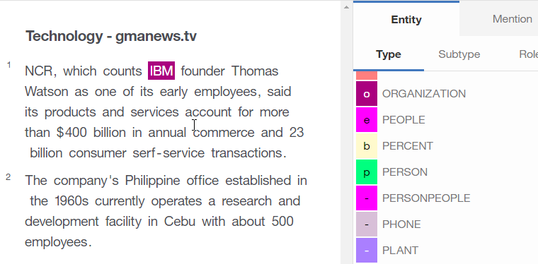

---

copyright:
  years: 2015, 2018
lastupdated: "2018-04-04"

---

{:shortdesc: .shortdesc}
{:new_window: target="_blank"}
{:tip: .tip}
{:pre: .pre}
{:codeblock: .codeblock}
{:screen: .screen}
{:javascript: .ph data-hd-programlang='javascript'}
{:java: .ph data-hd-programlang='java'}
{:python: .ph data-hd-programlang='python'}
{:swift: .ph data-hd-programlang='swift'}

本文档适用于 {{site.data.keyword.cloud}} 上的 {{site.data.keyword.knowledgestudiofull}}。要查看 {{site.data.keyword.IBM_notm}} Marketplace 上先前版本的 {{site.data.keyword.knowledgestudioshort}} 的文档，[请单击此链接 ](https://console.bluemix.net/docs/services/knowledge-studio/tutorials-create-ml-model.html){: new_window}。
{: tip}

# 创建机器学习模型
{: #wks_tutml_intro}

本教程帮助您了解构建机器学习模型的过程，机器学习模型可与其他 {{site.data.keyword.watson}} 服务一起部署和使用。
{: shortdesc}

## 学习目标

完成此教程中的课程后，您将了解如何执行以下任务：

- 创建文档集
- 对文档进行预注释
- 为人类注释者创建任务
- 分析注释者间一致性并对已注释文档中的冲突进行裁定
- 创建机器学习注释器

完成本教程约需 60 分钟。如果要研究与本教程相关的其他概念，那么可能需要更长时间。

## 开始之前

- 使用受支持的浏览器。有关信息，请参阅[浏览器需求](/docs/services/watson-knowledge-studio/system-requirements.html)。
- 您已成功完成[教程：创建工作空间](/docs/services/watson-knowledge-studio/tutorials-create-project.html)。
- 您必须至少有一个用户标识为 Admin 或 ProjectManager 角色。

    > **注：**如果可能，请将多个用户标识用于本教程中的机器学习模型任务（一个 Admin 或 ProjectManager 用户标识，以及至少两个 HumanAnnotator 用户标识）。使用多个用户标识可提供实际 {{site.data.keyword.IBM_notm}} {{site.data.keyword.watson}}™ {{site.data.keyword.knowledgestudioshort}} 工作空间的最现实模拟，其中项目经理必须协调并裁定多个人类注释者执行的注释。但是，如果只有权访问单个用户标识，那么仍可模拟该过程的大部分内容。

    有关用户角色的信息，请参阅[组建团队](/docs/services/watson-knowledge-studio/team.html)。

## 结果

完成本教程后，您将具有可用于其他 {{site.data.keyword.watson}} 服务的定制机器学习模型。

## 第 1 课：添加文档以进行注释
{: #tut_lessml1}

在本课程中，您将学习如何在 {{site.data.keyword.knowledgestudioshort}} 中向工作空间添加人类注释者可进行注释的文档。

### 关于本任务

有关添加文档的更多信息，请参阅[向工作空间添加文档](/docs/services/watson-knowledge-studio/documents-for-annotation.html#wks_projadd)。

### 过程

1. 将 <a target="_blank" href="https://watson-developer-cloud.github.io/doc-tutorial-downloads/knowledge-studio/documents-new.csv" download>`documents-new.csv`</a> 文件下载到计算机。此文件包含适合上传的示例文档。
1. 在工作空间内，单击侧边栏中的**文档**。
1. 在“文档”页面上，单击**上传文档集**。
1. 从计算机中选择 `documents-new.csv` 文件，然后单击**上传**。将在表中显示上传的文件。

### 后续步骤

现在，您可以将语料库划分为多个文档集，并将文档集分配给人类注释者。

## 第 2 课：创建注释集
{: #wks_tutless_ml2}

在本课程中，您将学习如何在 {{site.data.keyword.knowledgestudioshort}} 中创建注释集。

### 关于本任务

注释集是您从上传的文档集内分配给人类注释者的文档子集。人类注释者会对注释集内的文档进行注释。要稍后使用注释者间分数来比较每个人类注释者添加的注释，必须至少将两个人类注释者分配给不同的注释集。您还必须指定一定百分比的文档在各集合之间重叠。

> **注：**在真实工作空间中，您将根据在工作空间中工作的人类注释者数量，创建所需数量的注释集。在本教程中，您将创建两个注释集；如果您无权访问多个用户标识，那么可将两个注释集分配给同一个用户。

有关注释集的更多信息，请参阅[创建和分配注释集](/docs/services/watson-knowledge-studio/documents-for-annotation.html#wks_projdocsets)。

### 过程

1. 在工作空间内，单击侧边栏中的**文档**。
1. 单击**创建注释集**。

    这将打开“创建注释集”窗口。缺省情况下，此窗口显示基本集（包含所有文档）以及可用于为新注释集指定信息的字段。

1. 单击**添加另一个集合和人类注释者**来为其他注释集添加字段。您可以单击以添加想要创建的任意数量的注释集；对于本教程，只需创建两个。

    

1. 在**重叠**字段中，指定 `100`。这指定您想要将基本集内 100% 的文档包含在所有新注释集内，以便所有人类注释者可对它们进行注释。
1. 对于您要创建的每个新注释集，指定必填信息。

    - 在**注释者**字段中，选择要分配给新注释集的人类注释者用户标识。应将每个注释集分配给不同的人类注释者。

        > **注：**如果您只有一个管理员标识用于教程，请将该用户分配给所有注释集。在真实工作空间中，您将有多个人类注释者可供分配，但对于本教程，管理员可以充当人类注释者。

    - 在**集合名称**字段中，指定注释集的描述性名称（例如，`Set 1` 或 `DaveSet`）。

1. 单击**生成**。

### 结果

新注释集将得以创建，并且现在显示在“文档”页面的**注释集**选项卡中。

## 第 3 课：使用基于字典的注释器进行预注释
{: #wks_tutless_ml3}

在本课程中，您将学习如何使用基于字典的注释器在 {{site.data.keyword.knowledgestudioshort}} 中对文档进行预注释。

### 关于本任务

对文档进行预注释是一个可选步骤。然而，执行此步骤很值得，因为它可简化后续人类注释者的工作。

有关使用基于字典的注释器进行预注释的更多信息，请参阅[使用字典预注释器对文档进行预注释](/docs/services/watson-knowledge-studio/preannotation.html#wks_preannot)。

### 过程

1. 在工作空间内，从**资产和工具** > **预注释器**侧边栏中，单击**管理字典**。

  这将打开 `Test dictionary` 字典。

1. 从**实体类型**列表，选择 **ORGANIZATION** 以将 ORGANIZATION 实体类型映射至在*创建工作空间*教程的[添加字典](/docs/services/watson-knowledge-studio/tutorials-create-project.html#wks_tutless4)课程中创建的 `Test dictionary` 字典。
1. 单击左上方的后退箭头以返回至“预注释器”页面，然后单击**应用此预注释器**。
1. 在“运行注释器”页面上，单击复选框以选择先前在教程中创建的两个注释集（不包括基本集）。
1. 单击**运行**。

    

### 结果

使用创建的字典注释器对所选集合内的文档进行了预注释。稍后，可以通过单击**应用此预注释器**，使用相同注释器来对其他文档集进行预注释。

## 第 4 课：创建注释任务
{: #wks_tutless_ml4}

在本课程中，您将学习如何使用注释任务在 {{site.data.keyword.knowledgestudioshort}} 中跟踪人类注释者的工作。

### 关于本任务

有关注释任务的更多信息，请参阅[创建注释任务](/docs/services/watson-knowledge-studio/annotate-documents.html#wks_hatask)。

### 过程

1. 在工作空间内，从**资产和工具** > **文档**侧边栏中，选择**任务**选项卡。
1. 在“任务”页面上，单击**添加任务**。
1. 指定任务的详细信息：

    - 在**任务名称**字段中，输入 `Test`。
    - 在**截止期限**字段中，选择未来的日期。

1. 单击**创建**。
1. 在“向任务添加注释集”窗口中，单击复选框以选择在[第 3 课：使用基于字典的注释器进行预注释](/docs/services/watson-knowledge-studio/tutorials-create-ml-model.html#wks_tutless_ml3)中创建的两个注释集。这指定作为此任务的一部分，这两个注释集必须由其分配的人类注释者进行注释。
1. 单击**创建任务**。
1. 要在将来查看人工注释工作的进度，您可以单击任务以将其打开。

## 第 5 课：注释文档
{: #wks_tutless_ml5}

在本课程中，您将学习如何使用参考标准编辑器以在 {{site.data.keyword.knowledgestudioshort}} 中注释文档。

### 关于本任务

有关人工注释的更多信息，请参阅[使用参考标准编辑器的注释](/docs/services/watson-knowledge-studio/user-guide.html#wks_hagte)。

### 过程

1. 以分配给在[第 4 课：创建注释任务](/docs/services/watson-knowledge-studio/tutorials-create-ml-model.html#wks_tutless_ml4)中创建的注释任务的人类注释者身份，登录到 {{site.data.keyword.knowledgestudioshort}}。

    > **注：**如果对于本教程您只有权访问单个管理员标识，那么可使用该标识来执行人工注释。但是，请记住，在真实工作空间中，人工注释由具有 HumanAnnotator 角色的多个不同用户执行。

1. 打开 `My workspace` 工作空间。
1. 从侧边栏中，单击**文档注释** > **关系**。
1. 打开在[第 4 课：创建注释任务](/docs/services/watson-knowledge-studio/tutorials-create-ml-model.html#wks_tutless_ml4)中创建的 `Test` 注释任务。
1. 滚动至 *Technology - gmanews.tv* 文档并单击以将其打开进行注释。请注意，已使用 ORGANIZATION 实体类型注释术语 `IBM`；此注释是由字典预注释器在[第 2 课：创建注释集](/docs/services/watson-knowledge-studio/tutorials-create-ml-model.html#wks_tutless_ml2)中添加的。此预注释是正确的，因此无需进行修改。

    

1. 对提及项进行注释：

    1. 单击**提及项**图标以开始对提及项进行注释。
    1. 在文档正文中，选择文本 `Thomas Watson`。
    1. 在实体类型列表中，单击 **PERSON**。实体类型 PERSON 将应用于选中的提及项。

        

1. 单击侧边栏中的**文档注释** > **关系**以开始对关系进行注释。
1. 选择 `Thomas Watson` 和 `IBM` 提及项（按照该顺序）。要选择提及项，请单击文本上方的实体类型标签。
1. 在关系类型列表中，单击 **founderOf**。将使用 founderOf 关系连接这两个提及项。

    

1. 从状态菜单中，选择**已完成**，然后单击**保存**按钮。
1. 返回至文档列表，然后单击**提交所有文档**以提交文档进行核准。

    > **注：**在现实情境中，您将创建多得多的注释并完成集合内的所有文档，然后再进行提交。

1. 以在注释任务中分配给其他文档集的人类注释者身份，登录到 {{site.data.keyword.knowledgestudioshort}}。
1. 在 *Technology - gmanews.tv* 文档中重复相同注释，但这次使用 employedBy 关系而不是 founderOf 关系。

  以其他用户身份登录将有助于说明下一课中的注释者间一致性。请完成注释并单击**提交所有文档**。

## 第 6 课：分析注释者间一致性
{: #wks_tutless_ml6}

在本课程中，您将学习如何在 {{site.data.keyword.knowledgestudioshort}} 中比较多个人类注释者的工作。

### 关于本任务

要确定不同人类注释者是否一致地注释重叠文档，请检查注释者间一致性 (`IAA`) 分数。

{{site.data.keyword.knowledgestudioshort}} 通过在任务中检查所有文档集内的所有重叠文档来计算 IAA 分数，而与文档集的状态无关。IAA 分数显示不同的人类注释者如何对提及项、关系和指代链进行注释。最好定期检查 IAA 分数并验证人类注释者是否相互保持一致。

在本教程中，人类注释者提交了所有文档集以供核准。如果注释者间一致性分数可接受，那么您可核准这些文档集。如果拒绝某个文档集，那么会将其返回给人类注释者以进行改进。

### 过程

1. 以管理员身份登录到 {{site.data.keyword.knowledgestudioshort}}，选择**资产和工具** > **文档**，然后单击 `Test` 任务。

  在**状态**列中，您可以看到文档集已提交。

1. 单击**计算注释者间一致性**。
1. 通过单击第一个菜单，查看提及项、关系和指代链的 IAA 分数。您还可以按人类注释者对来查看一致性。例如，您可以将 Dave 的所有注释与 Phil 的所有注释进行比较。您还可以按特定文档查看一致性。例如，您可以查看某个文档上 Dave 的注释，对照同一文档上 Phil 的注释。通常，分数目标是 0.8（总分为 1），其中 1 表示完全一致。因为在本教程中仅注释了两个实体类型，所以大部分实体类型分数为 N/A（不适用），这意味着无可用信息，无法给出分数。

    *图 1. 通过名为 Dave 和 Phil 的用户查看注释者间分数*

    

1. 在查看分数后，您可以决定是想要核准还是拒绝处于 `Submitted` 状态的文档集。提交文档集后，会在其名称旁边会显示一个复选框。请执行下列其中一个操作：

    - 如果某个文档集的分数可接受，请选中该复选框并单击**接受**。不与其他文档集重叠的文档将提升为参考标准。重叠的文档必须首先通过裁定进行复查，以便可以解决冲突。对于本教程，请接受这两个文档集。
    - 如果某个文档集的分数不可接受，请选中该复选框并单击**拒绝**。人类注释者需要重新访问文档集以改进注释。

### 结果

对注释者间一致性分数求值后，您看到不同的注释者对如何对同一文档进行注释。如果注释者间一致性分数可接受，那么您已接受该文档集。

## 第 7 课：对已注释文档中的冲突进行裁定
{: #wks_tutless_ml7}

在本课程中，您将学习如何在 {{site.data.keyword.knowledgestudioshort}} 中裁定文档集之间重叠的文档中的冲突。

### 关于本任务

在核准文档集时，仅不与其他文档集重叠的文档才会提升为参考标准。如果某个文档是多个文档集之间的重叠部分，那么必须先裁定任何注释冲突，然后才能将该文档提升为参考标准。

### 过程

1. 以管理员身份登录到 {{site.data.keyword.knowledgestudioshort}}，选择**资产和工具** > **文档**，然后单击 `Test` 任务。
1. 验证这两个文档集是否处于已核准状态。
1. 单击**检查重叠文档以查找冲突**。

    您可以看到由多个人类注释者注释的重叠文档。

1. 要查看注释文档的方式中是否有任何冲突，请单击**检查冲突**。
1. 在裁定方式中，您可以查看冲突的注释数量并在将文档提升为参考标准之前除去或替换注释。
1. 对于本教程，假定您已纠正所有冲突并接受了更改。单击**提升为参考标准**。重复这些步骤以解决第二个文档集内的冲突。

    或者，您可以通过单击“文档”页面上的**接受**来将文档提升为参考标准。

### 结果

在解决注释冲突并将文档提升为参考标准后，您可以使用这些文档来培训机器学习模型。

## 第 8 课：创建机器学习模型
{: #wks_tutless_ml8}

在本课程中，您将学习如何在 {{site.data.keyword.knowledgestudioshort}} 中创建机器学习模型。

### 关于本任务

在创建机器学习模型时，请选择要用于对其进行培训的文档集。您还可以指定要用作培训数据、测试数据和盲区数据的文档的百分比。只有通过核准或裁定成为参考标准的文档才能用于培训机器学习模型。

### 过程

1. 以管理员身份登录到 {{site.data.keyword.knowledgestudioshort}}。
1. 从**模型管理** > **性能**侧边栏中，单击**培训和评估**。
1. 选择要用于创建机器学习模型的文档集。单击每个文档集名称旁边的复选标记。
1. 选择两个注释集以创建测试、培训和盲区数据。然后，单击**培训和评估**。

    > **注：**培训可能需要 10 分钟以上，甚或数小时，具体取决于人工注释的数量和各文档中的总字数。

1. 在培训机器学习模型后，您可以将其导出，或者通过单击每个图形上方的**详细统计信息**链接来查看有关其性能的详细信息。
1. 要查看“培训/测试/盲区集”页面，请单击**培训和评估**按钮。
1. 要查看人类注释者处理过的文档，请单击**查看参考标准**。
1. 要查看已培训机器学习模型在同一文档集上创建的注释，请单击**查看解译结果**。
1. 要查看有关机器学习模型的精度、召回率和 F1 分数的详细信息，请选择“性能”页面。
1. 单击每个图形上方的**详细统计信息**链接。在这些“统计信息”页面上，您可以使用单选按钮来查看提及项、关系和指代链的分数。

    您可以通过查看实体类型、关系类型和指代链的统计信息摘要来分析性能。您还可以通过从缺省为**摘要**的菜单中选择**混淆矩阵**，分析混淆矩阵中提供的统计信息。*混淆矩阵*帮助您将机器学习模型添加的注释与参考标准中的注释进行比较。

    > **注：**在本教程中，您仅使用组织的单个字典来注释文档。因此，对于除了 `ORGANIZATION` 之外的大部分实体类型，您看到的分数为 `0` 或 `N/A`。数字较低，但这是预期值，因为您尚未执行任何人工注释或纠正。

    *图 2. 机器学习模型的“统计信息”页面上的选项*

    

1. 从侧边栏中，选择**模型管理** > **版本**。在“版本”页面上，您可以针对模型和用于创建该模型的资源生成快照（字典和注释任务除外）。例如，在重新培训模型之前，您可能想要创建快照。如果下次对其进行培训时统计信息更差，那么可以提升旧版本并删除返回更差结果的版本。

### 结果

您创建了一个机器学习模型，对其进行了培训，并评估了该模型在注释测试数据和盲区数据时的表现情况。通过探索性能度量值，您可以识别提高机器学习模型准确性的方法。

## 教程小结
{: #wks_tutml_sum}

在学习 {{site.data.keyword.knowledgestudioshort}} 时，您创建了机器学习模型。

### 已学课程

通过完成本教程，您学习了以下概念：

- 文档集
- 机器学习模型
- 人工注释任务
- 注释者间一致性和裁定
