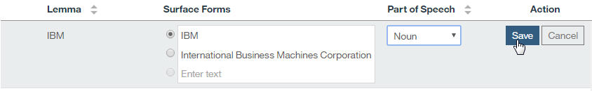

---

copyright:
  years: 2015, 2018
lastupdated: "2018-04-04"

---

{:shortdesc: .shortdesc}
{:new_window: target="_blank"}
{:tip: .tip}
{:pre: .pre}
{:codeblock: .codeblock}
{:screen: .screen}
{:javascript: .ph data-hd-programlang='javascript'}
{:java: .ph data-hd-programlang='java'}
{:python: .ph data-hd-programlang='python'}
{:swift: .ph data-hd-programlang='swift'}

本文档适用于 {{site.data.keyword.cloud}} 上的 {{site.data.keyword.knowledgestudiofull}}。要查看 {{site.data.keyword.IBM_notm}} Marketplace 上先前版本的 {{site.data.keyword.knowledgestudioshort}} 的文档，[请单击此链接 ](https://console.bluemix.net/docs/services/knowledge-studio/tutorials-create-project.html){: new_window}。
{: tip}

# {{site.data.keyword.knowledgestudioshort}} 入门
{: #wks_tutintro}

本 {{site.data.keyword.knowledgestudiofull}} 教程帮助您执行在开始任何其他教程前必须完成的先决条件任务。
{: shortdesc}

## 开始之前
{: #prereq}

确认您正在使用受支持的浏览器。有关信息，请参阅[浏览器需求](/docs/services/watson-knowledge-studio/system-requirements.html)。

## 创建服务实例
{: #instance}

1. 如果尚未登录，[请注册 {{site.data.keyword.ibmid}} ](https://console.bluemix.net){: new_window}，并登录到 {{site.data.keyword.cloud_notm}}。
1. 从[“仪表板”页面 ](https://console.bluemix.net/dashboard/apps){: new_window}，注册 {{site.data.keyword.knowledgestudioshort}} 套餐。

  1. 单击**目录**。
  1. 在搜索字段中，删除 **label:lite** 过滤器（如果存在）并搜索 `{{site.data.keyword.knowledgestudioshort}}`。
  1. 选择 **{{site.data.keyword.knowledgestudioshort}}**。
  1. 如果您没有[现买现付帐户或预订帐户 ](https://console.bluemix.net/docs/pricing/index.html){: new_window}，那么在 {{site.data.keyword.knowledgestudioshort}} 目录页面上，单击**升级**。将提示您提供信用卡信息。

    如果选择 {{site.data.keyword.knowledgestudioshort}} 免费套餐，那么将不会对信用卡收费。您可以免费使用免费套餐，且无时间限制。
    {: tip}

1. 在注册套餐后，启动 {{site.data.keyword.knowledgestudioshort}}。

  要完成本教程，您必须至少具有一个可在 {{site.data.keyword.knowledgestudioshort}} 中使用的用户标识。此用户标识必须具有 Admin 角色。如果已注册免费套餐，那么作为唯一用户，您具有 Admin 角色。有关用户角色的信息，请参阅[组建团队](/docs/services/watson-knowledge-studio/team.html)。

## 第 1 课：分配用户角色
{: #wks_tutless1}

在本课程中，您将了解可在 {{site.data.keyword.knowledgestudioshort}} 中分配给用户的不同角色。

### 关于本任务

创建机器学习模型需要主题专家、项目经理以及可理解并解释统计模型的用户提供输入。管理员将角色分配给每个用户，以便他们具有其任务的相应权限。有关用户角色的更多信息，请参阅[组建团队](/docs/services/watson-knowledge-studio/team.html)。

### 过程

1. 使用管理员标识登录到 {{site.data.keyword.knowledgestudioshort}}。
1. 单击“设置”图标以打开“服务详细信息”页面。该页面列出注册为 {{site.data.keyword.knowledgestudioshort}} 用户的所有用户标识。每个用户标识都具有以下角色之一（按所包含许可权的递减顺序）：

    - Admin
    - ProjectManager
    - HumanAnnotator

    有关用户角色的更多信息，请参阅[组建团队](/docs/services/watson-knowledge-studio/team.html)。

1. 请验证是否至少有一个用户具有 Admin 角色。具有此角色的用户标识可创建工作空间并充当项目经理或人类注释者。
1. 如果您具有其他用户标识的访问权，请验证是否至少有两个用户具有 HumanAnnotator 角色。

    > **注：**创建现实模型通常涉及多个人类注释者以及一名管理员或项目经理。但是，针对本教程的用途，您可以使用单个用户标识继续。

1. 可选：更改分配给用户标识的角色。在用户标识所在的表行的**操作**列中单击**修改帐户设置**图标，然后更改分配的用户角色。

    > **注：**您可以将用户标识升级为具有更高许可权的角色，但是无法将具有 Admin 或 ProjectManager 角色的用户降级为 HumanAnnotator 角色。

## 第 2 课：创建工作空间
{: #wks_tutless2}

在本课程中，您将学习如何在 {{site.data.keyword.knowledgestudioshort}} 中创建工作空间。

### 关于本任务

工作空间定义创建机器学习模型所需的所有资源，包括培训文档、类型系统、字典以及由人类注释者添加的注释。有关创建工作空间的更多信息，请参阅[创建工作空间](/docs/services/watson-knowledge-studio/create-project.html)。

### 过程

1. 以 {{site.data.keyword.knowledgestudioshort}} 管理员身份从 {{site.data.keyword.cloud_notm}} [仪表板 ](https://console.bluemix.net/dashboard/apps/){:new_window}，启动 {{site.data.keyword.knowledgestudioshort}} 服务。
1. 单击**创建工作空间**。
1. 指定新工作空间的详细信息：

    - 在**工作空间名称**字段中，输入 `My workspace`。
    - 在**工作空间描述**字段中，输入 `Watson Knowledge Studio tutorial workspace`。
    - 在**文档语言**字段中，使用缺省值**英语**。将用于本教程的样本文件使用的是英语。

1. 单击**创建**。

### 结果

将创建并自动打开工作空间。

### 后续步骤

现在，您可以开始配置工作空间资源，例如，类型系统。

## 第 3 课：创建类型系统
{: #wks_tutless3}

在本课程中，您将学习如何在 {{site.data.keyword.knowledgestudioshort}} 中上传和修改类型系统。必须在开始任何注释任务之前创建或上传类型系统。

### 关于本任务

有关类型系统的更多信息，请参阅[类型系统](/docs/services/watson-knowledge-studio/typesystem.html#wks_typesystem)。

### 过程

1. 将 <a target="_blank" href="https://watson-developer-cloud.github.io/doc-tutorial-downloads/knowledge-studio/en-klue2-types.json" download>en-klue2-types.json</a> 文件下载到计算机。此文件包含一个示例 KLUE 类型系统。
1. 从侧边栏中，单击**资产和工具** > **实体类型**。
1. 在“实体类型”页面上，单击**上传**。
1. 从计算机中选择 `en-klue2-types.json` 文件，然后单击**上传**。将在表中显示上传的类型系统。
1. 浏览类型系统，以便可查看上传的数据。
1. 编辑实体类型：

    1. 找到 MONEY 实体类型。
    1. 双击表行中的任意位置以编辑实体类型。
    1. 在**角色**列中，单击 AWARD 角色旁边的**删除角色**图标 。

        

    1. 单击**保存**。

### 后续步骤

完成对类型系统的更改后，可以开始向工作空间添加文档。

## 第 4 课：添加字典
{: #wks_tutless4}

在本课程中，您将学习如何在 {{site.data.keyword.knowledgestudioshort}} 中向工作空间添加字典。字典用于在创建机器学习模型时对文本进行预注释。

### 关于本任务

有关字典的更多信息，请参阅[向工作空间添加字典](/docs/services/watson-knowledge-studio/dictionaries.html#wks_projdictionaries)。

### 过程

1. 将 <a target="_blank" href="https://watson-developer-cloud.github.io/doc-tutorial-downloads/knowledge-studio/dictionary-items-organization.csv" download>`dictionary-items-organization.csv`</a> 文件下载到计算机。此文件包含 CSV 格式的字典术语，适合上传到 {{site.data.keyword.knowledgestudioshort}} 字典。
1. 从**资产和工具** > **预注释器**侧边栏中，选择**字典**选项卡，然后单击**管理字典**。
1. 单击**创建字典**以添加字典。

    > **注：**请勿单击**上传字典**，这用于上传您想要按原样使用的字典。对于本教程，您将创建新的可编辑字典，然后向其上传术语。

1. 在**名称**字段中，输入 `Test dictionary`，然后单击**保存**以创建（空）字典。

    这样将创建新字典并自动打开该字典以进行编辑。

1. 在字典窗格中，单击**上传**。
1. 在“上传字典条目”窗口中，从您的计算机中选择 `dictionary-items-organization.csv` 文件，然后单击**上传**。这会将文件中的术语上传到字典中。
1. 单击**添加条目**以创建新术语。将在表的顶部添加一个可编辑的行。
1. 在**表面形式**列中，在单独的行中分别输入 `IBM` 和 `International Business Machines Corporation`。（在开始输入新的表面形式时，在下方添加了一个空格，以用于另一个表面形式。）将 `IBM` 旁边的单选按钮保持选中状态，这指示 `IBM` 是词元。
1. 在**词性**列中，选择**名词**。
1. 单击**保存**。

    

### 后续步骤

创建字典后，您可以将其用于通过对文档进行预注释来加快人工注释任务。

## 教程小结
{: #wks_tutsum}

在学习 {{site.data.keyword.knowledgestudioshort}} 时，您创建了工作空间并向其添加了工件。

### 已学课程

通过完成本教程，您学习了以下概念：

- 工作空间
- 类型系统
- 字典
