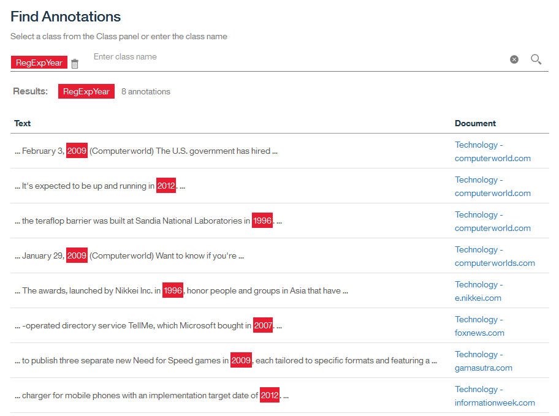

---

copyright:
  years: 2015, 2018
lastupdated: "2018-07-17"

---

{:shortdesc: .shortdesc}
{:new_window: target="_blank"}
{:tip: .tip}
{:pre: .pre}
{:codeblock: .codeblock}
{:screen: .screen}
{:javascript: .ph data-hd-programlang='javascript'}
{:java: .ph data-hd-programlang='java'}
{:python: .ph data-hd-programlang='python'}
{:swift: .ph data-hd-programlang='swift'}

本文档适用于 {{site.data.keyword.knowledgestudiofull}} on {{site.data.keyword.cloud}}。要查看 {{site.data.keyword.knowledgestudioshort}} on {{site.data.keyword.IBM_notm}} Marketplace 先前版本的文档，请[单击此链接 ](https://{DomainName}/docs/services/knowledge-studio/tutorials-create-rule-model.html){: new_window}。
{: tip}

# 创建基于规则的模型
{: #wks_tutrule_intro}

本教程帮助您了解如何创建基于规则的模型，您可以使用该模型来查找在文档中定义的文本模式。
{: shortdesc}

您将构建一个模型，该模型可在文档中查找匹配模式 `month day, year` 的文本。例如，模型将查找日期引用 *May 1, 2010*。在定义规则模式本身之前，您将创建可帮助构建模式的工件，包括可识别月份提及项的字典类和可识别文本中的年份提及项的正则表达式类。

## 学习目标
{: #objectives}

在完成本教程后，您将知道如何执行以下任务：

- 创建类
- 添加用于定义规则的文档
- 将字典与类相关联
- 定义正则表达式以捕获字符序列
- 定义规则

完成本教程约需 30 分钟。如果要研究与本教程相关的其他概念，那么可能需要更长时间。

## 开始之前
{: #prereqs}

- 使用受支持的浏览器。有关信息，请参阅[浏览器需求](/docs/services/watson-knowledge-studio/system-requirements.html)。
- 您已成功完成 [{{site.data.keyword.knowledgestudioshort}} 入门](/docs/services/watson-knowledge-studio/tutorials-create-project.html)，包括创建工作空间、创建类型系统和添加字典。
- 您必须至少有一个用户标识为“管理员”或“项目经理”角色。有关用户角色的信息，请参阅 [{{site.data.keyword.knowledgestudioshort}} 中的用户角色](/docs/services/watson-knowledge-studio/roles.html)。

## 结果
{: #results}

创建基于规则的模型后，可以按以下某种方式将其用于在文档中查找文本模式：

- 在创建机器学习模型之前[对文档进行预注释](/docs/services/watson-knowledge-studio/preannotation.html#wks_preannotrule)
- [部署或导出模型](/docs/services/watson-knowledge-studio/rule-annotator-model-use.html)至其他 {{site.data.keyword.watson}} 服务或产品

## 第 1 课：添加月份字典
{: #wks_tutless_rule1}

在本课程中，您将学习如何在 {{site.data.keyword.knowledgestudioshort}} 中向工作空间添加字典。该字典包含与一年中的月份相关的术语。

### 关于本任务
{: #wks_tutless_rule1_about}

在稍后的课程中，您将基于此字典定义类。在创建该类时，会将此字典内出现在文档中的所有术语自动注释为关联类类型的提及项。有关字典的更多信息，请参阅[向工作空间添加字典](/docs/services/watson-knowledge-studio/dictionaries.html#wks_projdictionaries)。

### 过程
{: #wks_tutless_rule1_procedure}

1. 将 <a target="_blank" href="https://watson-developer-cloud.github.io/doc-tutorial-downloads/knowledge-studio/dictionary-items-month.csv" download>`dictionary-items-month.csv` </a> 文件下载到计算机。此文件包含 CSV 格式的字典术语，适合上传到 {{site.data.keyword.knowledgestudioshort}} 字典。
2. 单击**资产** > **字典**。
3. 单击**创建字典**按钮以添加字典。
4. 在**名称**字段中，输入 `Month dictionary`，然后单击**保存**以创建字典。这样将创建新字典并自动打开该字典以进行编辑。
5. 在字典窗格中，单击**上传**。
6. 从计算机中选择 `dictionary-items-month.csv` 文件，然后单击**上传**。

    这会将文件中的术语导入到字典中。

## 第 2 课：添加样本文档
{: #wks_tutless_rule2}

在本课程中，您将学习如何使用说明您要定义的规则类型的语言模式来添加文档。

### 关于本任务
{: #wks_tutless_rule2_about}

有关添加文档的更多信息，请参阅[添加用于定义规则的文档](/docs/services/watson-knowledge-studio/rule-annotator-add-doc.html)。

### 过程
{: #wks_tutless_rule2_procedure}

1. 将 <a target="_blank" href="https://watson-developer-cloud.github.io/doc-tutorial-downloads/knowledge-studio/documents-new.csv" download>`documents-new.csv` </a> 文件下载到计算机。此文件包含适合上传的示例文档。
1. 单击**基于规则的模型** > **规则**。
1. 单击**文档**页面标题旁边的**添加文档**图标。
1. 单击**上传 CSV 文件**选项卡。
1. 单击以浏览先前下载到计算机的 `documents-new.csv` 文件，然后单击**上传**。

    此时将在主“文档”页面中显示一组文档。

    

## 第 3 课：创建类
{: #wks_tutless_rule3}

在本课程中，您将学习如何定义在定义规则时将使用的类。

### 关于本任务
{: #wks_tutless_rule3_about}

有关类的更多信息，请参阅[规则](/docs/services/watson-knowledge-studio/rule-annotator.html)。

### 过程
{: #wks_tutless_rule3_procedure}

1. 从工作空间的**规则**页面，单击右侧面板中**类**标题旁边的**添加类**图标。
1. 输入 `DictMonth` 作为类名，然后单击**添加**。

    此时将在“类”侧面板中显示新类。

## 第 4 课：将字典与类相关联
{: #wks_tutless_rule4}

在本课程中，您将学习如何在规则编辑器中使用字典。

### 过程
{: #wks_tutless_rule4_procedure}

1. 单击**基于规则的模型** > **规则**，然后单击**字典**选项卡。
2. 选择您先前创建的 **Month dictionary**。
3. 从**类**列表中，选择 `DictMonth`，然后单击**保存**。

    该类将与字典相关联。

    

### 结果
{: #wks_tutless_rule4_results}

对于与规则编辑器相关联的文档，对字典中术语的任何引用都将注释为 `DictMonth` 类提及项。您将在下一课中看到有关已注释这些引用的证明。

## 第 5 课：在文档中查找类注释
{: #wks_tutless_rule5}

在本课程中，您将学习如何在规则编辑器文档中查找类注释。

### 过程
{: #wks_tutless_rule5_procedure}

1. 选择**基于规则的模型** > **规则**。
2. 从“类”面板中，查找先前定义的 `DictMonth` 类，然后单击旁边的**搜索文档中的注释**图标。

    这样会显示“查找注释”页面，并显示包含月份的文本引用的所有文档。

3. 单击 `Technology - computerworld.com` 文档以查看完整文档。请注意，将突出显示文本 `February`，这意味着它已注释为 `DictMonth` 类的提及项。

## 第 6 课：定义正则表达式
{: #wks_tutless_rule6}

在本课程中，您将学习如何定义正则表达式。

### 关于本任务
{: #wks_tutless_rule6_about}

您将定义可查找诸如 `2009` 之类的年份模式的正则表达式。

有关定义正则表达式的更多信息，请参阅[定义规则](/docs/services/watson-knowledge-studio/rule-annotator-define-rule.html)。

### 过程
{: #wks_tutless_rule6_procedure}

1. 从**规则**页面，单击右侧面板中**类**旁边的**添加类**图标 。
1. 输入 `RegExpYear` 作为类名，然后单击**添加**。
1. 单击**正则表达式**选项卡，然后单击**正则表达式**标题旁边的**创建正则表达式**图标。
1. 单击**添加条目**。
1. 在**正则表达式**字段中，输入在 `1900` 和 `2099` 之间查找年份的以下表达式：

    ```
    (?:(?:19|20)[0-9]{2})
    ```
    {: screen}

1. 将**最少字记号数**设置为 `1`，并将**最多字记号数**设置为 `1`。
1. 单击**添加**以保存正则表达式条目。
1. 输入 `MyYearExp` 作为正则表达式名称，然后从**类**菜单中，选择先前定义的 `RegExpYear` 类。
1. 单击**保存**。

    在保存正则表达式后，会自动将其应用于样本文档。遵循在正则表达式中定义的模式的任何文本字符串将注释为 `RegExpYear` 类的提及项。

1. 要检查定义的表达式是否正确捕获时间出现实例，您可以搜索提及项。单击“类”面板中 **RegExpYear** 类旁边的`搜索文档中的注释`图标。

    

    此时将显示“查找注释”页面。年份提及项的出现实例将在所出现的样本文档中突出显示。

    

## 第 7 课：定义规则
{: #unique_1166829415}

在本课程中，您将学习如何定义规则。

### 关于本任务
{: #unique_1166829415_about}

您已定义了一个基于字典的类，用于对月份提及项进行注释。您还可以定义一个正则表达式，用于查找表示年份的数字值。现在，您将定义一个规则，用于捕获如下序列：一个月份，后跟一个数字、逗号，然后是一个年份。您将定义日期表达式的规则，如 *September 21, 2016*。

有关定义规则的更多信息，请参阅[定义规则](/docs/services/watson-knowledge-studio/rule-annotator-define-rule.html)。

### 过程
{: #unique_1166829415_procedure}

1. 选择**基于规则的模型** > **规则**，然后打开 `Technology - computerworld.com` 文档。
1. 选择文档中的文本 `February 3, 2009`。请确还保选择了逗号。

    

2. 单击**添加规则**图标。

    规则编辑器显示所标识的规则模式的描述。

    文本 `February 3, 2009` 可见。有一条实线连接描述中的单元格，可识别哪些单元格当前是模式的一部分。
    - `DictMonth` 类是规则模式的一部分，而不是文本 `February`。此选择是首选的选项，因为您想要模型查找 `DictMonth` 类注释为日期模式中第一个记号的任何月份，而不是仅文本 `February`。
    - 在规则结尾，年份 `2009` 已注释为 `RegExpYear` 类的提及项。`RegExpYear` 类是规则模式的一部分，而不是数字 2009。此选择也是首选的选项，因为您想要模型查找 `RegExpYear` 类注释为日期模式中最后一个记号的任何年份，而不是仅特定文本 `2009`。

    数字 3 及其后面的逗号 (,) 显示为模式中的第二个和第三个记号。由于当前已指定模式，因此该模型将仅查找指定月份第 3 天的日期出现实例。我们想要模型查找指定月份中任何一天的日期，因此接下来我们将更改天记号的功能设置。

3. 在天 `3` 单元格的上方，单击**文本**图标以打开记号的功能设置。

    

    当前，规则设置为与匹配精确文本 `3`。而我们想要它匹配任何数字。

4. 通过选择**字符类型：数字**，然后清除选项**文本：3**，将功能设置更改为数字。

    

    您已更改数字 `3` 单元格的定义。

    

    **字符类型**图标指示它可以是任何数字，而不要求数字恰好等于 3。

5. 请勿更改逗号记号的任何设置。

    我们想要模式中的第三个记号为逗号，因此**文本：,** 的当前功能设置是恰当的。除了功能设置外，每个记号还有一个重复设置。重复设置指定为使记号匹配模式，该记号可在文本中重复的次数。**必需（恰好为 1）**的当前重复设置是适当的。

    

6. 指定类以表示模式 `DictMonth + numeric token + comma + RegExpYear`。

    请注意四个空单元格表示从文档选择的四个记号。要选择所有单元格，请选择第一个单元格，然后在按下 Shift 键的同时单击其他每个单元格。输入 `RuleDate` 作为类名，然后单击以创建新类。

    

7. 在**规则名称**字段中，输入 `MyDateRule`，然后单击**保存**。

    在保存规则后，会自动将其应用于样本文档。如果 `Technology - computerworld.com` 文档仍在规则编辑器中打开，那么您将看到文档中的 `February 3, 2009` 文本现在注释为 RuleDate 类的提及项。

    

    您可以通过单击“类”面板中 `RuleDate` 类旁边的**搜索文档中的注释**图标 ，搜索样本文档中出现的所有 `RuleDate` 类提及项。最好检查是否正确捕获了所有日期，以确认您正确定义了模式。

    

## 第 8 课：创建基于规则的模型
{: #wks_tutless_rule8}

在本课程中，您将学习如何创建基于规则的模型。

### 关于本任务
{: #wks_tutless_rule8_about}

有关创建基于规则的模型的更多信息，请参阅[创建基于规则的模型](/docs/services/watson-knowledge-studio/rule-annotator-model-create.html)。

### 过程
{: #wks_tutless_rule8_procedure}

1. 选择**基于规则的模型** > **版本**，然后单击**基于规则的模型类型映射**选项卡。

1. 从类型系统将 `RuleDate` 类映射到 `DATE` 实体。

    1. 查找 `DATE` 实体，然后单击**编辑**。

        

    1. 从列表中选择 `RuleDate` 类，然后单击**保存**。

        

1. 要使用基于规则的模型对文档集或注释集进行预注释，请选择**基于规则的模型**选项卡，然后单击**运行此模型**。

## 教程小结
{: #wks_tutrule_sum}

在学习 {{site.data.keyword.knowledgestudioshort}} 时，您创建了基于规则的模型。

### 已学课程
{: #lessons_learned}

通过完成本教程，您学习了以下概念：

- 类
- 正则表达式
- 规则
