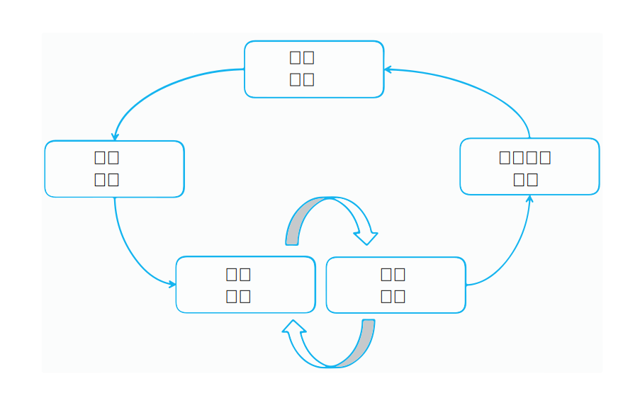

---

copyright:
  years: 2015, 2018
lastupdated: "2018-04-04"

---

{:shortdesc: .shortdesc}
{:new_window: target="_blank"}
{:tip: .tip}
{:pre: .pre}
{:codeblock: .codeblock}
{:screen: .screen}
{:javascript: .ph data-hd-programlang='javascript'}
{:java: .ph data-hd-programlang='java'}
{:python: .ph data-hd-programlang='python'}
{:swift: .ph data-hd-programlang='swift'}

此文件適用於 {{site.data.keyword.knowledgestudiofull}} on {{site.data.keyword.cloud}}。若要查看舊版 {{site.data.keyword.knowledgestudioshort}} on {{site.data.keyword.IBM_notm}} Marketplace 的文件，[請按一下此鏈結 ](https://console.bluemix.net/docs/services/knowledge-studio/annotate-documents.html){: new_window}。
{: tip}

# 註釋設定
{: #annotate-documents}

瞭解該產業及其語言的使用者必須註釋文件。
{: shortdesc}

執行下列作業，讓註釋人員能夠存取工作區：

- 邀請主題專家至您所使用的 {{site.data.keyword.knowledgestudioshort}} 實例。
- 關聯註釋人員與一個以上您希望他們註釋的註釋集。
- 建立作業，以指派註釋人員註釋集合中的文件。

    > **注意：**在您明確指派作業給註釋人員之後，他們才能在登入 {{site.data.keyword.knowledgestudioshort}} 時看到您的工作區。

您的使用者（註釋人員）需要熟悉[註釋文件](/docs/services/watson-knowledge-studio/user-guide.html)，其中包含如何註釋文件的詳細資訊。

## 模型生命週期
{: #wks_lifecycle}

您使用 {{site.data.keyword.knowledgestudioshort}} 建立的模型是可以插入自然語言處理程序 (NLP) 管線的軟體元件。

使用 {{site.data.keyword.knowledgestudioshort}}，您可以建立、評估及改善新領域的模型。模型會將註釋（meta 資料）新增至出現在自然語言內容中的文字。註釋可在您的領域內容中識別感興趣實體的提及項目、其間的關係以及提及項目如何互相參照相同的實體，應用程式可使用註釋來自動分析及處理文字。應用程式使用者可從這個分析層次中受益，因為他們可以擷取意義、探索見解，以及在自然語言上下文中取得答案。

建立模型是一個反覆運算的多步驟處理程序，包含數個階段：知識管理、產生基準、開發模型、評估模型以及部署運行環境。

### 端對端領域改寫
{: #wks_lifecycle__wks_lifecycleS6}

下圖彙總模型開發的這五個階段之間的互動，以及每一個階段中發生的一般活動。

圖 2. 五個模型開發階段的摘要，以及每一個階段發生的活動。

### 知識管理
{: #wks_lifecycle__wks_lifecycleS1}

此階段（在 {{site.data.keyword.knowledgestudioshort}} 外部）是指選取、收集、保留及維護特定領域相關內容的處理程序。管理會將值新增至資料；它會將資料轉換成受信任的資訊和知識。

### 產生基準
{: #wks_lifecycle__wks_lifecycleS2}

此階段是指使用 {{site.data.keyword.knowledgestudioshort}} 工具以及最佳作法來產生已審核資料的集合，其可用來將 {{site.data.keyword.watson}} 解決方案套用至特定領域。這個已審核資料（稱為*基準* 或*黃金標準文件*）的正確性很重要，因為基準不正確會造成根據該基準的應用程式也不正確。

教導 {{site.data.keyword.watson}} 新領域的基本部分，就是向其提供您領域內容中感興趣實體的相關知識、其間的關係以及實體如何相互參照。收集此知識包括下列活動：

- 讓領域主題專家建立下列資源，或識別您領域中可重複使用或修改的現有資源：

  - 註釋準則及範例，可協助註釋人員瞭解您領域內容中的單字和段落的註釋方式。
  - 類型系統，用於定義特定領域的類型（物件）及特性（資料分類），這些可透過文字分析在您的領域內容中探索到。類型系統控制註釋人員可以新增至文件的註釋類型。
  - 在您領域內容中要視為相等詞彙的詞彙字典。

- 建立代表您領域內容之文件的語料庫。
- 根據您新增至 {{site.data.keyword.knowledgestudioshort}} 工作區的字典，預先註釋文件。建立機器學習模型之後，您可以使用此模型來預先註釋您新增至語料庫的新文件。預先註釋是在機器學習模型可用之前，在可能的範圍內先用機器註釋文件的程序。預先註釋僅需要驗證機器註釋的正確性，即可取代部分人工註釋的建立作業，因此可以減少人工註釋的勞動力。
- 將文件分給註釋人員，然後註釋人員會使用 {{site.data.keyword.knowledgestudiofull}} 基準編輯器工具，以手動的方式將註釋新增至小型的文件集。
- 比較人工註釋結果並解決衝突。在此階段中，需要裁定來確保已正確並一致註釋的文件會升級成基準，而它們可用來訓練及測試機器學習模型。

### 模型開發
{: #wks_lifecycle__wks_lifecycleS3}

此階段是指使用 {{site.data.keyword.knowledgestudioshort}} 工具來建立模型。建立基準之後，人工註釋結果可用來訓練演算法，以自動新增註釋至大型文件集合，例如，包括數百萬份文件的集合。

### 模型評估
{: #wks_lifecycle__wks_lifecycleS4}

此階段是指使用 {{site.data.keyword.knowledgestudioshort}} 工具來調整模型及改善效能。針對基準文件的測試集來評估模型所產生的結果。*正確性分析* 會識別註釋錯誤的原因。*空餘空間分析* 可協助您評量需要聚焦的錯誤，以及如何修正模型可以產生最大的影響。調整可以反覆進行，以改善效能，直到達到令人滿意的正確性程度為止。

### 模型部署
{: #wks_lifecycle__wks_lifecycleS5}

此階段是指匯出可讓模型在機器學習運行環境中執行的元件，以及讓模型可供其他 {{site.data.keyword.watson}} 認知應用程式存取。例如，您可以部署機器學習模型，以供 {{site.data.keyword.Bluemix}}{{site.data.keyword.alchemyapishort}} 使用，或匯出要在 {{site.data.keyword.IBM_notm}}{{site.data.keyword.watson}} Explorer 中使用的模型。

## 建立註釋作業
{: #wks_hatask}

在註釋人員可以開始新增註釋至文件之前，註釋程序管理員必須先建立一個註釋作業。

### 關於本作業

註釋作業指定要註釋的文件。若要比較註釋人員的執行成效，以及查看註釋人員套用註釋準則的一致程度，您必須在此作業中至少併入兩位註釋人員。此外，某些百分比的文件必須在您新增至作業的所有註釋集中發生（您可以在建立註釋集時指定重疊百分比）。

#### 重要事項

- 註釋作業是一個暫存概念，存在的目的是要容許註釋人員在隔離的空間中註釋文字。它也會確保只有已核准的註釋才會升級成基準。
- 一個作用中作業一次可以內含一個註釋集。若要將某作業中的註釋集新增至其他作業，您必須先刪除該註釋集作用所在的作業。
- 如果您刪除註釋人員的使用者帳戶，也會影響他們的註釋。會刪除文件中已指派給該使用者但未升級成基準的所有註釋。
- 如果類型系統或基準編輯器設定在您建立人工註釋作業之後有所變更，您必須決定是否要將變更延伸至作業中。類型系統變更會影響註釋；註釋人員可能需要檢閱及更新他們的文件。
- 如果字典變更，變更不會反映在現行的註釋作業中。若要將資源變更套用至基準，您必須建立新的註釋作業。
- 每個工作區最多可以有 256 個註釋作業。

### 程序

若要建立註釋作業，請執行下列動作：

1. 以 {{site.data.keyword.knowledgestudioshort}} 管理者身分登入，並選取您的工作區。
1. 選取**資產及工具** > **文件** > **作業**標籤。
1. 按一下**新增作業**。指定作業的敘述性名稱，然後選取作業必須完成的日期。

    > **附註：**稍後無法變更作業名稱。

1. 按一下**建立**。即會顯示可用的註釋集清單，以及指派給它們的註釋人員名稱。
1. 選取您要併入作業中的每一個註釋集，然後按一下**建立作業**。

    註釋集名稱旁邊的勾號讓它看起來像是依預設已選取所有註釋集，但實際上並不是。您必須明確選取要併入的註釋集。{: tip}

### 下一步

作業建立完成之後，您可以回到**資產及工具** > **文件** > **作業**標籤，以檢視每一位註釋人員的進度。您也可以：

- 在基準編輯器中，指定使用顏色和鍵盤快速鍵的喜好設定。
- 指定註釋人員內部協議臨界值，然後開啟作業以查看多位註釋人員標記相同文件的一致程度。
- 指定 URL，將您的註釋準則連接至基準編輯器。
- 請檢查在註釋集之間重疊的核准文件，以解決註釋衝突。
- 開啟作業以將註釋集新增至其中。請確定您新增的註釋集包括與原始註釋集中的文件重疊的文件。

## 配置基準編輯器喜好設定
{: #wks_hapref}

專案經理可以在基準編輯器中，指定使用顏色和鍵盤快速鍵的喜好設定。

### 程序

若要指定使用基準編輯器的視覺化喜好設定，請執行下列動作：

1. 以 {{site.data.keyword.knowledgestudioshort}} 管理者身分登入，並選取您的工作區。
1. 從左側導覽中，選取**設定**。
1. 選取**實體類型**或**關係類型**標籤。
1. 選取您要變更的實體類型或關係類型，然後按一下**編輯鍵盤快速鍵及顏色**。對於每一種類型，您可以定義：

    - 鍵盤快速鍵，這表示使用者可以輸入 `<shortcut>`，以將類型標籤套用至強調顯示的文字。例如，如果您定義 `o` 作為 ORGANIZATION 的鍵盤快速鍵，則使用者可選取文字，然後按 `o` 鍵，將 ORGANIZATION 實體類型套用至強調顯示的文字。如果您指定大寫字母，則使用者將輸入 `Shift+<letter>`。
    - 文字顏色。請確定文字顏色與背景顏色成對比，以在該文字被標示之後仍看得見。
    - 背景顏色。這是在您註釋實體之後，套用至實體的標籤顏色。

    註釋文件時，註釋人員可以使用鍵盤快速鍵來快速新增註釋。註釋標籤及文字顏色可協助註釋人員在新增註釋至文件之後，立即辨識類型。
    - 如果有您不想要註釋人員指派給提及項目的實體或關係類型，您可以將它們隱藏在基準編輯器中，這會縮短並簡化使用者所看到的類型選項清單。若要這樣做，請取消選取此類型的**作用中**勾選框。

    當您指派新的快速鍵及顏色時，可以預覽變更。

1. 您也可以變更預設選擇強調顯示顏色。這是在您選取文字之後，顯示在該文字周圍的邊框顏色。預設顏色是淺藍色，但您可以在**選擇強調顯示**標籤上變更此顏色，以更容易識別所選取文字的界限。

#### 相關作業

[在不失去人工註釋的情況下修改類型系統](/docs/services/watson-knowledge-studio/improve-ml.html#wks_projtypesysmod)

## 設定 IAA 臨界值
{: #wks_haiaathresh}

為協助您決定要接受還是拒絕已註釋的文件集，您可以指定註釋人員內部協議臨界值。臨界值可協助您對照系統所計算的 IAA 分數，來比較註釋人員內部協議的表現好壞。

### 關於本作業

若要比較註釋人員註釋相同文件的差異度，請指定評估臨界值。如果某位註釋人員所做的註釋不同於另一位註釋人員所做的註釋，導致該差異造成了低分數，這表示註釋人員並不同意。不同意的情形需要進行調查並解決。

### 程序

若要設定註釋人員內部協議臨界值，請執行下列動作：

1. 以 {{site.data.keyword.knowledgestudioshort}} 管理者身分登入，並選取您的工作區。
1. 從左側導覽中，選取**設定**。
1. 選取 **IAA 設定**，指定介於 0 和 1 之間的值（例如 .5 或 .8），然後按一下**儲存**。

## 連接至註釋準則
{: #wks_haguidelines}

建立專案的註釋準則之後，您可以配置 {{site.data.keyword.knowledgestudioshort}} 來連接它們。為了協助選擇要套用的正確註釋，註釋人員可以在註釋文件時檢閱準則。如果管理者在解決重疊文件中的註釋衝突時需要協助，也可以檢閱準則。

### 程序

若要將基準編輯器及裁定工具連接至您的註釋準則，請執行下列動作：

1. 以 {{site.data.keyword.knowledgestudioshort}} 管理者身分登入，並選取您的工作區。
1. 從左側導覽中，選取**設定**。
1. 選取**註釋準則**。
1. 指定在其中管理準則的 URL，即您企業內的網站或您先前在 {{site.data.keyword.IBM_notm}}developerWorks&reg; 中建立的 Wiki。
1. 按一下**儲存**。系統即會將基準編輯器及裁定工具連接至您的註釋準則。視您建立準則時授與使用者的存取權而定，註釋人員及工作區管理者可能可以在開啟這些準則（例如，若要新增說明及範例）之後予以更新。

### 註釋準則
{: #wks_guidelines}

對於如何記載準則的方法並沒有規定的格式，但重點是這些準則包括詳細範例。註釋人員需要瞭解哪個實體類型要套用至提供上下文的提及項目，以及瞭解給定的一對提及項目的有效關係類型。得自您領域內容的範例通常是傳送正確註釋選項的最佳方式。

註釋準則不是靜態的。隨著專案的發展，您可能會發現在準則中未正確擷取的提及項目及關係實例。而且，您可能會發現以不同方式解譯準則的多位註釋人員之間，有不一致的情形發生。藉由在出現狀況時更新準則，您可以協助改善註釋隨時間變化的正確性及一致性。

在文件可視為基準之前，必須針對註釋相同文件的不同註釋人員，解決其註釋差異之間的任何衝突。討論造成混淆的原因是解決衝突的重要方式，可以協助註釋人員從錯誤中學習。改善並釐清準則有助於減少衝突數，並協助確保已正確且一致標誌的文件升級成基準。

為協助您管理準則，您可能想要將有可能變成長文件的準則分成多個部分，例如，用於註釋實體的準則、用於註釋關係的準則以及用於註釋提及項目互相參照方式的準則。您在某個區域中所做的變更必須以您在另一個區域所做的變更進行評估與協調。例如，如果您新增實體類型，請檢閱用於註釋關係類型的準則，並指定新實體類型與其他實體類型之間的關係。

### 註釋準則範例
{: #wks_guidelinesexample}

大部分的註釋準則都需要大量的詳細資料及範例，以確保註釋人員一致地註釋文字。

這裡呈現的範例是針對包含交通事故報告的小型領域所建立的簡單準則。

#### 作業目標
{: #wks_guidelinesexample__annotgoals}

- 身為專案成員，請熟悉手動註釋及機器學習模型修正的反覆運算程序。
- 使用基準編輯器來註釋汽車領域的文件，並使用註釋來訓練機器學習模型。視需要註釋實體類型、關係類型並且互相參照實體。

#### 準則表示法
{: #wks_guidelinesexample__annotnotation}

- 方括弧 [ ] 指出在註釋少於整個引用文字時，所要註釋的範圍。

    視情況併入否定，例如，`[no injuries]ACCIDENT_OUTCOME`。類型系統未使用實體類別來代表否定。

#### 實體類型
{: #wks_guidelinesexample__annottype}

類型系統不使用實體子類型或角色，也不使用提及項目類型或類別。

<table cellpadding="4" cellspacing="0" summary="" id="wks_guidelinesexample__table_okd_5kj_f5" class="table" width="100%" rules="rows" frame="void" border="0"><thead class="thead" align="left"><tr class="row"><th class="entry ncol thleft" valign="top" width="23.584905660377355%" id="d1735e810">實體類型</th>
<th class="entry ncol thleft" valign="top" width="37.971698113207545%" id="d1735e812">準則</th>
<th class="entry ncol thleft" valign="top" width="38.44339622641509%" id="d1735e814">範例</th>
</tr>
</thead>
<tbody class="tbody"><tr class="row"><td class="entry ncol" valign="top" width="23.584905660377355%" headers="d1735e810 ">
ACCIDENT_OUTCOME
</td>
<td class="entry ncol" valign="top" width="37.971698113207545%" headers="d1735e812 ">
意外事故的結果。同時適用於人類（例如，死亡）與汽車（例如，凹陷）。
可以包括「拖運」及「展開安全氣囊」作為損壞嚴重性指標，以及「運送至醫院」（但非殯儀館）作為受傷嚴重性指標。可以包括否定狀況。
</td>
<td class="entry ncol" valign="top" width="38.44339622641509%" headers="d1735e814 ">
"[casualty]"、"[injury]"、"sustained [total loss]"、"[no injuries]"、"[towed] due to
[disabling damage]"、[not towed]、"air bag did [not deploy]"（安全氣囊本身必須是 PART_OF_CAR，由 sufferedFrom 關聯至此 ACCIDENT_OUTCOME），以及嚴重性指標。
</td>
</tr>
<tr class="row"><td class="entry ncol" valign="top" width="23.584905660377355%" headers="d1735e810 ">
CONDITION
</td>
<td class="entry ncol" valign="top" width="37.971698113207545%" headers="d1735e812 ">
天氣或道路狀況；現場的一部分，可能影響意外事故的可能性，而且可能每天都會變更，但是與汽車或駕駛員無關。

可能是駕駛員錯誤或機械故障，且必須看似有問題。應該排除 STRUCTURE。

</td>
<td class="entry ncol" valign="top" width="38.44339622641509%" headers="d1735e814 ">
"dry"、"rainy"、"construction"、"heavy traffic"、"daylight"，但不是 "grassy" 或
"intoxicated"。

"flat tire"、"overcorrected"（如在轉向中）、"asleep"、"intoxicated"、"[failed to
negotiate]CONDITION a [curve]STRUCTURE"、"[departed] the lane" 或路肩，但不是 "attempting to
pass"，除非這個詞組伴隨 "without enough room" 或類似詞組，也不是
"departing the road"（此為 INCIDENT）。

</td>
</tr>
<tr class="row"><td class="entry ncol" valign="top" width="23.584905660377355%" headers="d1735e810 ">
INCIDENT
</td>
<td class="entry ncol" valign="top" width="37.971698113207545%" headers="d1735e812 ">
碰撞的實際提及項目，或者明顯不適當且可能有破壞性的汽車移動（例如，越野），或一些其他損壞事故（例如，火燒車）。

不要彼此互相參照不一樣的移動，即使它們之間的關聯性很強，例如，"impacted"、"pushed rearward" 以及 "came to final rest"。

從延伸範圍中排除 STRUCTURE；
例如，"[came to rest]INCIDENT in a [ditch]STRUCTURE" 或 "[remaining in contact]INCIDENT with
the [guardrail]STRUCTURE"。

</td>
<td class="entry ncol" valign="top" width="38.44339622641509%" headers="d1735e814 ">
 "crash"、"impacted"、"overturned"、"contacted"、"against"、"pushed"、"passenger was
[ejected]"、"rolled over a quarter turn" -- 直角轉彎指出嚴重性，但為事故的一部分，而非 ACCIDENT_OUTCOME（不要註釋車輛旋轉）。

"came to final rest" 在非車輛所屬的地方，例如，堤防或在撞擊移動中，或者 "departed
the roadway"（不僅僅是離開車道，這可能是事故原因）。

</td>
</tr>
<tr class="row"><td class="entry ncol" valign="top" width="23.584905660377355%" headers="d1735e810 ">
MANUFACTURER
</td>
<td class="entry ncol" valign="top" width="37.971698113207545%" headers="d1735e812 ">
製造這輛車的公司。
</td>
<td class="entry ncol" valign="top" width="38.44339622641509%" headers="d1735e814 ">
Toyota、Mazda、General Motors
</td>
</tr>
<tr class="row"><td class="entry ncol" valign="top" width="23.584905660377355%" headers="d1735e810 ">
MODEL
</td>
<td class="entry ncol" valign="top" width="37.971698113207545%" headers="d1735e812 ">
特定類型的汽車，由特定製造商所製造。排除 "LX" 或 "SE" 之類的所有額外詞彙/裁切線指示器（例如，對於詞組 "Xterra
SE" 僅註釋 "Xterra"）。
</td>
<td class="entry ncol" valign="top" width="38.44339622641509%" headers="d1735e814 ">
Camry
</td>
</tr>
<tr class="row"><td class="entry ncol" valign="top" width="23.584905660377355%" headers="d1735e810 ">
MODEL_YEAR
</td>
<td class="entry ncol" valign="top" width="37.971698113207545%" headers="d1735e812 ">
型號年份，為汽車名稱的一部分。
</td>
<td class="entry ncol" valign="top" width="38.44339622641509%" headers="d1735e814 ">
'99、2001
</td>
</tr>
<tr class="row"><td class="entry ncol" valign="top" width="23.584905660377355%" headers="d1735e810 ">
PART_OF_CAR
</td>
<td class="entry ncol" valign="top" width="37.971698113207545%" headers="d1735e812 ">
車輛的零件（內部或外部），不論是否特別與事故有關。不列出這類零件的功能。包括零件在汽車的位置指示，或者只是指出汽車的某部分，而非特定零件。

可為複數。可以包括車輛中的位置規格，例如，"[driver airbag]"、"[RF door]"（表示右前方）、"[RR] passenger"、"[LF and RF air bags]"、"[first row passive/automatic restraints]"、"[safety system] with EDR capabilities"。

包括拖曳艇、坦克等等（除了半拖車之外），其具有不同的年份/型號/製造商。

</td>
<td class="entry ncol" valign="top" width="38.44339622641509%" headers="d1735e814 ">
斷面、前面、輪胎、方向盤、安全氣囊等等。
</td>
</tr>
<tr class="row"><td class="entry ncol" valign="top" width="23.584905660377355%" headers="d1735e810 ">
PERSON
</td>
<td class="entry ncol" valign="top" width="37.971698113207545%" headers="d1735e812 ">
報告中所描述在事故現場中的任何人（可能是駕駛員或車輛的乘客/佔有者、行人或目擊者）。

不要註釋形容詞，因此請勿註釋 "a [69-year-old] drove"，但是請註釋 "a 69-year-old [male] drove"。可為複數，例如，"LR and RF [occupants]"。排除事故之後才到達的人員。

如果沒有「動作」實體類型，請使用 PERSON 來標記參與/造成碰撞的野生動物，因為比起 STRUCTURE，牠們的移動能力更像 PERSON。

附註：「乘客安全氣囊」是 PART_OF_CAR；不默示有人員存在。

</td>
<td class="entry ncol" valign="top" width="38.44339622641509%" headers="d1735e814 ">
駕駛員、佔有者、病患、兒童
</td>
</tr>
<tr class="row"><td class="entry ncol" valign="top" width="23.584905660377355%" headers="d1735e810 ">
STRUCTURE
</td>
<td class="entry ncol" valign="top" width="37.971698113207545%" headers="d1735e812 ">
在道路上、道路附近或屬於道路的建築物。包括可能與事故配置相關的特定道路形容詞；省略其他形容詞。
</td>
<td class="entry ncol" valign="top" width="38.44339622641509%" headers="d1735e814 ">
[two-lane, two-way road]、[left lane]、eastbound [lane]、2-foot [ditch]、[right lane line]、[exit ramp]、[pole]、[tree]、steep descending [embankment]
</td>
</tr>
<tr class="row"><td class="entry ncol" valign="top" width="23.584905660377355%" headers="d1735e810 ">
VEHICLE
</td>
<td class="entry ncol" valign="top" width="37.971698113207545%" headers="d1735e812 ">
MODEL、MANUFACTURER 及 MODEL_YEAR 以外的任何車輛參照。可為複數，在這種情況下，互相參照不太可能，也沒有部分群組關係。

僅考量屬於現場一部分的車輛；排除稍後回應的緊急車輛（舉例說明）。自行車為 VEHICLE。

</td>
<td class="entry ncol" valign="top" width="38.44339622641509%" headers="d1735e814 ">
"the [truck]"、"the [car]"、"[V1]'s"
</td>
</tr>
</tbody>
</table>

#### 關係類型
{: #wks_guidelinesexample__annotreltype}

類型系統使用關係類型，但不使用關係類別或關係的其他屬性。否定不是由關係類別進行編碼，而是由提及項目的範圍進行編碼，例如，[no occupants]PERSON were [hospitalized]ACCIDENT_OUTCOME with the two mentions linked by the relation type sufferedFrom。

<table cellpadding="4" cellspacing="0" summary="" id="wks_guidelinesexample__table_z25_m4j_f5" class="table" width="100%" rules="rows" frame="void" border="0"><thead class="thead" align="left"><tr class="row"><th class="entry ncol thleft" valign="top" width="33.26996197718631%" id="d1735e923">第一個提及項目的可能實體類型</th>
<th class="entry ncol thleft" valign="top" width="19.011406844106464%" id="d1735e925">關係類型</th>
<th class="entry ncol thleft" valign="top" width="47.71863117870722%" id="d1735e927">第二個提及項目的可能實體類型</th>
</tr>
</thead>
<tbody class="tbody"><tr class="row"><td class="entry ncol" valign="top" width="33.26996197718631%" headers="d1735e923 ">
VEHICLE、MODEL、MANUFACTURER [<b>2</b>]
</td>
<td class="entry ncol" valign="top" width="19.011406844106464%" headers="d1735e925 ">
hasProperty
</td>
<td class="entry ncol" valign="top" width="47.71863117870722%" headers="d1735e927 ">
MANUFACTURER、MODEL、MODEL_YEAR
</td>
</tr>
<tr class="row"><td class="entry ncol" valign="top" width="33.26996197718631%" headers="d1735e923 ">
PERSON
</td>
<td class="entry ncol" valign="top" width="19.011406844106464%" headers="d1735e925 ">
occupantOf
</td>
<td class="entry ncol" valign="top" width="47.71863117870722%" headers="d1735e927 ">
VEHICLE、MODEL、MANUFACTURER、MODEL_YEAR [<b>1</b>]、PART_OF_CAR、STRUCTURE
</td>
</tr>
<tr class="row"><td class="entry ncol" valign="top" width="33.26996197718631%" headers="d1735e923 ">
PERSON、PART_OF_CAR、STRUCTURE、VEHICLE、MODEL、MANUFACTURER、MODEL_YEAR [<b>1</b>]
</td>
<td class="entry ncol" valign="top" width="19.011406844106464%" headers="d1735e925 ">
sufferedFrom
</td>
<td class="entry ncol" valign="top" width="47.71863117870722%" headers="d1735e927 ">
ACCIDENT_OUTCOME
</td>
</tr>
<tr class="row"><td class="entry ncol" valign="top" width="33.26996197718631%" headers="d1735e923 ">
VEHICLE
</td>
<td class="entry ncol" valign="top" width="19.011406844106464%" headers="d1735e925 ">
driveUnder
</td>
<td class="entry ncol" valign="top" width="47.71863117870722%" headers="d1735e927 ">
CONDITION、ACCIDENT_CAUSE
</td>
</tr>
<tr class="row"><td class="entry ncol" valign="top" width="33.26996197718631%" headers="d1735e923 ">
PART_OF_CAR
</td>
<td class="entry ncol" valign="top" width="19.011406844106464%" headers="d1735e925 ">
locatedOn
</td>
<td class="entry ncol" valign="top" width="47.71863117870722%" headers="d1735e927 ">
VEHICLE、MODEL、MANUFACTURER、MODEL_YEAR [<b>1</b>]
</td>
</tr>
<tr class="row"><td class="entry ncol" valign="top" width="33.26996197718631%" headers="d1735e923 ">
ACCIDENT_OUTCOME
</td>
<td class="entry ncol" valign="top" width="19.011406844106464%" headers="d1735e925 ">
outcomeOf
</td>
<td class="entry ncol" valign="top" width="47.71863117870722%" headers="d1735e927 ">
INCIDENT
</td>
</tr>
<tr class="row"><td class="entry ncol" valign="top" width="33.26996197718631%" headers="d1735e923 ">
INCIDENT
</td>
<td class="entry ncol" valign="top" width="19.011406844106464%" headers="d1735e925 ">
causedBy
</td>
<td class="entry ncol" valign="top" width="47.71863117870722%" headers="d1735e927 ">
CONDITION、ACCIDENT_CAUSE <strong class="ph b">（提示：需要因果關係的文字證明）</strong>
</td>
</tr>
<tr class="row"><td class="entry ncol" valign="top" width="33.26996197718631%" headers="d1735e923 ">
INCIDENT
</td>
<td class="entry ncol" valign="top" width="19.011406844106464%" headers="d1735e925 ">
impactPoint
</td>
<td class="entry ncol" valign="top" width="47.71863117870722%" headers="d1735e927 ">
命中或參與事故的 PERSON、PART_OF_CAR、STRUCTURE、VEHICLE、MANUFACTURER、MODEL 或
MODEL_YEAR [<b>1</b>]。

STRUCTURE 的 impactPoint 不包括僅指定未參與該 STRUCTURE 的撞擊位置，所以它不適用於 [intersection]STRUCTURE 中的兩輛車碰撞，但適用於撞擊 [embankment]STRUCTURE 的車輛。

</td>
</tr>
</tbody>
</table>

#### 表格附註

**1** 表示法 VEHICLE/MODEL/MANUFACTURER/MODEL_YEAR 參照車輛的提及項目。最後三個分別適用於有下列類似文字的案例："the Accord"、"the Honda"，或可能很少的 "the '99"。四個實體類型依照優先順序排序，因此，在 "the driver of the '99 Honda Accord" 中，關係為駕駛員（作為 PERSON）occupantOf Accord（作為 MODEL），在此情況下，Accord 與 Honda 及 '99 都有 hasProperty 關係。

**2** 只有在 MODEL 及 MANUFACTURER 顯示為名詞（參照車輛）時，才能作為 hasProperty 的第一個引數。MODEL 可以與 MANUFACTURER 及 MODEL_YEAR 有 hasProperty 關係，就像 "the '99 Honda Accord drove" 一樣。MANUFACTURER 只能與 MODEL_YEAR 有 hasProperty 關係，就像 "the '99 Honda drove" 一樣。
