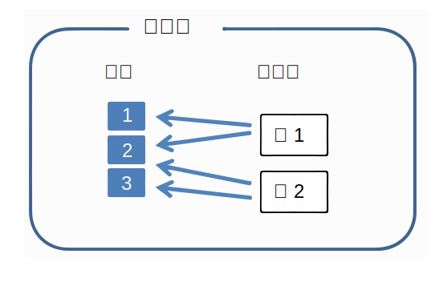
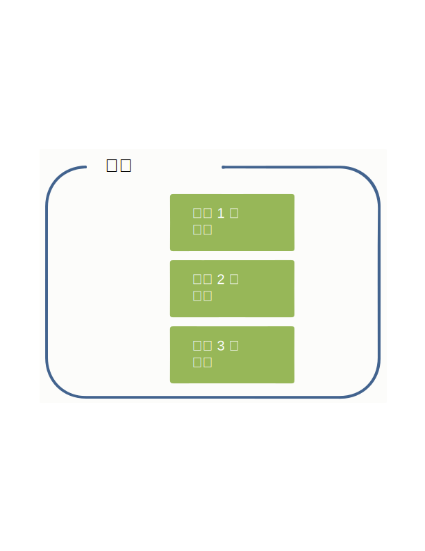
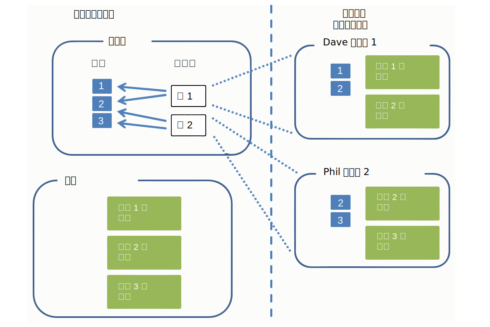
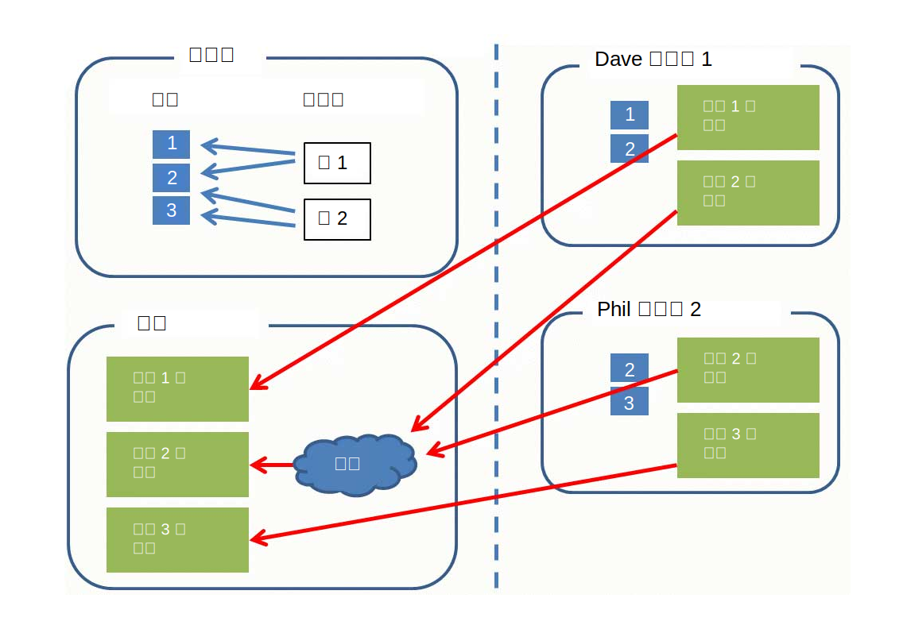

---

copyright:
  years: 2015, 2018
lastupdated: "2018-04-04"

---

{:shortdesc: .shortdesc}
{:new_window: target="_blank"}
{:tip: .tip}
{:pre: .pre}
{:codeblock: .codeblock}
{:screen: .screen}
{:javascript: .ph data-hd-programlang='javascript'}
{:java: .ph data-hd-programlang='java'}
{:python: .ph data-hd-programlang='python'}
{:swift: .ph data-hd-programlang='swift'}

此文件適用於 {{site.data.keyword.knowledgestudiofull}} on {{site.data.keyword.cloud}}。若要查看舊版 {{site.data.keyword.knowledgestudioshort}} on {{site.data.keyword.IBM_notm}} Marketplace 的文件，[請按一下此鏈結 ](https://console.bluemix.net/docs/services/knowledge-studio/documents-for-annotation.html){: new_window}。
{: tip}

# 新增文件以進行註釋
{: #documents-for-annotation}

若要訓練機器學習模型，您必須將包含主題知識的文件（例如，日誌登載文章或其他業界特定的文字）新增至您的工作區。
{: shortdesc}

## 關於本作業

若要定義規則型模型的規則，您可以新增或上傳可從中繪製型樣以定義為規則的文件。如需相關資訊，請參閱[新增文件以定義規則](/docs/services/watson-knowledge-studio/rule-annotator-add-doc.html)。本節說明如何僅針對註釋新增文件。

## 文件
{: #wks_sampledoc}

若要訓練機器學習模型，您需要收集代表您領域內容的文件，以及對您的應用程式有高價值的文件。

嘗試確保您的訓練文件確實代表您領域感興趣的內容；亦即，其包含許多可以註釋的相關提及項目。若要選擇最佳文件，請遵循下列準則：

- 努力提供一組大小總計約為 300,000 個單字的文件。對複雜的類型系統提供更多單字，而對較簡單的類型系統則提供較少單字。
- 將每一份文件的內容限制為一或兩個頁面（少於 2,000 個單字，每份文件接近 1,000 個單字是最好的）。在模型開發的早期階段中，讓每一份文件保持為少數幾個段落也是一種很好的作法。註釋人員可以在長文件中標示提及項目和關係，但嘗試標示跨多個頁面的互相參照則不是聰明的作法。
- 請確定文件中的資料分佈在所有可能的實體類型、子類型和角色，以及它們之間的關係。要達成的目標是最後在文件集合中，每一個實體類型至少有 50 個註釋，而每一個關係類型有 50 個註釋。
- 同樣地，文件應該代表應用程式所涵蓋之主題範圍的幅度，但如果實體類型及關係類型的出現頻率不準確，請嘗試取得每一個類型至少 50 個範本，對於其提及項目傾向詞組的實體類型，則需要更多。
- 您為了訓練而建立的文件集必須至少包含 10 個已註釋的文件。

當您準備好建立及訓練模型時，您新增至工作區的文件可分成幾個文件集，作為訓練資料、測試資料及盲目資料。個別的資料集對於評量模型效能而言十分重要。

您可以使用下列方式來新增文件：

- UTF-8 格式的雙直欄 CSV 檔
- UTF-8 格式的文字檔
- 包含下載自 {{site.data.keyword.knowledgestudioshort}} 工作區之文件的 ZIP 檔
- 包含 UIMA CAS XMI 格式檔案的 ZIP 檔

### CSV 檔
{: #wks_sampledoc__wks_samplecsv}

您可以從本端機器中，上傳包含範例文字的雙直欄 CSV 檔。一次上傳一個 CSV 檔。CSV 檔中的第一個直欄指定文件的檔名。檔案中的第二個直欄包含文件文字。如需必要格式的範例，請參閱指導教學範例檔中的 <a href="https://watson-developer-cloud.github.io/doc-tutorial-downloads/knowledge-studio/documents-new.csv" download>`documents-new.csv`</a> 檔案。

### 其他 Watson Knowledge Studio 工作區中的文件
{: #wks_sampledoc__wks_samplecorpus}

如果您先前已從 {{site.data.keyword.knowledgestudioshort}} 工作區下載文件，則可以上傳您所下載的 `ZIP` 檔。有一個選項可讓您指定是否要將基準註釋併入在匯入的檔案中。

註釋文件之後，已註釋的文件會以 `JSON` 格式儲存。這些檔案中的標記語言（顯示如何剖析原始文件文字及進行記號化）包括註釋人員新增的所有註釋的元素。為了隨時間變化改善模型正確性，您可以將這些檔案上傳至另一個工作區，從而保留所有現有註釋。註釋人員可以修訂、刪除及新增註釋到這些文件中，或者您可以略過人工註釋，並使用這些檔案來建立訓練、測試及盲目文件集，以評估與改善模型效能。

### UIMA CAS XMI 檔案
{: #wks_sampledoc__samplexmi}

若要協助訓練模型，您可以上傳由 UIMA 分析引擎預先註釋的文件。預先註釋的檔案必須為「UIMA 共用分析結構」的 XML 序列化 (UIMA CAS XMI)」格式，並結合成 ZIP 檔。例如，您可以上傳在 {{site.data.keyword.IBM_notm}} {{site.data.keyword.watson}} Explorer 集合中註釋的文件。

註釋人員可以修訂、刪除及新增註釋到這些文件中，或者您可以略過人工註釋，並使用這些檔案來建立訓練、測試及盲目文件集，以評估與改善模型效能。如何建立這些檔案以及上傳它們的需求的詳細資料，請參閱[上傳預先註釋的文件](/docs/services/watson-knowledge-studio/preannotation.html#wks_uima)。

### 匿名資料

如果您要建置針對資料最佳化的模型，但基於隱私權原因不要將資料以現狀上傳至 {{site.data.keyword.knowledgestudioshort}}，您可以先刪除文件中的任何個人識別資訊 (PII)，然後使用那些匿名文件來訓練模型。請不要編寫資訊，或以變數進行大規模取代。為得到最佳結果，請將實際資訊取代為相同類型的偽造資訊。

例如，如果您要保護的 PII 為用戶端名稱，則以使用各種一般名稱語法樣式的偽造名稱（例如 *Jane Doe*、*Mr . Smith*、*Dietrich* 或 *Dr . Jones, PhD*）來取代每一個名稱，而非編寫每一個名稱或以變數（例如 *USER_NAME*）取代每一個名稱。請考慮撰寫一個 Script 來連結各種名字和姓氏、職稱和姓氏，以及單獨新增姓氏，以建立可插入至文件的偽造名稱，來取代真實使用者名稱的實例。目標是盡可能模擬來源文件中的可能實際值。如果文件中使用相同的文字 (USER_NAME) 或者文字已經過編寫，則您基本上會訓練模型，預期所有名稱都具有該相同值或者都已經過編寫。在運行環境於新文件上使用模型，並發現之前從未見過的名稱以其所有變異形式出現時，您會希望模型能夠將這些名稱辨識為名稱。

## 將文件新增至工作區
{: #wks_projadd}

若要訓練模型，您必須將代表您領域內容的文件新增至工作區。

### 關於本作業

作為最佳作法，請以相對較小的文件集合開始。使用這些文件來訓練註釋人員（如果您的工作區包括人工註釋），以及修正註釋準則。小型文件可協助註釋人員識別整個文件中的互相參照鏈結。隨著註釋正確性的改善，您可以將更多文件新增至語料庫，以提供更深入的訓練工作。

### 程序

若要將文件新增至工作區，請執行下列動作：

1. 以 {{site.data.keyword.knowledgestudioshort}} 管理者或專案經理身分登入，並選取您的工作區。
1. 選取**資產及工具** > **文件** > **文件集**標籤。
1. 按一下**上傳文件集**，將文件新增至語料庫。
1. 使用下列其中一種格式來上傳文件。一次可以上傳一種類型的檔案。

    <table border="1" frame="hsides" rules="rows" cellpadding="4" cellspacing="0" summary="此表格中的每一列說明一個選項。" class="simpletable choicetable choicetableborder">
      <thead><tr><th id="d31095e284-option" valign="bottom" align="left" class="ncol thleft thbot">選項</th>
          <th id="d31095e284-desc" valign="bottom" align="left" class="ncol thleft thbot">說明</th></tr></thead>
      <tbody><tr class="strow chrow"><td valign="top" headers="d31095e284-option" id="d31095e286" class="stentry choption ncol">
<strong>CSV 檔</strong>
</td>
          <td valign="top" headers="d31095e284-desc d31095e286" class="stentry chdesc ncol">
拖曳包含範例文件的單一 CSV 檔，或按一下以在
              本端系統上尋找檔案，然後按一下<b>上傳</b>。CSV 檔中的第一個直欄
              指定文件的檔名。檔案中的第二個直欄包含文件文字。
              CSV 檔必須採用 UTF-8 格式。
</td>
        </tr>
        <tr class="strow chrow"><td valign="top" headers="d31095e284-option" id="d31095e294" class="stentry choption ncol">
<strong>文字檔</strong>
</td>
          <td valign="top" headers="d31095e284-desc d31095e294" class="stentry chdesc ncol">
從您的本端系統拖曳一個以上文字檔，或按一下來尋找並選取檔案，
              然後按一下<b>上傳</b>。文字檔必須採用 UTF-8 格式。
</td>
        </tr>
        <tr class="strow chrow"><td valign="top" headers="d31095e284-option" id="d31095e302" class="stentry choption ncol">
<strong>DOCXML 檔</strong>
</td>
          <td valign="top" headers="d31095e284-desc d31095e302" class="stentry chdesc ncol">
從您的本端系統拖曳一個以上 <code>DOCXML</code> 檔案，或按一下來尋找
              並選取檔案，然後按一下<b>上傳</b>。<code>DOCXML</code>
              檔案必須是從其他機器學習模型下載的文件，且必須是
              UTF-8 格式。上傳時不會將這些文件重新記號化。
</td>
        </tr>
        <tr class="strow chrow"><td valign="top" headers="d31095e284-option" id="d31095e316" class="stentry choption ncol">
<strong>ZIP 檔</strong>
</td>
          <td valign="top" headers="d31095e284-desc d31095e316" class="stentry chdesc ncol">
如果您先前已從
              Watson Knowledge
              Studio
              工作區下載文件，請拖曳
              包含已下載文件的 <code>ZIP</code> 檔，或按一下來尋找並選取
              檔案。如果您想要在下載文件之前併入已新增至文件的註釋，
              請確定已選取包括基準的選項，然後再按一下
              <b>上傳</b>。只會匯入在下載文件之前
              已升級為基準的註釋。

<b>限制：</b>匯入已註釋的文件
              時，會將它們重新記號化。這個程序可改變
              Watson Knowledge
              Studio
              在這些文件中
              所認為的句子界限。因為註釋是由句子所定義，所以在這個程序期間，
              部分註釋可能會失效。從另一個工作區上傳文件之後，請快速檢閱
              註釋，以解決所有不相符問題。

            
您必須先將類型系統從原始工作區上傳至現行工作區，才能上傳基準註釋。如需詳細資料，請參閱[從其他工作區上傳資源 ](exportimport.html){: new_window}。

            
如果您先前已下載格式為 UIMA CAS XMI 的已註釋文件，則可以上傳包含已分析內容的 <code>ZIP</code> 檔。先指定這是您要上傳的內容類型，然後再按一下<b>上傳</b>。如需如何建立這些檔案以及上傳它們的需求的詳細資料，請參閱[上傳預先註釋的文件 ](preannotation.html#wks_uima){: new_window}。

          </td>
        </tr>
      </tbody>
    </table>

1. 新增文件之後，按一下文件名稱以進行預覽，並驗證內容正常。例如，驗證文字檔是 UTF-8 格式，且文件中看不見任何讀音標記或字元正規化問題，並檢查不良的句子岔斷。如果發生問題，您可能需要先預先處理這些檔案，然後再將它們新增至語料庫。在字典或人工註釋開始之前，您會希望文件盡可能乾淨且完整格式化。

### 下一步

在您啟動任何人工註釋作業之前，請將語料庫分成多個文件集，並將這些文件集指派給註釋人員。

## 建立及指派註釋集
{: #wks_projdocsets}

新增文件之後，將文件分成數個文件集，以由多位註釋人員進行註釋。若要檢視註釋人員內部協議分數，您必須至少指派兩位註釋人員，並指定部分百分比的文件在這些集合之間重疊。

### 開始之前

- 您必須先上傳文件集，才能將它們分成註釋集。
- 您必須針對將在此工作區使用文件的所有註釋人員，在 {{site.data.keyword.knowledgestudioshort}} 中建立使用者帳戶。

### 關於本作業

> **注意：**如果您使用 Google Chrome 瀏覽器，則無法透過從資料夾選取大量檔案（例如超過 300 個）的方式來上傳檔案。暫行解決方法是使用 Firefox 瀏覽器，或者選取少量檔案並分次上傳檔案。

每個工作區最多可以建立 1,000 個註釋集。

### 程序

若要建立註釋集，請執行下列動作：

1. 以 {{site.data.keyword.knowledgestudioshort}} 管理者或專案經理身分登入，並選取您的工作區。
1. 選取**資產及工具** > **文件** > **註釋集**標籤。
1. 按一下**建立註釋集**。

    1. 對於基本集，選取您要劃分為註釋集的文件集合，這可以是語料庫中的所有文件，或是先前配置給文件集的文件。

    1. 對於重疊值，請指定您要併入每一個註釋集中的文件百分比。除非兩個以上的註釋人員註釋相同的文件，否則無法計算註釋人員內部協議分數。例如，如果您針對包含 30 個文件的語料庫指定了 20% 的重疊值，且您將語料庫分成 3 個文件集，則所有註釋人員都會註釋 6 個文件 (20%) 。剩餘的 24 個文件將分給 3 位註釋人員（每人 8 個文件）。因此，每一位註釋人員都會收到 14 個文件來註釋 (6+8)。

    > **附註：**您計劃用來訓練機器學習模型的註釋集必須至少包含 10 個已註釋文件。

    1. 從註釋人員清單中選取使用者名稱。

        > **附註：**如果您使用免費訂閱方案，請建立您自己與註釋集的關聯。您無法新增其他使用者，並將他們指派給註釋人員角色。但是，藉由新增自己，您可以填寫註釋人員的角色，並測試實際註釋人員如何與基準編輯器互動以註釋文件。

    1. 命名註釋集。

        在工作區進行時評估註釋人員工作的最佳作法是，建立註釋集名稱來識別指派給該註釋集的註釋人員。建立註釋集之後，就無法變更註釋集名稱。

1. 完成指派將使用此工作區的所有註釋人員之後，請按一下**產生**來建立註釋集。當註釋人員登入基準編輯器時，只會看到指派給他們的註釋集。

**相關作業**：

[組合團隊](/docs/services/watson-knowledge-studio/team.html)

## 刪除文件
{: #wks_projdelete}

如果您判定文件不代表會讓模型受益的標準產業文字，則可以移除該文件。

### 程序

若要刪除文件，請完成下列步驟：

1. 以 {{site.data.keyword.knowledgestudioshort}} 管理者身分登入，並選取您的工作區。
1. 選取**資產及工具** > **文件** > **文件集**標籤。
1. 尋找您要移除的文件，然後按一下**刪除**。
1. 您無法刪除內含在註釋集（已與註釋作業相關聯）中的文件。如果文件是註釋集的一部分，但尚未與作業相關聯，您可以遵循先前的步驟來刪除文件。

    如果文件與註釋作業相關聯，請執行下列其中一個作業：
    - 如果註釋人員尚未開始註釋文件，請刪除註釋作業，然後刪除文件。若要刪除註釋作業，請開啟**資產及工具** > **文件** > **作業**標籤，尋找與文件相關聯的註釋作業，按一下作業的**顯示功能表**圖示，然後按一下**刪除**。之後，您可以重建註釋作業並關聯相同的註釋集，現在其中有一個較少的文件。
    - 如果註釋人員已開始註釋文件，請不要刪除作業，否則您將會失去他們的工作。您可以告訴他們繼續工作，但忽略集合中不想要的文件。讓他們完成所有其他的註釋工作，然後完成將集合新增至基準的程序。新增之後，但在任何人執行機器學習模型之前，請刪除不要的文件。您不會想要使用未註釋的文件來訓練模型，因為不論您有沒有註釋，機器學習模型都會從中學習。現在，您可以從**資產及工具** > **文件** > **文件集**標籤中，刪除不想要但目前又是基準一部分的文件。

## 資料模型
{: #wks_datamodel}

本主題中的圖表彙總 {{site.data.keyword.knowledgestudioshort}} 系統中的文件流程，以及語料庫中文件、註釋作業及基準之間的差異。

語料庫包含文件，其分割為文件集：

- 文件只是文字的字串。
- 文件集是一組文件的指標。文件集不包含文件本身的副本。
- 部分文件集可以指向單一文件，這個設定可以透過在建立註釋集時所指定的重疊參數來進行控制。

圖 1. 此圖說明指向三個文件的兩個文件集。文件會在這些集合之間進行劃分。

基準包含新增至文件的註釋（陳述、關係及互相參照的提及項目）。對於每一個文件而言，基準都是獨特的。

圖 2. 此圖說明基準包含新增至文件 1、文件 2、文件 3 等等的註釋。

當您建立註釋作業時，會為您新增至作業的註釋集中的每一個文件建立註釋副本。註釋人員會註釋文件。這些註釋彼此隔離，並與基準隔離。註釋作業是一個暫存概念，存在的目的是要容許註釋人員在隔離的空間中註釋文字。相反地，基準是永久且獨特的。

 圖 2. 此圖說明專案經理建立註釋集並將其指派給註釋作業。註釋人員 Dave 及 Phil 會對文件集中指派給他們的文件進行註釋。

專案經理在註釋作業中核准註釋集之後，未與其他註釋集重疊之文件中的註釋會變成基準。對於在註釋集之間重疊的文件（在本範例中以文件 2 表示），專案經理必須裁定並解決衝突。重疊文件中的註釋不會變成基準，除非透過裁定獲得核准。

然後，基準用來訓練及測試機器學習模型，或者可作為下一個模型開發反覆運算的基礎。若要在新的反覆運算中使用基準，您必須建立新的註釋作業。

 圖 3. 此圖說明兩位註釋人員所新增的註釋如何變成基準。兩位註釋人員同時註釋一個文件（標籤為文件 2）。此重疊文件中的註釋必須先經過裁定才能變成基準。
