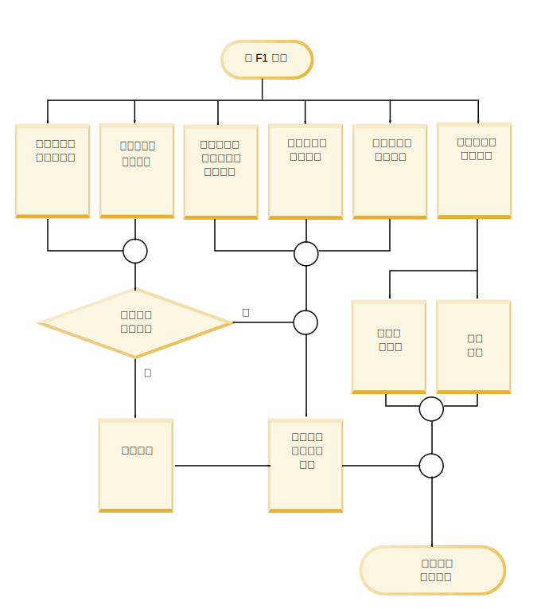
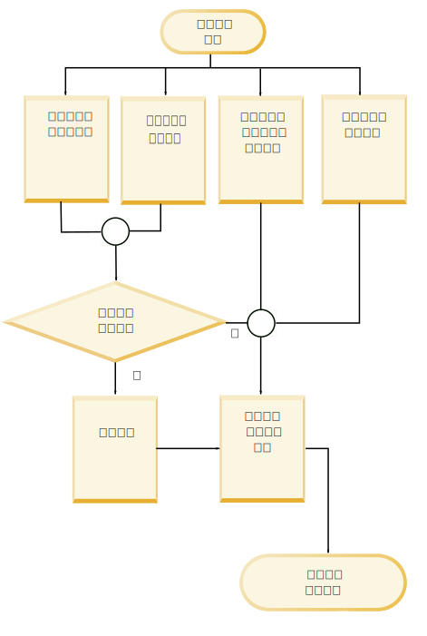

---

copyright:
  years: 2015, 2018
lastupdated: "2018-08-03"

---

{:shortdesc: .shortdesc}
{:new_window: target="_blank"}
{:tip: .tip}
{:pre: .pre}
{:codeblock: .codeblock}
{:screen: .screen}
{:javascript: .ph data-hd-programlang='javascript'}
{:java: .ph data-hd-programlang='java'}
{:python: .ph data-hd-programlang='python'}
{:swift: .ph data-hd-programlang='swift'}

此文件適用於 {{site.data.keyword.knowledgestudiofull}} on {{site.data.keyword.cloud}}。若要查看舊版 {{site.data.keyword.knowledgestudioshort}} on {{site.data.keyword.IBM_notm}} Marketplace 的文件，[請按一下此鏈結 ](https://{DomainName}/docs/services/knowledge-studio/evaluate-ml.html){: new_window}。
{: tip}

# 分析機器學習模型效能
{: #evaluate-ml}

檢閱由已訓練模型所新增的註釋，判斷是否必須對模型進行任何調整，以改善其在文件中尋找有效實體提及項目、關係提及項目及互相參照的能力。
{: shortdesc}

## 關於本作業
{: #evaluate-ml_about}

您可以透過檢視實體類型、關係類型及互相參照提及項目的統計資料摘要，來分析效能。您也可以分析*混淆矩陣* 中呈現的統計資料。混淆矩陣可協助您比較機器學習模型所新增的註釋與基準中的註釋。

模型統計資料提供下列度量值：

- **F1 分數 (F1 score)**

    此測量同時考量查準率及查全率來計算分數。F1 分數可以解譯為查準率與查全率值的加權平均，其中，F1 分數的最佳值為 1，最差值為 0。請參閱[分析低 F1 分數](/docs/services/watson-knowledge-studio/evaluate-ml.html#evaluate-mllowf1)。

- **查準率**

    此測量指出與註釋人員輸出相比較時，機器學習模型輸出的正確部分。查準率是由正確標示的註釋數目除以機器學習模型所新增的註釋總數所決定的。實體類型 A 的查準率分數 1.0，表示已標示為實體類型 A 的每個提及項目都確實屬於該分類。低的查準率分數可協助您識別機器學習模型建立不正確註釋的位置。此分數不會指出機器學習模型遺失了多少由註釋人員標示為實體類型 A 的其他提及項目；而查全率分數則會反映該資訊。請參閱[分析低查準率分數](/docs/services/watson-knowledge-studio/evaluate-ml.html#evaluate-mllowp)。

- **查全率**

    此測量針對應以給定標籤註釋的提及項目，指定實際上真的以該標籤進行註釋的提及項目數目 - 註釋人員在相同文件中識別的*正確* 提及項目數目。查全率是由正確標示的註釋數目除以應該建立的註釋數目所決定的。查全率分數 1.0，表示應該標示為實體類型 A 的每個提及項目都已正確標示。低的查全率分數可協助您識別機器學習模型無法建立但其應該要建立之註釋的位置。此分數不會指出不應該但卻也標示為實體類型 A 的其他提及項目數目；而查準率分數則會反映該資訊。請參閱[分析低查全率分數](/docs/services/watson-knowledge-studio/evaluate-ml.html#evaluate-mllowr)。

- **註釋總數百分比**

    基準的測量，顯示在測試文件集中註釋為任何實體類型或關係類型的總字數中，以給定實體類型或關係類型進行註釋的單字數目。此統計資料不適用於互相參照的提及項目。此值可協助您瞭解某類型的普遍提及項目是如何與您基準中的其他類型進行比較。

- **語料庫密度的百分比（依據單字數目）**

    基準的測量，顯示總字數中（不論是否已註釋），以給定實體類型或關係類型進行註釋的單字數目。此統計資料不適用於互相參照的提及項目。此值可協助您瞭解此類型的普遍提及項目是如何與您領域文件中的所有其他單字進行比較。

- **包含類型的文件百分比**

    基準的測量，顯示包含給定實體類型或關係類型的文件數目。此統計資料不適用於互相參照的提及項目。此值可協助您評量集合中的文件是否足以代表領域。如果重要實體類型的百分比很低，則您可能想要新增更多文件，內含數量不足之類型的提及項目。

## 程序
{: #evaluate-ml_procedure}

若要檢視模型訓練成果的效能統計資料，請執行下列動作：

1. 以 {{site.data.keyword.knowledgestudioshort}} 管理者或專案經理身分登入，並選取您的工作區。
1. 選取**機器學習模型** > **效能**。
1. 針對提及項目、關係或互相參照，選取**詳細統計資料**鏈結。
1. 在**摘要**視圖中，指定您要評估測試資料或訓練資料，然後指定您要查看其統計資料的註釋類型：實體類型、關係類型或互相參照的提及項目。當您捲動瀏覽資料時，會標示及強調顯示分數低的項目，以指出它們需要進行調查和改善。三角形警告圖示指出 F1 值小於固定值 0.5。

    例如，部分實體類型的 F1 分數可能很高，因為文件是透過預先註釋以及由註釋人員進行註釋。但其他實體類型的 F1 分數可能很低，因為詞組中的差異，以及註釋人員解譯文字或註釋準則的方式差異，讓機器學習模型更難以辨識型樣及套用正確的註釋。

1. 在測試資料的**混淆矩陣**視圖中，指定您要查看其統計資料的註釋類型：實體類型或關係類型。針對每一個實體類型或關係類型：

    - 矩陣中的每一列都會顯示基準（註釋人員所新增的實體類型及關係類型）。
    - 矩陣中的每一個直欄都會顯示解碼結果（機器學習模型所新增的註釋記號）。
    - 每一個儲存格中的數字都代表每個提及項目的註釋記號數目，而不是提及項目的出現次數。

        記號用來描述字串。它們鬆散地對應單字。提及項目可包含多個記號。例如，*Barack Obama* 這個提及項目包含兩個記號。在 PERSON 列或直欄中，值 2 用來代表文件中 *Barack Obama* 的單一提及項目。記號計數僅鬆散地對應至單字計數，因為在某些情況下會以不同方式計算記號。例如，句子結尾的標點符號會被計算為記號，而縮寫形式通常會展開成兩個記號。

    - 標示為 **O** 的直欄可識別記號，該記號應該由機器學習模型註釋為交集列中所識別的類型（人工註釋），但是卻未註釋為任何類型。
    - 當文件集中沒有給定類型的註釋時，會顯示值 **N/A**。例如，如果文件集中沒有任何 PERSON 提及項目已針對基準進行註釋或者註釋為測試資料，則 PERSON 實體類型的分數為 N/A。

    例如，下列混淆矩陣範例顯示機器學習模型在處理交通事故之文件上的執行結果。

    <table summary="突發事件報告混淆矩陣範例">
       <caption>表 1. 混淆矩陣範例</caption>
       <tr>
        <th style="vertical-align:bottom; text-align:left" id="d15356e164">實體類型</th>
        <th style="vertical-align:bottom; text-align:center" id="d15356e166">MANUFACTURER</th>
        <th style="vertical-align:bottom; text-align:center" id="d15356e168">MODEL</th>
        <th style="vertical-align:bottom; text-align:center" id="d15356e170">O</th>
      </tr>
      <tr>
        <td style="vertical-align:top; text-align:left" headers="d15356e164">MANUFACTURER</td>
        <td style="vertical-align:top; text-align:center" headers="d15356e166">515</td>
        <td style="vertical-align:top; text-align:center" headers="d15356e168">5</td>
        <td style="vertical-align:top; text-align:center" headers="d15356e170">44</td>
      </tr>
    </table>
    {: #evaluate-ml__datasimpletable_yms_hff_cw}

    從這個矩陣中可學習到下列事物：
    - 模型將 515 個記號正確辨識為 MANUFACTURER 實體類型的提及項目。
    - 模型將 5 個記號錯誤地標示為 MODEL 類型的提及項目，其應該標示為 MANUFACTURER。
    - 有 44 個記號包含模型無法註釋為任何實體類型的 MANUFACTURER 類型提及項目。

    當您評估模型效能並檢視解碼結果時，您可以從調查錯誤標示或完全遺失的記號開始進行。

## 效能改善提要
{: #evaluate-ml_cheat}

使用本提要可協助您判斷可以採取的步驟，以改善機器學習模型效能。

很難規定適用各領域的效能分數改善規則，其中，類型系統複雜性、訓練文件適用性、註釋人員技能以及其他因素都會影響結果。不過，下表可協助您進行起始評量，並採取步驟來改善效能，尤其是在模型開發及測試的初期階段期間。

下表針對最常見的機器學習模型效能問題來建議修正方式。

<table summary="表格會在該第一欄下列出一般問題，並在第一列中列出建議的修正程式。X 標記指出哪個修正程式要套用至哪個問題。">
    <caption>表 2. 一般效能問題的修正程式</caption>
    <tr>
      <th style="vertical-align:bottom; text-align:left" id="d15356e221">問題</th>
      <th style="vertical-align:bottom; text-align:center" id="d15356e223">新增字典</th>
      <th style="vertical-align:bottom; text-align:center" id="d15356e225">編輯文件集</th>
      <th style="vertical-align:bottom; text-align:center" id="d15356e227">新增特定類型專用文件</th>
      <th style="vertical-align:bottom; text-align:center" id="d15356e229">對語料庫進行更多註釋</th>
      <th style="vertical-align:bottom; text-align:center" id="d15356e231">修正人工註釋</th>
      <th style="vertical-align:bottom; text-align:center" id="d15356e233">加強註釋人員準則</th>
      <th style="vertical-align:bottom; text-align:center" id="d15356e235">更新類型系統</th>
      <th style="vertical-align:bottom; text-align:center" id="d15356e237">進一步調查</th>
    </tr>
    <tr>
      <td style="vertical-align:top; text-align:left" headers="d15356e221">低 F1</td>
      <td style="vertical-align:top; text-align:center" headers="d15356e223">X</td>
      <td style="vertical-align:top; text-align:center" headers="d15356e225">X</td>
      <td style="vertical-align:top; text-align:center" headers="d15356e227">X</td>
      <td style="vertical-align:top; text-align:center" headers="d15356e229">X</td>
      <td style="vertical-align:top; text-align:center" headers="d15356e231">X</td>
      <td style="vertical-align:top; text-align:center" headers="d15356e233">X</td>
      <td style="vertical-align:top; text-align:center" headers="d15356e235">X</td>
      <td style="vertical-align:top; text-align:center" headers="d15356e237">X</td>
    </tr>
    <tr>
      <td style="vertical-align:top; text-align:left" headers="d15356e221">低查準率</td>
      <td style="vertical-align:top; text-align:center" headers="d15356e223"></td>
      <td style="vertical-align:top; text-align:center" headers="d15356e225"></td>
      <td style="vertical-align:top; text-align:center" headers="d15356e227"></td>
      <td style="vertical-align:top; text-align:center" headers="d15356e229">X</td>
      <td style="vertical-align:top; text-align:center" headers="d15356e231">X</td>
      <td style="vertical-align:top; text-align:center" headers="d15356e233">X</td>
      <td style="vertical-align:top; text-align:center" headers="d15356e235">X</td>
      <td style="vertical-align:top; text-align:center" headers="d15356e237">X</td>
    </tr>
    <tr>
      <td style="vertical-align:top; text-align:left" headers="d15356e221">低查全率</td>
      <td style="vertical-align:top; text-align:center" headers="d15356e223">X</td>
      <td style="vertical-align:top; text-align:center" headers="d15356e225">X</td>
      <td style="vertical-align:top; text-align:center" headers="d15356e227">X</td>
      <td style="vertical-align:top; text-align:center" headers="d15356e229">X</td>
      <td style="vertical-align:top; text-align:center" headers="d15356e231"></td>
      <td style="vertical-align:top; text-align:center" headers="d15356e233"></td>
      <td style="vertical-align:top; text-align:center" headers="d15356e235"></td>
      <td style="vertical-align:top; text-align:center" headers="d15356e237"></td>
    </tr>
    <tr>
      <td style="vertical-align:top; text-align:left" headers="d15356e221">低註釋 %</td>
      <td style="vertical-align:top; text-align:center" headers="d15356e223"></td>
      <td style="vertical-align:top; text-align:center" headers="d15356e225">X</td>
      <td style="vertical-align:top; text-align:center" headers="d15356e227">X</td>
      <td style="vertical-align:top; text-align:center" headers="d15356e229">X</td>
      <td style="vertical-align:top; text-align:center" headers="d15356e231"></td>
      <td style="vertical-align:top; text-align:center" headers="d15356e233"></td>
      <td style="vertical-align:top; text-align:center" headers="d15356e235"></td>
      <td style="vertical-align:top; text-align:center" headers="d15356e237"></td>
    </tr>
    <tr>
      <td style="vertical-align:top; text-align:left" headers="d15356e221">低密度</td>
      <td style="vertical-align:top; text-align:center" headers="d15356e223"></td>
      <td style="vertical-align:top; text-align:center" headers="d15356e225">X</td>
      <td style="vertical-align:top; text-align:center" headers="d15356e227">X</td>
      <td style="vertical-align:top; text-align:center" headers="d15356e229">X</td>
      <td style="vertical-align:top; text-align:center" headers="d15356e231"></td>
      <td style="vertical-align:top; text-align:center" headers="d15356e233"></td>
      <td style="vertical-align:top; text-align:center" headers="d15356e235"></td>
      <td style="vertical-align:top; text-align:center" headers="d15356e237"></td>
    </tr>
    <tr>
      <td style="vertical-align:top; text-align:left" headers="d15356e221">類型的文件數太少</td>
      <td style="vertical-align:top; text-align:center" headers="d15356e223"></td>
      <td style="vertical-align:top; text-align:center" headers="d15356e225"></td>
      <td style="vertical-align:top; text-align:center" headers="d15356e227">X</td>
      <td style="vertical-align:top; text-align:center" headers="d15356e229">X</td>
      <td style="vertical-align:top; text-align:center" headers="d15356e231"></td>
      <td style="vertical-align:top; text-align:center" headers="d15356e233"></td>
      <td style="vertical-align:top; text-align:center" headers="d15356e235">X</td>
      <td style="vertical-align:top; text-align:center" headers="d15356e237"></td>
    </tr>
    <tr>
      <td style="vertical-align:top; text-align:left" headers="d15356e221">分類不正確</td>
      <td style="vertical-align:top; text-align:center" headers="d15356e223">X</td>
      <td style="vertical-align:top; text-align:center" headers="d15356e225"></td>
      <td style="vertical-align:top; text-align:center" headers="d15356e227"></td>
      <td style="vertical-align:top; text-align:center" headers="d15356e229"></td>
      <td style="vertical-align:top; text-align:center" headers="d15356e231"></td>
      <td style="vertical-align:top; text-align:center" headers="d15356e233"></td>
      <td style="vertical-align:top; text-align:center" headers="d15356e235">X</td>
      <td style="vertical-align:top; text-align:center" headers="d15356e237"></td>
    </tr>
    <tr>
      <td style="vertical-align:top; text-align:left" headers="d15356e221">遺失註釋</td>
      <td style="vertical-align:top; text-align:center" headers="d15356e223">X</td>
      <td style="vertical-align:top; text-align:center" headers="d15356e225"></td>
      <td style="vertical-align:top; text-align:center" headers="d15356e227"></td>
      <td style="vertical-align:top; text-align:center" headers="d15356e229">X</td>
      <td style="vertical-align:top; text-align:center" headers="d15356e231"></td>
      <td style="vertical-align:top; text-align:center" headers="d15356e233"></td>
      <td style="vertical-align:top; text-align:center" headers="d15356e235"></td>
      <td style="vertical-align:top; text-align:center" headers="d15356e237"></td>
    </tr>
    <tr>
      <td style="vertical-align:top; text-align:left" headers="d15356e221">測試與訓練結果有落差</td>
      <td style="vertical-align:top; text-align:center" headers="d15356e223"></td>
      <td style="vertical-align:top; text-align:center" headers="d15356e225">X</td>
      <td style="vertical-align:top; text-align:center" headers="d15356e227"></td>
      <td style="vertical-align:top; text-align:center" headers="d15356e229"></td>
      <td style="vertical-align:top; text-align:center" headers="d15356e231"></td>
      <td style="vertical-align:top; text-align:center" headers="d15356e233"></td>
      <td style="vertical-align:top; text-align:center" headers="d15356e235"></td>
      <td style="vertical-align:top; text-align:center" headers="d15356e237"></td>
    </tr>
    <tr>
      <td style="vertical-align:top; text-align:left" headers="d15356e221">測試訓練資料的低 F1</td>
      <td style="vertical-align:top; text-align:center" headers="d15356e223"></td>
      <td style="vertical-align:top; text-align:center" headers="d15356e225"></td>
      <td style="vertical-align:top; text-align:center" headers="d15356e227"></td>
      <td style="vertical-align:top; text-align:center" headers="d15356e229"></td>
      <td style="vertical-align:top; text-align:center" headers="d15356e231">X</td>
      <td style="vertical-align:top; text-align:center" headers="d15356e233">X</td>
      <td style="vertical-align:top; text-align:center" headers="d15356e235"></td>
      <td style="vertical-align:top; text-align:center" headers="d15356e237">X</td>
    </tr>
</table>
{: #evaluate-ml_cheat__datasimpletable_nhm_5ym_cw}

### 修正方式說明
{: #evaluate-ml_fixes}

- **新增字典**

    字典包含給定實體類型的範例表面形式。如果訓練統計資料顯示在訓練資料中不常出現該類型的註釋，您可能需要新增字典，或在現有字典中新增更多項目。如果您知道該實體類型是領域的關鍵，且經常發生，則省略可能表示機器學習模型未辨識出*出現* 在訓練資料中且與該類型相關聯的表面形式。提供更多表面形式範例，有助於解決此問題。

- **編輯文件集**

    請確定您有足夠的整體訓練資料。機器學習模型需要有足夠的內容，才能進行學習。目標是提供 300,000 個單字左右。（您可以在來源文件上執行字數工具來檢查數量。）如果您的訓練集太小，請將文件新增至語料庫中。只有少數文件運用每一個重要的實體類型或關係是不夠的；您需要有許多文件才能說明一般領域文獻中如何使用那些類型。
  - 請確定用於測試及訓練的各種文件都是類似的。例如，不要使用來自某個資料來源的文件作為測試資料集，同時使用來自其他資料來源的文件作為訓練資料集。不同的資料來源可能以完全不同的方式來代表實體及關係類型資訊。最好使用來自這兩個資料集中所有資料來源的文件組合，以取得業界文獻中最完整的使用範例。如果測試執行的整體效能分數與訓練執行有很大的差異，可能是由於各自使用的資料集不一致。
  - 不要浪費時間在格式不正確的文件上。您新增至語料庫的文字文件必須是 UTF-8 格式。如果您將文件從其他格式轉換為使用 UTF-8 編碼，您可能會看到讀音標記以及其他字元正規化問題。這類不正確格式會導致不正確的記號表示。如果使用單字記號來代表在文件之間有所不同的某個提及項目，則會減弱範例並對機器學習產生負面影響。

- **新增特定類型專用文件**

    如果包含特定類型的文件百分比太低，可能表示您的語料庫不具有完整代表性。機器學習模型需要許多範例才能從中學習。新增更多文件至語料庫可能會有所幫助。如果您的類型系統及文件確實代表某個領域，則預期會看到任何隨機選擇的文件都包含該類型的合理子集。雖然並不是所有情況下都是如此，但是這個狀況是一種信號，讓您調查您的類型系統以及語料庫中文件的品質。您可能需要尋找其他更巧妙運用執行中類型的領域文件。如果查全率很低，通常指出您需要新增更多文件。

- **對語料庫進行更多註釋**

    如果機器學習模型在尋找某些類型的實例時遇到問題，可能是因為基準未包含足夠的類型用法範例。註釋人員有時會很仔細的對實體類型提及項目貼上標籤，但是對註釋關係類型及互相參照卻略顯不足。對於語料庫密度百分比較低的所有重要類型，您可能想要著重於在來源文件中尋找那些類型的更多註釋。但是，如果提及項目的正確性不足，也不必太擔心互相參照及關係的正確性。除非實體提及項目一開始就是正確的，否則實體之間的關係提及項目以及實體的互相參照也不會正確。

- **修正人工註釋**

    查看您的訓練資料是否一致且完全註釋。機器學習模型會從您的基準註釋學習。例如，如果句子包含詞組 Obama family，且您在某個句子中將 "Obama" 標示為 PERSON，而在另一個句子中將 "Obama family" 標示為 PEOPLE，這樣的不一致表示機器學習模型無法學習正確的註釋。同樣地，如果您在某個句子將 "Obama" 標示為 PERSON，但在另一個句子中完全沒有標示他的姓名，則註釋工作不完整，且機器學習模型無法正確訓練。這種類型的不一致以及局部標籤有時稱為*類型混淆*。在大部分情況下，只有讓多位註釋人員檢閱一組重疊的文件，才會出現類型混淆相關錯誤。請注意在解決文件衝突期間所顯現的問題，因為它們可以深入瞭解類型系統本身的深層問題。如果沒有空間可以進一步改善或調整類型系統，則可能需要更新註釋準則並併入範例。您可以提供常見錯誤的圖解，以及在一組給定情況下如何適當地註釋提及項目。

    另一個註釋不一致的指標是，如果您有足夠的註釋，但語料庫密度太低。當領域文獻中重要的提及項目經常發生，但是在文件集之間卻註釋為不同類型時，密度可能會受到影響。

    低查準率通常指出您需要改善註釋一致性。若要這樣做，請檢閱註釋準則，更適當地訓練註釋人員，並確保註釋人員正在協同作業並非彼此隔離。

    請檢查註釋人員內部協議分數。這個分數是個很有價值的數字，測量在同一文件上不同註釋人員之輸出間的協議程度。這個分數不只告訴您要用來訓練機器學習模型之基準文件的品質，同時也指出機器學習模型效能的上限。在這些文件上進行訓練的模型不可能勝過人工可達成的最佳協議。例如，如果效能持續在 75，沒有再更高，則請查看註釋人員內部協議結果。如果註釋人員內部協議分數為 80，請採取動作以更適當地訓練註釋人員，並確保在裁定期間，正確地解決衝突（根據註釋準則）。如果人員不同意標示的方式，則機器學習模型不可能套用正確的標籤。

- **加強註釋人員準則**

    清楚且完整的註釋程式準則是和諧且成功註釋開發工作的重要部分。註釋人員要執行的工作很艱難。在您開始使用領域文件之前，指派實體及關係類型的工作中有很難掌握的細微差別。準則可在註釋人員評估文件時，提供例行性檢查。準則應該是在使用中且可變更的文件，特別是在註釋程序開始的時候。它們提供了重要的意見迴圈，因為註釋人員可以擷取其在註釋一些文件時所學習到的事物，然後當該註釋人員或其他人註釋一些其他文件時，即可將新的提示及陷阱新增至準則等等。請務必包括一些困難決策及其偏好解決方案的範例。決定您需要新增什麼內容至註釋準則的最佳方式，是謹慎檢閱文件衝突。實際人員不同意之註釋以及其解決方式的真實範例，對註釋人員而言，是他們在處理新文件註釋時的最佳協助。

- **更新類型系統**

    您可能因為下列原因而需要更新類型系統：
  - 包含訓練資料的文件會參照一些概念，這些概念為領域中的重要類型，但未在類型系統的任何一處表示出來。這暗示您可能需要新增會擷取遺漏概念或關係的類型。請注意，不要嘗試為欄位中的每個概念，或發生在領域文件中的每個實體，定義一個類型；類型系統應該限制為僅限最基本的類型。
  - 註釋人員一致誤用某個現有類型。如果某類型一致造成混淆，則您可能需要將它重新命名，或者如果它是多餘的，則請將它刪除。
  - 註釋人員從未使用某個現有類型，因為文件中從未參照過該類型。如果不太可能在此領域的文獻中用到該類型，請將它自類型系統中移除。
  - 當註釋人員註釋文件時，通常會交換兩種類型。請考量這兩種類型是否可以合併為正確代表概念或關係的某個類型。例如，如果類型系統同時包含 PERSON 及 PEOPLE（通常可交換使用），則最好使用一個名為 PERSONPEOPLE 的類型，其涵蓋這兩個狀況，而非兩個個別的類型。

    > **注意：**更新類型系統時請小心。如果您在註釋人員評估與舊類型系統相關聯的文件集之後，才更新類型系統，則註釋人員必須重新評估文件集。請確定您需要進行的變更非常重要，足以保證這類重做。

- **進一步調查**

    如果您的類型系統、字典及來源文件都很完整，且人工註釋也已完成，但機器學習模型仍然表現不佳，則模型訓練程序中可能有某部分發生錯誤。例如，對訓練資料進行測試時，您應該一律看到高整體分數（超過 95%）。

## 分析低 F1 分數
{: #evaluate-mllowf1}

調整機器學習模型的效能，以解決 F1 分數過低。

### 症狀
{: #evaluate-mllowf1_symptoms}

F1 分數的最佳值為 1，最差值為 0。低 F1 分數指出查準率及查全率兩者都很差。機器學習模型產生錯誤註釋，且找不到應該找到的註釋。

### 原因
{: #evaluate-mllowf1_causes}

有很多不同的原因會造成低 F1 分數，視領域、類型系統複雜性、訓練文件適用性、註釋人員技能以及其他因素而定。

### 解決問題
{: #evaluate-mllowf1_resolving}

執行下列一個以上步驟，來調整機器學習模型的效能，然後重新訓練您的模型：

1. 識別常發生且正確性低的類型。

    > **附註：**分析關係時，查看關係類型本身的 F1 分數，以及參與關係之兩個實體的各別 F1 分數。

1. 識別常混淆的類型。查看混淆矩陣中對角線外的數字，即可找到此資訊。
1. 檢閱機器學習模型信心十足的錯誤。
1. 在混淆矩陣中，尋找誤否定及誤肯定中的型樣。
1. 如果特定類型在訓練資料中不常出現，請新增包含那些類型的訓練資料。

    藉由檢查類型的百分比統計資料（有三個：註釋數 % 、語料庫密度 % 以及文件數 % ），您可以判斷出現頻率。

1. 如果特定類型具有低 F1 分數，請檢閱適用於那些類型之註釋準則的清晰度。
1. 針對在訓練資料中不常出現的類型，新增字典。

圖 1. 如何解決低 F1 分數

## 分析低查準率分數
{: #evaluate-mllowp}

調整機器學習模型的效能，以解決低查準率分數。在高層次，低查準率指出需要改善註釋一致性。

### 症狀
{: #evaluate-mllowp_symptoms}

查準率分數的最佳值為 1，最差值為 0。低查準率分數指出機器學習模型產生不正確的註釋。

### 原因
{: #evaluate-mllowp_causes}

有很多不同的原因會造成低查準率分數，視領域、類型系統複雜性、訓練文件適用性、註釋人員技能以及其他因素而定。

### 解決問題
{: #evaluate-mllowp_resolving}

執行下列一個以上步驟，來調整機器學習模型的效能，然後重新訓練您的模型：

1. 識別常發生且查準率低的類型。
1. 識別常混淆的類型。查看混淆矩陣中對角線外的數字，即可找到此資訊。
1. 檢閱機器學習模型信心十足的錯誤。
1. 在混淆矩陣中，尋找誤否定中的型樣。
1. 如果特定類型具有低查準率分數，請檢閱適用於那些類型之註釋準則的清楚程度。

圖 2. 如何解決低查準率分數

## 分析低查全率分數
{: #evaluate-mllowr}

調整機器學習模型的效能，以解決低查全率分數。在高層次，低查全率指出需要新增其他訓練資料。

### 症狀
{: #evaluate-mllowr_symptoms}

查全率分數的最佳值為 1，最差值為 0。低查全率分數指出機器學習模型無法建立其應該要建立的註釋。

### 原因
{: #evaluate-mllowr_causes}

有很多不同的原因會造成低查全率分數，視領域、類型系統複雜性、訓練文件適用性、註釋人員技能以及其他因素而定。

### 解決問題
{: #evaluate-mllowr_resolving}

執行下列一個以上步驟，來調整機器學習模型的效能，然後重新訓練您的模型：

1. 識別常發生且查全率低的類型。
1. 識別常混淆的類型。查看混淆矩陣中對角線外的數字，即可找到此資訊。
1. 檢閱機器學習模型信心十足的錯誤。
1. 在混淆矩陣中，尋找誤肯定中的型樣。
1. 如果特定類型具有低查全率分數，請檢閱適用於那些類型之註釋準則的清晰度。

圖 3. 如何解決低查全率分數
