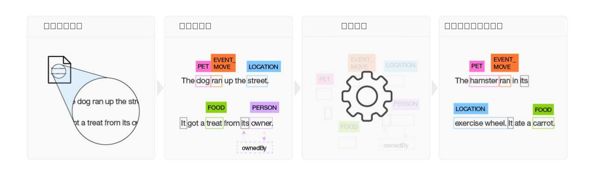

---

copyright:
  years: 2015, 2018
lastupdated: "2018-07-18"

---

{:shortdesc: .shortdesc}
{:new_window: target="_blank"}
{:tip: .tip}
{:pre: .pre}
{:codeblock: .codeblock}
{:screen: .screen}
{:javascript: .ph data-hd-programlang='javascript'}
{:java: .ph data-hd-programlang='java'}
{:python: .ph data-hd-programlang='python'}
{:swift: .ph data-hd-programlang='swift'}

此文件適用於 {{site.data.keyword.knowledgestudiofull}} on {{site.data.keyword.cloud}}。若要查看舊版 {{site.data.keyword.knowledgestudioshort}} on {{site.data.keyword.IBM_notm}} Marketplace 的文件，[請按一下此鏈結 ](https://console.bluemix.net/docs/services/knowledge-studio/index.html){: new_window}。
{: tip}

# 關於
{: #wks_overview_full}

使用 {{site.data.keyword.knowledgestudiofull}} 來建立機器學習模型，瞭解您產業特有的語言細微差別、意義及關係，或建立規則型模型，以根據您定義的規則來找出文件中的實體。
{: shortdesc}

若要變成特定產業或領域的主題專家，必須訓練 {{site.data.keyword.watson}}。您可以使用 {{site.data.keyword.knowledgestudioshort}} 協助訓練 {{site.data.keyword.watson}} 的作業。

## 建置機器學習模型

{{site.data.keyword.knowledgestudioshort}} 提供易於使用的工具來註釋非結構化領域文獻，並使用那些註釋來建立瞭解領域語言的自訂機器學習模型。模型的正確性會透過反覆測試得到改善，最終產生的演算法可以從其看到的型樣中學習，並在大型的新文件集合中辨識那些型樣。您可以將已完成的機器學習模型部署至其他 {{site.data.keyword.watson}} 雲端型供應項目及認知解決方案，以尋找並擷取提及項目的關係及實體，包括實體互相參照。

 圖 1. 建置機器學習模型過程的概觀

1. 根據一組特定領域來源文件，團隊會建立類型系統，以定義將使用模型的應用程式感興趣之資訊的實體類型及關係類型。
1. 兩個以上註釋人員組成的群組會註釋一小組來源文件，以標示代表實體類型的單字、識別關係類型（其中文字識別實體提及項目之間的關係），以及定義互相參照，其會識別參照相同事物（亦即，相同實體）的不同提及項目。系統會解決註釋中的任何不一致，且建置一組最佳的已註釋文件，以構成基準。
1. {{site.data.keyword.knowledgestudioshort}} 會使用基準來訓練模型。
1. 經過訓練的模型可用來在以前從未看過的新文件中尋找實體、關係及互相參照。

如需詳細資料，請參閱[建立機器學習模型](/docs/services/watson-knowledge-studio/ml-annotator.html)。

## 建置規則型模型

{{site.data.keyword.knowledgestudioshort}} 提供規則編輯器，簡化在文件中尋找並擷取一般型樣作為規則的過程。然後，您可以建立可辨識規則型樣的模型，並部署它以供其他服務使用。

如需詳細資料，請參閱[建立規則型模型](/docs/services/watson-knowledge-studio/rule-annotator.html)。

## Watson 服務整合
{: #wks_watsoninteg}

在 {{site.data.keyword.knowledgestudiofull}} 與其他 {{site.data.keyword.watson}} 服務之間共用領域構件及模型。

請使用 {{site.data.keyword.knowledgestudioshort}} 來執行下列作業：

- 使用 {{site.data.keyword.nlushort}} 服務來引導註釋自動尋找並註釋文件中的實體。當註釋人員開始註釋文件時，他們可以看到服務已完成的註釋，並可以檢閱及新增這些註釋。如需詳細資料，請參閱[使用 {{site.data.keyword.nlushort}} 預先註釋文件](/docs/services/watson-knowledge-studio/preannotation.html#wks_preannotnlu)。
- 上傳採用 [UIMA CAS XMI 格式](/docs/services/watson-knowledge-studio/preannotation.html#wks_uimaweximport)的已分析文件。例如，您可以上傳從 {{site.data.keyword.IBM_notm}} {{site.data.keyword.watson}} Explorer 內容分析集合或 [{{site.data.keyword.IBM_notm}} {{site.data.keyword.watson}} Explorer Content Analytics Studio](/docs/services/watson-knowledge-studio/preannotation.html#wks_uimawexstudio) 匯出的 UIMA CAS XMI 檔案。
- 部署要與 {{site.data.keyword.watson}} {{site.data.keyword.discoveryshort}} 服務搭配使用的[機器學習](/docs/services/watson-knowledge-studio/publish-ml.html#wks_madiscovery)或[規則型](/docs/services/watson-knowledge-studio/rule-annotator-model-use.html#wks_rule_discovery)模型。
- 部署要與 {{site.data.keyword.nlushort}} 服務搭配使用的[機器學習](/docs/services/watson-knowledge-studio/publish-ml.html#wks_manlu)或[規則型](/docs/services/watson-knowledge-studio/rule-annotator-model-use.html#wks_rule_nlu)模型。
- 匯出要在 {{site.data.keyword.IBM_notm}} {{site.data.keyword.watson}} Explorer 中使用的[機器學習模型](/docs/services/watson-knowledge-studio/publish-ml.html#wks_maexport)。
- 匯出要在 {{site.data.keyword.IBM_notm}} {{site.data.keyword.watson}} Explorer 中使用的[規則型模型 PEAR 檔](/docs/services/watson-knowledge-studio/rule-annotator-model-use.html#wks_rule_export)。
