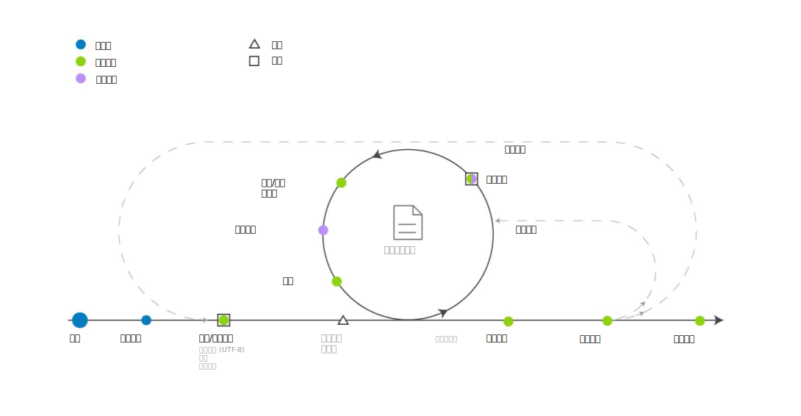

---

copyright:
  years: 2015, 2018
lastupdated: "2018-07-19"

---

{:shortdesc: .shortdesc}
{:new_window: target="_blank"}
{:tip: .tip}
{:pre: .pre}
{:codeblock: .codeblock}
{:screen: .screen}
{:javascript: .ph data-hd-programlang='javascript'}
{:java: .ph data-hd-programlang='java'}
{:python: .ph data-hd-programlang='python'}
{:swift: .ph data-hd-programlang='swift'}

此文件適用於 {{site.data.keyword.knowledgestudiofull}} on {{site.data.keyword.cloud}}。如果要在 {{site.data.keyword.IBM_notm}} Marketplace 上查看舊版 {{site.data.keyword.knowledgestudioshort}} 的文件，[請按一下這個鏈結 ](https://{DomainName}/docs/services/knowledge-studio/ml-annotator.html){: new_window}。
{: tip}

# 機器學習模型建立工作流程
{: #ml_annotator}

建立機器學習模型，該模型會訓練您可以用來在新文件中識別感興趣之實體、共同參照及關係的模型。
{: shortdesc}

瞭解在 {{site.data.keyword.knowledgestudioshort}} 中建立機器學習模型的一般工作流程。

所有步驟是由專案經理執行，只有*註釋文件* 步驟除外，這是由註釋人員執行。因為註釋人員通常是主題專家，所以在建立工作區資源（例如類型系統）期間，可能會諮詢他們。

 圖 1. 開發機器學習模型的工作流程

<table summary="建立及修正模型">
  <caption>表 1. 建立及修正工作流程</caption>
  <tr>
    <th style="vertical-align:bottom; text-align:left" id="d14771e70">步驟</th>
    <th style="vertical-align:bottom; text-align:left" id="d14771e72">說明</th>
  </tr>
  <tr>
    <td style="vertical-align:top; text-align:left" headers="d14771e70">
      
建立工作區。

    </td>
    <td style="vertical-align:top; text-align:left" headers="d14771e72">
      
請參閱[建立工作區](/docs/services/watson-knowledge-studio/create-project.html)。工作區包含用來建立模型的資源，包括：

      <dl>
        <dt>類型系統</dt>
        <dd>
          
上傳或建立類型系統，然後定義註釋人員在註釋文字時可以套用的實體類型和關係類型。模型程序管理員通常會與您領域的主題專家合作，一起定義類型系統。請參閱[建立類型系統](/docs/services/watson-knowledge-studio/typesystem.html)。

        </dd>
        <dt>來源文件</dt>
        <dd>
          
將代表您領域內容的範例文件上傳至工作區，以建立語料庫。請參閱[新增註釋的文件](/docs/services/watson-knowledge-studio/documents-for-annotation.html)。將語料庫分割為文件集、指定在所有文件集之間共用的文件百分比，並將文件集指派給註釋人員。請參閱[建立及指派註釋集](/docs/services/watson-knowledge-studio/documents-for-annotation.html#wks_projdocsets)。

        </dd>
        <dt>字典</dt>
        <dd>
          
上傳或建立用於註釋文字的字典。您可以選擇手動新增字典項目，或從檔案上傳項目，然後編輯項目。請參閱[建立字典](/docs/services/watson-knowledge-studio/dictionaries.html)。

        </dd>
      </dl>
    </td>
  </tr>
  <tr>
    <td style="vertical-align:top; text-align:left" headers="d14771e70">
      
<strong>選用</strong>：預先註釋文件

    </td>
    <td style="vertical-align:top; text-align:left" headers="d14771e72">
      
根據工作區字典中的術語、{{site.data.keyword.nlushort}} 類型的提及，或是根據您定義的規則，預先註釋文件。請參閱[引導註釋](/docs/services/watson-knowledge-studio/preannotation.html#wks_preannotate)。

    </td>
  </tr>
  <tr>
    <td style="vertical-align:top; text-align:left" headers="d14771e70">
      
註釋文件

    </td>
    <td style="vertical-align:top; text-align:left" headers="d14771e72">
      <ol>
        <li>
          
專案經理會將註釋作業指派給註釋人員、配置註釋人員之間的協議臨界值，並提供註釋準則供註釋人員遵循。請參閱[建立註釋作業](/docs/services/watson-knowledge-studio/annotate-documents.html#wks_hatask)。

        </li>
        <li>
          
註釋人員使用基準編輯器來手動註釋文件。註釋人員會識別您領域內容中感興趣的提及項目，並使用實體類型加以標記。註釋人員也會識別提及項目之間的關係（例如，Mary 是 IBM 的員工），以及提及項目如何共同參照相同的實體（例如，出現「她」時是指 Mary）。請參閱[註釋文件](/docs/services/watson-knowledge-studio/user-guide.html)。

        </li>
      </ol>
    </td>
  </tr>
  <tr>
    <td style="vertical-align:top; text-align:left" headers="d14771e70">
      
裁定及提升文件

    </td>
    <td style="vertical-align:top; text-align:left" headers="d14771e72">
      
接受或拒絕由註釋人員產生的基準，並裁定任何註釋差異以解決衝突。評估註釋人員努力的正確性和一致性，可能是由資深註釋人員或具有比專案經理更豐富之主題經驗的使用者負責。請參閱[裁定](/docs/services/watson-knowledge-studio/build-groundtruth.html#wks_haperform)。

    </td>
  </tr>
  <tr>
    <td style="vertical-align:top; text-align:left" headers="d14771e70">
      
訓練模型

    </td>
    <td style="vertical-align:top; text-align:left" headers="d14771e72">
      
建立機器學習模型。請參閱[建立機器學習模型](/docs/services/watson-knowledge-studio/train-ml.html#wks_madocsets)。

    </td>
  </tr>
  <tr>
    <td style="vertical-align:top; text-align:left" headers="d14771e70">
      
評估模型。

    </td>
    <td style="vertical-align:top; text-align:left" headers="d14771e72">
      
評估模型的正確性。請參閱[評估模型新增的註釋](/docs/services/watson-knowledge-studio/train-ml.html#wks_matest)。根據模型的正確性，此步驟可能會導致需要一再重新執行較早的步驟，直到達到最佳正確性為止。如需根據常見效能問題所更新項目的相關構想，請參閱[分析機器學習模型效能](/docs/services/watson-knowledge-studio/evaluate-ml.html)。

    </td>
  </tr>
  <tr>
    <td style="vertical-align:top; text-align:left" headers="d14771e70">
      
發佈模型。

    </td>
    <td style="vertical-align:top; text-align:left" headers="d14771e72">
      
匯出或部署模型。請參閱[使用機器學習模型](/docs/services/watson-knowledge-studio/publish-ml.html)。

    </td>
  </tr>
</table>
