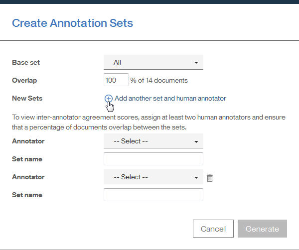

---

copyright:
  years: 2015, 2018
lastupdated: "2018-08-24"

---

{:shortdesc: .shortdesc}
{:new_window: target="_blank"}
{:tip: .tip}
{:pre: .pre}
{:codeblock: .codeblock}
{:screen: .screen}
{:javascript: .ph data-hd-programlang='javascript'}
{:java: .ph data-hd-programlang='java'}
{:python: .ph data-hd-programlang='python'}
{:swift: .ph data-hd-programlang='swift'}

此文件適用於 {{site.data.keyword.knowledgestudiofull}} on {{site.data.keyword.cloud}}。若要查看舊版 {{site.data.keyword.knowledgestudioshort}} on {{site.data.keyword.IBM_notm}} Marketplace 的文件，[請按一下此鏈結 ](https://{DomainName}/docs/services/knowledge-studio/tutorials-create-ml-model.html){: new_window}。
{: tip}

# 建立機器學習模型
{: #wks_tutml_intro}

本指導教學協助您瞭解建置機器學習模型的程序，您可以將部署此模型，並將它與其他 {{site.data.keyword.watson}} 服務搭配使用。
{: shortdesc}

## 學習目標
{: #objectives}

在完成本指導教學中的課程之後，您將知道如何執行下列作業：

- 建立文件集
- 預先註釋文件
- 建立註釋人員的作業
- 分析註釋人員內部協議，並裁定已註釋文件中的衝突
- 建立機器學習模型

完成本指導教學大約需要 60 分鐘。如果您要探索與本指導教學相關的其他概念，可能需要更長的時間才能完成。

## 開始之前
{: #prereqs}

- 您使用的是支援的瀏覽器。請參閱[瀏覽器需求](/docs/services/watson-knowledge-studio/system-requirements.html)。
- 您已順利完成[開始使用 {{site.data.keyword.knowledgestudioshort}}](/docs/services/watson-knowledge-studio/tutorials-create-project.html)，其中涵蓋建立工作區、建立類型系統，以及新增字典。
- 您必須至少有一個使用者 ID 為 Admin 或「專案經理」角色。

    > **附註：**如果可能的話，請對本指導教學中的機器學習模型作業使用多個使用者 ID（一個 Admin 或「專案經理」使用者 ID，以及至少兩個「註釋人員」使用者 ID）。使用多個使用者 ID 可提供實際 {{site.data.keyword.knowledgestudiofull}} 工作區的最真實模擬作業，其中專案經理必須協調並裁定多位註釋人員所執行的註釋。不過，如果您只能存取單一使用者 ID，您仍然可以模擬程序的大部分。

    如需使用者角色的相關資訊，請參閱 [{{site.data.keyword.knowledgestudioshort}} 中的使用者角色](/docs/services/watson-knowledge-studio/roles.html)。

## 結果
{: #results}

在完成本指導教學之後，您將具有可與其他 {{site.data.keyword.watson}} 服務搭配使用的自訂機器學習模型。

## 課程 1：新增文件以進行註釋
{: #tut_lessml1}

在本課程中，您將學習如何將可由註釋人員註釋的文件新增至 {{site.data.keyword.knowledgestudioshort}} 中的工作區。

### 關於本作業
{: #tut_lessml1_about}

如需新增文件的相關資訊，請參閱[將文件新增至工作區](/docs/services/watson-knowledge-studio/documents-for-annotation.html#wks_projadd)。

### 程序
{: #tut_lessml1_procedure}

1. 將 <a target="_blank" href="https://watson-developer-cloud.github.io/doc-tutorial-downloads/knowledge-studio/documents-new.csv" download>`documents-new.csv` </a> 檔案下載至您的電腦。此檔案包含適用於上傳的範例文件。
1. 在工作區內，按一下**資產** > **文件**。
1. 在「文件」頁面上，按一下**上傳文件集**。
1. 從您的電腦上傳 `documents-new.csv` 檔案。上傳的檔案即會顯示在表格中。

### 下一步
{: #tut_lessml1_next}

您現在可以將語料庫分成多個文件集，並將這些文件集指派給註釋人員。

## 課程 2：建立註釋集
{: #wks_tutless_ml2}

在本課程中，您將學習如何在 {{site.data.keyword.knowledgestudioshort}} 中建立註釋集。

### 關於本作業
{: #wks_tutless_ml2_about}

*註釋集* 是已上傳文件集中您指派給註釋人員的文件子集。註釋人員會註釋註釋集中的文件。若要稍後使用註釋程式內部評分來比較每一位註釋人員所新增的註釋，您必須至少將兩位註釋人員指派給不同的註釋集。您還必須指定部分百分比的文件在這些集合之間重疊。

> **附註：**在真實的情境中，您將根據工作區中工作的註釋人員數目，視需要建立多個註釋集。在本指導教學中，您將建立兩個註釋集。如果您沒有多個使用者 ID 的存取權，則可以將這兩個註釋集指派給同一位使用者。

如需註釋集的相關資訊，請參閱[建立及指派註釋集](/docs/services/watson-knowledge-studio/documents-for-annotation.html#wks_projdocsets)。

### 程序
{: #wks_tutless_ml2_procedure}

1. 在工作區內，按一下**資產** > **文件**。
2. 按一下**建立註釋集**。

    即會開啟「建立註釋集」視窗。依預設，此視窗會顯示基本集（包含所有文件）以及欄位（您可以在其中指定新註釋集的資訊）。

3. 按一下**新增另一個集合及註釋人員**，來新增其他註釋集的欄位。您可以按一下來新增您要建立的數個註釋集。對於本指導教學，您只需要兩個註釋集。

    

4. 在**重疊**欄位中，指定 `100`。此值指定您想要將基本集中的百分之百文件併入所有的新註釋集中，讓所有註釋人員都可以註釋它們。
5. 對於每一個新的註釋集，指定所需的資訊。

    - 在**註釋程式**欄位中，選取要指派給新註釋集的註釋人員使用者 ID。在真實的情境中，每一個註釋集都會指派給不同的註釋人員。

        > **附註：**如果您只有一個管理者 ID 可用於本指導教學，請將該使用者指派給所有註釋集。在真實的情境中，您會有多個註釋人員，但對於指導教學，管理者可以作為註釋人員。

    - 在**集合名稱**欄位中，指定註釋集的敘述性名稱。對於本指導教學，您可以使用名稱 `Set 1` 及 `Set 2`。

6. 按一下**產生**。

### 結果
{: #wks_tutless_ml2_results}

即會建立新的註釋集。

## 課程 3：以字典型註釋程式預先註釋
{: #wks_tutless_ml3}

在本課程中，您將學習如何使用字典型註釋程式在 {{site.data.keyword.knowledgestudioshort}} 中預先註釋文件。

### 關於本作業
{: #wks_tutless_ml3_about}

預先註釋文件是一個選用步驟。不過，它是一個值得執行的步驟，因為它會讓註釋人員的工作更輕鬆。

如需使用字典進行預先註釋的相關資訊，請參閱[使用字典預先註釋文件](/docs/services/watson-knowledge-studio/preannotation.html#wks_preannot)。

### 程序
{: #wks_tutless_ml3_procedure}

1. 在工作區內，按一下**資產** > **字典**。

  即會開啟 `Test dictionary` 字典。*開始使用 {{site.data.keyword.knowledgestudioshort}}* 指導教學的[新增字典](/docs/services/watson-knowledge-studio/tutorials-create-project.html#wks_tutless4)課程顯示如何建立此字典。

1. 從**實體類型**清單中，選取 `ORGANIZATION` 實體類型，將它對映至 `Test dictionary` 字典。

  *開始使用 {{site.data.keyword.knowledgestudioshort}}* 指導教學的[建立類型系統](/docs/services/watson-knowledge-studio/tutorials-create-project.html#wks_tutless3)課程顯示如何建立類型系統，其中包含 `ORGANIZATION` 實體類型。

1. 在**機器學習模型** > **預先註釋** > **字典**標籤上，按一下**套用此預先註釋程式**。
1. 選取您在[課程 2](/docs/services/watson-knowledge-studio/tutorials-create-ml-model.html#wks_tutless_ml2) 中建立的註釋集，但不包括您在[課程 1](/docs/services/watson-knowledge-studio/tutorials-create-ml-model.html#tut_lessml1) 中建立的文件集。
1. 按一下**執行**。

    

### 結果
{: #wks_tutless_ml3_results}

即會使用您所建立的字典來預先註釋所選取集合中的文件。如果您喜歡的話，可以使用字典來預先註釋您稍後新增的文件集或註釋集。

## 課程 4：建立註釋作業
{: #wks_tutless_ml4}

在本課程中，您將學習如何使用註釋作業來追蹤 {{site.data.keyword.knowledgestudioshort}} 中註釋人員的工作。

### 關於本作業
{: #wks_tutless_ml4_about}

如需註釋作業的相關資訊，請參閱[建立註釋作業](/docs/services/watson-knowledge-studio/annotate-documents.html#wks_hatask)。

### 程序
{: #wks_tutless_ml4_procedure}

1. 在工作區內，按一下**機器學習模型** > **註釋作業**。
2. 在「作業」頁面上，按一下**新增作業**。
3. 指定作業的詳細資料：

    - 在**作業名稱**欄位中，輸入 `Test`。
    - 在**截止日期**欄位中，選取未來的日期。

4. 按一下**建立**。
5. 選取您在[課程 2](/docs/services/watson-knowledge-studio/tutorials-create-ml-model.html#wks_tutless_ml2) 中建立的註釋集。

 同時選取這兩個註釋集，指定這兩個註釋集必須由其指派的註釋人員註釋才能完成此作業。

7. 按一下**建立作業**。
8. 當註釋人員開始註釋文件時，您可以開啟作業來查看其進度。

## 課程 5：註釋文件
{: #wks_tutless_ml5}

在本課程中，您將學習如何使用*基準編輯器* 在 {{site.data.keyword.knowledgestudioshort}} 中註釋文件。

### 關於本作業
{: #wks_tutless_ml5_about}

如需人工註釋的相關資訊，請參閱[使用基準編輯器進行註釋](/docs/services/watson-knowledge-studio/user-guide.html#wks_hagte)。

### 程序
{: #wks_tutless_ml5_procedure}

1. 以指派給您在[課程 4](/docs/services/watson-knowledge-studio/tutorials-create-ml-model.html#wks_tutless_ml4) 中所建立之註釋作業的使用者身分，登入 {{site.data.keyword.knowledgestudioshort}}。

    > **附註：**如果針對本指導教學您只能存取單一管理者 ID，則您可以使用該 ID 來執行人工註釋。不過，請記住，在真實的情境中，人工註釋是由具有「註釋人員」角色的不同使用者來執行。

1. 開啟 `My workspace` 工作區，然後按一下**機器學習模型** > **註釋作業**。
1. 開啟您在[課程 4](/docs/services/watson-knowledge-studio/tutorials-create-ml-model.html#wks_tutless_ml4) 中所建立的 `Test` 註釋作業。
1. 針對其中一個指派的註釋集按一下**註釋**。

  根據您設定註釋作業的方式，可能會有一個以上的註釋作業指派給您用以登入的使用者 ID。

1. 從文件清單中，尋找 *Technology - gmanews.tv* 文件並將它開啟。

  請注意，已使用 `ORGANIZATION` 實體類型註釋 `IBM` 一詞。此註釋是由[課程 3](/docs/services/watson-knowledge-studio/tutorials-create-ml-model.html#wks_tutless_ml3) 中套用的字典預先註釋程式所新增。此預先註釋正確無誤，因此不需要進行修改。

  

1. 註釋提及項目：

    1. 按一下「實體」標籤。
    2. 在文件內文中，選取文字 `Thomas Watson`。
    3. 在實體類型的清單中，按一下 `PERSON`。實體類型 `PERSON` 即會套用至選取的提及項目。

        

1. 註釋關係：

    1. 按一下「關係」標籤。
    1. 選取 `Thomas Watson` 及 `IBM` 提及項目（依該順序）。若要選取提及項目，請按一下文字上方的實體類型標籤。
    1. 在關係類型的清單中，按一下 `founderOf`。兩個提及項目會透過 `founderOf` 關係相互連接。

         連接的提及項目。")

1. 從狀態功能表中，選取**已完成**，然後按一下**儲存**按鈕。
1. 按一下**開啟文件清單**，回到此作業的文件清單，然後按一下**提交所有文件**，來提交文件以取得核准。

    > **附註：**在真實狀況下，您將建立更多的註釋，並會在提交之前完成集合中的所有文件。

1. 關閉此註釋集，然後在 `Test` 作業中開啟其他註釋集。

   根據您設定註釋作業的方式，以及您已將它們指派給哪些使用者，您可能需要以指派給註釋作業中其他註釋集的使用者身分登入 {{site.data.keyword.knowledgestudioshort}}。

1. 在 *Technology - gmanews.tv* 文件中重複相同的註釋，但這次請使用 `employedBy` 關係，而非 `founderOf` 關係。

  以另一個使用者身分登入將有助於說明下一個課程中的註釋人員內部協議。但是，如果只有一個使用者，您仍可以完成指導教學，以瞭解註釋人員內部協議如何運作。

1. 在您完成第二個註釋集的註釋之後，請按一下**提交所有文件**。

## 課程 6：分析註釋人員內部協議
{: #wks_tutless_ml6}

在本課程中，您將學習如何在 {{site.data.keyword.knowledgestudioshort}} 中比較多位註釋人員的工作。

### 關於本作業
{: #wks_tutless_ml6_about}

若要判定不同註釋人員是否一致地註釋重疊文件，請檢閱*註釋人員內部協議* (IAA) 分數。

{{site.data.keyword.knowledgestudioshort}} 會計算 IAA 分數，方法為檢查作業中所有文件集的所有重疊文件，不論文件集的狀態為何。IAA 分數顯示註釋人員註釋提及項目、關係及互相參照鏈結的差異度。定期檢查 IAA 分數，並驗證註釋人員彼此一致，這是一個良好的構想。

在本指導教學中，註釋人員已提交所有文件集以取得核准。如果註釋人員內部協議分數是可接受的，則您可以核准文件集。如果您拒絕文件集，會將它退回給註釋人員以進行改善。

如需註釋人員內部協議的相關資訊，請參閱[建置基準](/docs/services/watson-knowledge-studio/build-groundtruth.html)。

### 程序
{: #wks_tutless_ml6_procedure}

1. 以管理者身分登入 {{site.data.keyword.knowledgestudioshort}}，選取**機器學習模型** > **註釋作業**，然後按一下 `Test` 作業。

  在**狀態**直欄中，您可以看到文件集已提交。

1. 按一下**計算註釋人員內部協議**。
1. 按一下第一個功能表，來檢視提及項目、關係及互相參照鏈結的 IAA 分數。您也可以透過註釋人員的配對來檢視協議。您也可以依特定文件檢視協議。一般來說，目標是 1 分中的 .8 分，其中 1 表示完美協議。因為您在本指導教學中僅註釋了兩個實體類型，所以大部分的實體類型分數都是 `N/A`（不適用），這表示沒有可用的資訊可提供分數。

    *圖 1. 檢閱名為 `dave` 及 `phil` 之使用者的註釋人員內部分數*

    

1. 檢閱分數之後，您可以決定是要核准還是拒絕處於 `SUBMITTED` 狀態的文件集。請採取下列其中一個動作：

    - 如果分數對註釋集而言是可接受的，請選取勾選框，然後按一下**接受**。不與其他文件集重疊的文件會升級成基準。必須先透過裁定來檢閱確實重疊的文件，以解決衝突。對於本指導教學，請接受這兩個文件集。
    - 如果分數對註釋集而言是不可接受的，請選取勾選框，然後按一下**拒絕**。註釋人員需要重新造訪文件集，以改善註釋。

### 結果
{: #wks_tutless_ml6_results}

當您評估註釋人員內部協議分數時，您會看到一對註釋人員註釋相同文件的差異度。如果註釋人員內部協議分數是可接受的，則已接受文件集。

## 課程 7：裁定已註釋文件中的衝突
{: #wks_tutless_ml7}

在本課程中，您將學習如何裁定在 {{site.data.keyword.knowledgestudioshort}} 的文件集之間重疊的文件中的衝突。

### 關於本作業
{: #wks_tutless_ml7_about}

當您核准文件集時，只有不與其他文件集重疊的文件才會升級成基準。如果文件是多個文件集之間的重疊部分，則您必須先裁定任何註釋衝突，然後才能將文件升級成基準。

如需裁定的相關資訊，請參閱[建置基準](/docs/services/watson-knowledge-studio/build-groundtruth.html)。

### 程序
{: #wks_tutless_ml7_procedure}

1. 以管理者身分登入 {{site.data.keyword.knowledgestudioshort}}，選取**機器學習模型** > **註釋作業**，然後按一下 `Test` 作業。
1. 驗證兩個文件集都處於已核准狀態。
1. 按一下**檢查重疊文件的衝突**。

    您可以查看已由多位註釋人員所註釋的重疊文件。

1. 因為指導教學已指示您建立 *Technology - gmanews.tv* 文件的衝突關係，所以請在清單中尋找該文件，然後按一下**檢查衝突**。
1. 選取兩個衝突的註釋集，然後按一下**檢查衝突**。

    即會開啟裁定模式。在裁定模式中，您可以檢視重疊文件，檢查衝突，然後移除或取代這些註釋，再將文件提升至基準。

1. 選取**關係衝突**，接受 `foderOf` 關係，然後拒絕 `employedBy` 關係。
1. 請按一下**升級成基準**。

    或者，您也可以藉由在「文件」頁面上按一下**接受**，將文件升級成基準。

### 結果
{: #wks_tutless_ml7_results}

在解決註釋衝突並將文件升級成基準之後，您可以使用它們來訓練機器學習模型。

## 課程 8：建立機器學習模型
{: #wks_tutless_ml8}

在本課程中，您將學習如何在 {{site.data.keyword.knowledgestudioshort}} 中建立機器學習模型。

### 關於本作業
{: #wks_tutless_ml8_about}

建立機器學習模型時，請選取要用來訓練它的文件集。您也會指定要用作訓練資料、測試資料及盲目資料的文件百分比。只有已透過核准或裁定變成基準的文件，才能用來訓練機器學習模型。

如需機器學習模型的相關資訊，請參閱[訓練機器學習模型](/docs/services/watson-knowledge-studio/train-ml.html)及[分析機器學習模型效能](/docs/services/watson-knowledge-studio/evaluate-ml.html)。

### 程序
{: #wks_tutless_ml8_procedure}

1. 以管理者身分登入 {{site.data.keyword.knowledgestudioshort}}。
1. 按一下**機器學習模型** > **效能** > **訓練並評估**。
2. 選取**全部**，然後按一下**訓練並評估**。

    > **附註：**訓練時間可能超過十分鐘，或甚至可能需要幾小時，視人工註釋數目及所有文件中的字數而定。

3. 在訓練機器學習模型之後，您可以從「版本」頁面中將它匯出，也可以按一下位於「效能」頁面上每一個圖形上方的**詳細統計資料**鏈結，來檢視有關其效能的詳細資訊。
4. 若要檢視「訓練/測試/盲目集」頁面，請按一下**訓練並評估**按鈕。
5. 若要查看註釋人員所使用的文件，請按一下**檢視基準**。
6. 若要查看已訓練之機器學習模型在同一組文件上所建立的註釋，請按一下**檢視解碼結果**。
7. 若要檢視機器學習模型之精準度、查全率及 F1 分數的詳細資料，請按一下「效能」頁面。
8. 按一下每一個圖形上方的**詳細統計資料**鏈結。在這些「統計資料」頁面上，您可以使用圓鈕來檢視提及項目、關係及互相參照鏈結的評分。

    您可以透過檢視實體類型、關係類型及互相參照鏈結的統計資料摘要，來分析效能。您也可以分析*混淆矩陣* 中呈現的統計資料。若要查看矩陣，請將**摘要**變更為**混淆矩陣**。混淆矩陣可協助您比較機器學習模型所新增的註釋與基準中的註釋。

    > **附註：**在本指導教學中，您僅針對組織使用單一字典註釋文件。因此，除了 `ORGANIZATION` 之外，大部分實體類型的評分都是 `0` 或 `N/A`。分數很低，但在預期之內，因為您未執行任何人工註釋或更正。

    *圖 2.「統計資料」頁面上針對機器學習模型的選項*

    

9.  按一下**版本**。在「版本」頁面上，您可以取得模型的 Snapshot 及用來建立它的資源（但字典及註釋作業除外）。例如，您可能想要在重新訓練模型之前取得 Snapshot。如果統計資料在您下次訓練模型時較差，則您可以升級舊版本，並刪除傳回較差結果的版本。

### 結果
{: #wks_tutless_ml8_results}

您已建立機器學習模型、訓練它，並評估在註釋測試資料及盲目資料時的模型執行程度。藉由探索效能度量，您可以識別用來改善機器學習模型正確性的方式。

## 指導教學摘要
{: #wks_tutml_sum}

您已建立機器學習模型。

### 已學習的課程
{: #lessons_learned}

藉由完成本指導教學，您已學到下列概念：

- 文件集
- 機器學習模型
- 人工註釋作業
- 註釋人員內部協議與裁定
