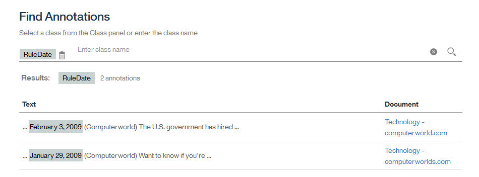

---

copyright:
  years: 2015, 2018
lastupdated: "2018-04-04"

---

{:shortdesc: .shortdesc}
{:new_window: target="_blank"}
{:tip: .tip}
{:pre: .pre}
{:codeblock: .codeblock}
{:screen: .screen}
{:javascript: .ph data-hd-programlang='javascript'}
{:java: .ph data-hd-programlang='java'}
{:python: .ph data-hd-programlang='python'}
{:swift: .ph data-hd-programlang='swift'}

此文件適用於 {{site.data.keyword.knowledgestudiofull}} on {{site.data.keyword.cloud}}。若要查看舊版 {{site.data.keyword.knowledgestudioshort}} on {{site.data.keyword.IBM_notm}} Marketplace 的文件，[請按一下此鏈結 ](https://console.bluemix.net/docs/services/knowledge-studio/tutorials-create-rule-model.html){: new_window}。
{: tip}

# 建立規則型模型
{: #wks_tutrule_intro}

本指導教學協助您瞭解如何建立規則型模型，您可以使用此模型來尋找您在文件中定義的文字型樣。
{: shortdesc}

您將建置一個模型，其可在文件中尋找符合型樣 `month day, year` 的文字。例如，模型將會尋找日期參照 *May 1, 2010*。在您定義規則型樣本身之前，您會建立構件，用來協助您建置型樣，包括辨識月份提及項目的字典類別，以及辨識文字中年份提及項目的正規表示式類別。

## 學習目標

在完成本指導教學之後，您將知道如何執行下列作業：

- 建立類別
- 新增定義規則的文件
- 建立字典與類別的關聯
- 定義正規表示式來擷取字元的序列
- 定義規則

大約需要 30 分鐘來完成本指導教學。如果您要探索與本指導教學相關的其他概念，將需要更多時間才能完成。

## 開始之前

- 您使用的是支援的瀏覽器。如需相關資訊，請參閱[瀏覽器需求](/docs/services/watson-knowledge-studio/system-requirements.html)。
- 您已順利完成[指導教學：建立工作區](/docs/services/watson-knowledge-studio/tutorials-create-project.html)。
- 您必須至少有一個使用者 ID 為 Admin 或 ProjectManager 角色。如需使用者角色的相關資訊，請參閱[組合團隊](/docs/services/watson-knowledge-studio/team.html)。

## 結果

在建立規則型模型之後，您可以在下列其中一種方式中使用它，用來尋找文件中的文字型樣：

- 在您建立機器學習模型之前，[預先註釋您的文件](/docs/services/watson-knowledge-studio/preannotation.html#wks_preannotrule)
- [將模型部署或匯出](/docs/services/watson-knowledge-studio/rule-annotator-model-use.html)至其他 {{site.data.keyword.watson}} 服務或產品

## 課程 1：新增月份字典
{: #wks_tutless_rule1}

在本課程中，您將學習如何將字典新增至 {{site.data.keyword.knowledgestudioshort}} 中的工作區。字典包含與年度月份相關的詞彙。

### 關於本作業

在之後的課程中，您將根據這個字典來定義類別。當您建立該類別時，此字典中所有在文件中找到的詞彙都會自動註釋為關聯類別類型的提及項目。如需字典的相關資訊，請參閱[將字典新增至工作區](/docs/services/watson-knowledge-studio/dictionaries.html#wks_projdictionaries)。

### 程序

1. 將 <a target="_blank" href="https://watson-developer-cloud.github.io/doc-tutorial-downloads/knowledge-studio/dictionary-items-month.csv" download>`dictionary-items-month.csv` </a> 檔案下載至您的電腦。此檔案包含 CSV 格式的字典詞彙，適用於上傳至 {{site.data.keyword.knowledgestudioshort}} 字典。
1. 從**資產及工具** > **預先註釋程式**資訊看板中，選取**字典**標籤，然後按一下**管理字典**。
1. 按一下**建立字典**按鈕來新增字典。
1. 在**名稱**欄位中，鍵入 `Month dictionary`，然後按一下**儲存**來建立（空白）字典。即會建立新的字典，並自動開啟以進行編輯。
1. 在字典窗格中，按一下**上傳**。
1. 在「上傳字典項目」視窗中，選取您電腦中的 `dictionary-items-month.csv` 檔案，然後按一下**上傳**。

    檔案中的詞彙即會匯入至字典。

## 課程 2：新增範例文件
{: #wks_tutless_rule2}

在本課程中，您將學習如何新增具有說明您要定義之規則類型的語言型樣的文件。

### 關於本作業

如需新增文件的相關資訊，請參閱[新增文件以定義規則](/docs/services/watson-knowledge-studio/rule-annotator-add-doc.html)。

### 程序

1. 將 <a target="_blank" href="https://watson-developer-cloud.github.io/doc-tutorial-downloads/knowledge-studio/documents-new.csv" download>`documents-new.csv` </a> 檔案下載至您的電腦。此檔案包含適用於上傳的範例文件。
1. 從資訊看板中，按一下**文件註釋** > **規則**。
1. 按一下**文件**旁的**新增文件**圖示。
1. 按一下**上傳 CSV 檔**標籤。
1. 按一下以瀏覽您先前下載至電腦的 `documents-new.csv` 檔案，然後按一下**上傳**。

    一組文件即會顯示在主要「文件」頁面中。

    

## 課程 3：建立類別
{: #wks_tutless_rule3}

在本課程中，您將學習如何定義您在定義規則時將使用的類別。

### 關於本作業

如需類別的相關資訊，請參閱[規則](/docs/services/watson-knowledge-studio/rule-annotator.html)。

### 程序

1. 從工作區的**規則**頁面中，在右側畫面中，按一下**類別**旁的**新增類別**圖示。

1. 輸入 `DictMonth` 作為類別名稱，然後按一下**新增**。

    新類別即會顯示在「類別」側邊畫面中。

## 課程 4：建立字典與類別的關聯
{: #wks_tutless_rule4}

在本課程中，您將學習如何在規則編輯器中使用字典。

### 程序

1. 從資訊看板中，選取**文件註釋** > **字典**，然後按一下您先前建立的**月份字典**。

1. 從**類別**清單中，選取 `DictMonth`，然後按一下**儲存**。

    類別即會與字典相關聯。

    

### 結果

對於與規則編輯器相關聯的文件，字典中詞彙的任何參照都會註釋為 `DictMonth` 類別提及項目。在下一個課程中，您將看到已註釋這些參照的證明。

## 課程 5：在文件中尋找類別註釋
{: #wks_tutless_rule5}

在本課程中，您將學習如何在規則編輯器文件中尋找類別註釋。

### 程序

1. 從資訊看板中，選取**文件註釋** > **規則**。
1. 從「類別」畫面中，尋找您先前定義的 `DictMonth` 類別，然後按一下其旁邊的**搜尋文件中的註釋**圖示。

    即會顯示「尋找註釋」頁面，並顯示所有包含月份文字參照的文件。

1. 按一下 `Technology - computerworld.com` 文件來檢視完整文件。請注意，會強調顯示 `February` 這個字，這表示它已註釋為 `DictMonth` 類別的提及項目。

## 課程 6：定義正規表示式
{: #wks_tutless_rule6}

在本課程中，您將學習如何定義正規表示式。

### 關於本作業

您將定義一個正規表示式，其可尋找年份型樣，如 *2009*。

如需定義正規表示式的相關資訊，請參閱[定義規則](/docs/services/watson-knowledge-studio/rule-annotator-define-rule.html)。

### 程序

1. 從**規則**頁面中，在右側畫面中，按一下**類別**旁的**新增類別**圖示 ()。
1. 輸入 `RegExpYear` 作為類別名稱，然後按一下**新增**。
1. 從資訊看板中，按一下 **Regex**，然後按一下**正規表示式**旁的**建立正規表示式**圖示。
1. 按一下**新增項目**按鈕。
1. 在**正規表示式**欄位中，輸入下列表示式：

    ```
    (?:(?:19|20)[0-9]{2})
    ```
    {: screen}

    > **附註：**此正規表示式會尋找 1900 與 2099 之間的年份。

1. 將**單字記號數下限**設為 `1`，將**單字記號數上限**設為 `1`。
1. 按一下**新增**來儲存正規表示式項目。
1. 輸入 `MyYearExp` 作為正規表示式名稱，然後從**類別**功能表中，選取您先前定義的 *RegExpear* 類別。
1. 按一下**儲存**。

    在儲存正規表示式之後，它會自動套用至範例文件。任何位於您在正規表示式中定義之型樣後面的字串，都會註釋為 **RegExpYear** 類別的提及項目。

1. 若要檢查您定義的表示式是否正確擷取時間事件，您可以搜尋提及項目。按一下「類別」側邊畫面中 **RegExpYear** 類別旁的**搜尋文件中的註釋**圖示。

    

    即會顯示「尋找註釋」頁面。在發生年份提及項目之事件的範例文件中，會強調顯示這些事件。

    

## 課程 7：定義規則
{: #unique_1166829415}

在本課程中，您將學習如何定義規則。

### 關於本作業

您已定義一個用於註釋月份提及項目的字典型類別。您也已定義一個用於尋找代表年份的數值的正規表示式。現在，您將定義一個規則，用於擷取月份序列，後面接著一個數字、一個逗點及一個年份。您將定義日期表示式的規則，例如 *September 21, 2016*。

如需定義規則的相關資訊，請參閱[定義規則](/docs/services/watson-knowledge-studio/rule-annotator-define-rule.html)。

### 程序

1. 從資訊看板中，選取**文件註釋** > **規則**，然後開啟 `Technology - computerworld.com` 文件。
1. 選取文件中的文字 *February 3, 2009*。確定您也選取了逗點。

    

1. 按一下**新增規則**圖示。

    規則編輯器會顯示您所識別之規則型樣的描述。

    可以看見文字 *February 3, 2009*。連接描述中儲存格的灰線會識別哪些儲存格目前是型樣的一部分。
    - *DictMonth* 類別是規則型樣的一部分，而不是文字 *February*。這是偏好的選項，因為您想要模型尋找已被 *DictMonth* 類別註釋為日期型樣中第一個記號的任何月份，而不只是文字 *February*。
    - 在規則結尾處，年份 *2009* 已註釋為 *RegExpYear* 類別的提及項目。*RegExpYear* 類別是規則型樣的一部分，而不是數字 2009。這也是偏好的選項，因為您想要模型尋找已被 *RegExpYear* 類別註釋為日期型樣中最後一個記號的任何年份，而不只是特定文字 *2009*。

    其後的數字 3 及逗點 (,) 顯示為型樣中的第二個和第三個記號。由於目前已指定型樣，模型將僅尋找指定月份第 3 天的日期事件。我們想要模型尋找指定月份任何一天的日期，因此接下來我們將變更日記號的特性設定。

1. 在日 `3` 儲存格上方，按一下**文字**圖示，以開啟記號的特性設定。

    

    目前，規則會設為符合確切文字 `3`。我們反而想要它符合任何數字。

1. 將特性設定變更為數值，方法為選取**字元類型：數值**，然後取消選取**文字：3**。

    

    您已變更數字 `3` 儲存格的定義。

    

    **Aa** 圖示指出，不需要數字等於 3，而讓它可以是任何數字。

1. 不要變更逗點記號的任何設定。

    我們想要型樣中的第三個記號為逗點，因此，**文字：,** 的現行特性設定是適當的。除了特性設定之外，每一個記號都有重複設定。重複設定指定記號可在文字中重複的次數，以讓它符合型樣。**必要（正好為 1）** 的現行重複設定也如指定般是適當的。

    

1. 指派類別來代表型樣 `DictMonth + numeric token + comma + RegExpYear`。

    請注意四個空的儲存格，代表您從文件中選取的四個記號。若要選取所有儲存格，請選取第一個儲存格，然後按住 Shift 鍵並按一下每一個其他儲存格。輸入 `RuleDate` 作為類別名稱，然後按一下它以建立新類別。

    

    您已順利定義規則的型樣。

1. 在**規則名稱**欄位中，輸入 `MyDateRule`，然後按一下**儲存**。

    在儲存規則之後，它會自動套用至範例文件。如果 `Technology - computerworld.com` 文件仍在規則編輯器中開啟，則您會看到文件中的 `February 3, 2009` 文字現在已註釋為 RuleDate 類別的提及項目。

    

    您可以在範例文件中搜尋 RuleDate 類別提及項目的所有事件，方法為從「類別」畫面中，按一下 `RuleDate` 類別旁的**搜尋文件中的註釋**圖示（）。良好作法為檢查是否已適當擷取所有日期，以確認您已正確定義型樣。

    

## 課程 8：建立規則型模型
{: #wks_tutless_rule8}

在本課程中，您將學習如何建立規則型模型。

### 關於本作業

如需建立規則型模型的相關資訊，請參閱[建立規則型模型](/docs/services/watson-knowledge-studio/rule-annotator-model-create.html)。

### 程序

1. 從資訊看板中，選取**模型管理** > **版本**，然後按一下**規則型模型類型對映**標籤。

1. 將您所定義的 `RuleDate` 類別對映至來自類型系統的 `DATE` 實體。

    1. 尋找 **DATE** 實體，然後按一下**編輯**。

        

    1. 從下拉清單中選擇 `RuleDate` 類別，然後按一下**儲存**。

        

1. 若要執行規則型模型，請選取**規則型**標籤，然後按一下**執行此模型**。

## 指導教學摘要
{: #wks_tutrule_sum}

學習 {{site.data.keyword.knowledgestudioshort}} 時，您已建立規則型模型。

### 已學習的課程

藉由完成本指導教學，您已學到下列概念：

- 類別
- 正規表示式
- 規則
