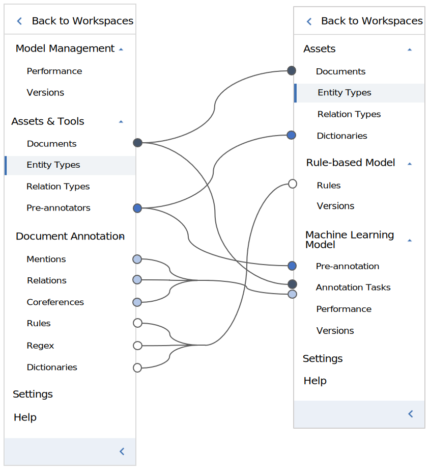

---

copyright:
  years: 2015, 2018
lastupdated: "2018-09-11"

---

{:shortdesc: .shortdesc}
{:new_window: target="_blank"}
{:tip: .tip}
{:pre: .pre}
{:codeblock: .codeblock}
{:screen: .screen}
{:javascript: .ph data-hd-programlang='javascript'}
{:java: .ph data-hd-programlang='java'}
{:python: .ph data-hd-programlang='python'}
{:swift: .ph data-hd-programlang='swift'}

This documentation is for {{site.data.keyword.knowledgestudiofull}} on {{site.data.keyword.cloud}}. To see the documentation for the previous version of {{site.data.keyword.knowledgestudioshort}} on {{site.data.keyword.IBM_notm}} Marketplace, [click this link ](https://{DomainName}/docs/services/knowledge-studio/release-notes.html){: new_window}.
{: tip}

# Release notes
{: #release-notes}

The following new features and changes to {{site.data.keyword.knowledgestudiofull}} are available.
{: shortdesc}

## December 2018
{: #dec2018}

### New features and changes
{: #new-dec2018}

-  Introduced support to deploy the same machine learning model version to multiple service instances and general improvements to the **Version History and Deployment** page. For information about deploying multiple instances of the same model version see [Deploying the same model version to multiple services](/docs/services/watson-knowledge-studio/publish-ml.html#machine-learning-model)

-  Added the `models` method to the {{site.data.keyword.nlushort}} service allowing users to list deployed {{site.data.keyword.knowledgestudioshort}} models.

## September 2018
{: #sept2018}

### New features and changes
{: #new-sept2018}

- Introduced support for HTML, DOC, DOCX, and PDF files. For information about the supported document types, size limits, and other information, see  [Creating a workspace > Machine learning model > Document management](/docs/services/watson-knowledge-studio/create-project.html#machine-learning-model). For information about adding documents for annotation, see [Adding documents to a workspace](/docs/services/watson-knowledge-studio/documents-for-annotation.html#wks_projadd).

## August 2018
{: #august2018}

### New features and changes
{: #new-august2018}

- Introduced a new option for automated migration of Standard plan instances from the deprecated {{site.data.keyword.IBM_notm}} Marketplace platform to the [{{site.data.keyword.cloud_notm}} platform ](https://www.ibm.com/blogs/bluemix/2017/12/watson-knowledge-studio-ibm-cloud/){: new_window}. If you have a Standard instance on the deprecated platform, you'll have the option to migrate. For more information, see [Migrating to {{site.data.keyword.cloud_notm}}](/docs/services/watson-knowledge-studio/client-migration.html).

## July 2018
{: #july2018}

### New features and changes
{: #new-july2018}

- The **Deployed Models** page was updated to include models from {{site.data.keyword.knowledgestudioshort}} instances that are managed by [IAM *resource groups* ](https://{DomainName}/docs/iam/users_roles.html){: new_window}, in addition to models that are managed by [Cloud Foundry *organizations* ](https://{DomainName}/docs/iam/cfaccess.html){: new_window}.

   What you see on the Deployed Models page depends on the [region ](https://{DomainName}/docs/resources/services_region.html){: new_window} that hosts your {{site.data.keyword.knowledgestudioshort}} instance. If the region supports instances managed by both access management methods, you see a tab for each method. Models from instances that are managed by IAM are listed on the **Resource Groups** tab. Models from instances that are managed by Cloud Foundry are listed on the **Organizations** tab.

  If the region supports instances managed by only one of the access management methods, you see only one list of models, because only one access management method is applicable.

   To view the **Deployed Models** page, from the **Settings** menu in the top right menu bar, click **Manage deployed models**. For information about undeploying models on the **Deployed Models** page, see [Undeploying machine learning models](/docs/services/watson-knowledge-studio/publish-ml.html#undeploy-view-model) and [Undeploying rule-based models](/docs/services/watson-knowledge-studio/rule-annotator-model-use.html#undeploy-view-model).

- The navigation was changed to better align with the {{site.data.keyword.knowledgestudioshort}} workflow. Also, the following functionality was reorganized:

    - In the previous version, management of dictionaries was included as part of the Pre-annotators page. Now, management of dictionaries is located on the Dictionaries page in the Assets section of the navigation.
    - In the previous version, human annotation functionality was distributed across the Mentions, Relations, and Coreferences tabs in the Document Annotation section of the navigation. Now, the functionality is merged under the Annotation Tasks page in the Machine Learning Model section of the navigation.
    - To manage human annotation tasks, in the previous version, you found the Tasks tab under the Assets & Tools > Documents page. Now, you add tasks and manage existing tasks on the Annotation Tasks page in the Machine Learning Model section of the navigation.
    - In the previous version, the Rules, Regex and Dictionaries pages were separate pages in the Document Annotation section of the navigation. Now, the functionality is merged under the Rules page in the Rule-based Model section of the navigation.

    For more details about the navigation changes, see Figure 1 and Table 3.

 Figure 1. Screen captures of the previous navigation (left side) and new navigation (right side).

| Feature | Previous location | Current location |
|---------|--------------------------|----------------------|
| Annotation tasks | Assets & Tools > Documents > Tasks | Machine Learning Model > Annotation Tasks |
| Coreferences tab | Document Annotation | Machine Learning Model > Annotation Tasks > task > annotation set > document |
| Dictionaries page (management) | Assets & Tools > Pre-annotators > Manage Dictionaries | Assets |
| Dictionaries tab (mapping to classes for rule-based model) | Document Annotation | Rule-based Model > Rules |
| Documents page | Assets & Tools | Assets |
| Entity Types page | Assets & Tools | Assets |
| Mentions tab | Document Annotation | Machine Learning Model > Annotation Tasks > task > annotation set > document |
| Performance page | Model Management | Machine Learning Model |
| Pre-annotators page | Assets & Tools | Machine Learning Model > Pre-annotation |
| Regex tab | Document Annotation | Rule-based Model > Rules |
| Relation Types page | Assets & Tools | Assets |
| Relations tab | Document Annotation | Machine Learning Model > Annotation Tasks > task > annotation set > document |
| Rules tab | Document Annotation | Rule-based Model |
| Tasks tab | Assets & Tools > Documents | Machine Learning Model > Annotation Tasks |
| Versions page (machine learning model) | Model Management | Machine Learning Model |
| Versions page (rule-based model) | Model Management | Rule-based Model |
{: caption="Table 3. Navigation changes (July 2018)" caption-side="top"}

## May 2018
{: #may2018}

### New features and changes
{: #new-may2018}

- A configuration issue was fixed that caused service instances in Sydney region to not appear in US South region.
- In the Deploy Model window, if the region you're deploying to supports both {{site.data.keyword.iamlong}} *resource groups* and Cloud Foundry *spaces*, to see the list, you will need to choose the method of access management that your service instance uses. For more information about Cloud Foundry and {{site.data.keyword.iamshort}}, see [Resource Groups and Access Management ](https://www.ibm.com/blogs/bluemix/2017/12/resource-groups-access-management/){: new_window}.
- Added the data collection setting on the Service Details page. For more information about data collection, see [Troubleshooting, support, and FAQs](/docs/services/watson-knowledge-studio/troubleshooting.html#content)
- Added Chinese (traditional) language support.
- Users who have the Admin role can now see the number of workspaces that are used. This info is available on the Service Details page.
- {{site.data.keyword.alchemylanguagefull}} is no longer available to deploy models to. For information, see [Retirement of {{site.data.keyword.alchemyapishort}} service ](https://www.ibm.com/blogs/bluemix/2017/03/bye-bye-alchemyapi/){: new_window}.
- Now, if you delete a workspace, you will be asked to confirm your action. We hope this confirmation prevents accidental deletions.
- The documentation includes some new details about data privacy. Read more in [Information security](/docs/services/watson-knowledge-studio/information-security.html).

## April 2018
{: #april2018}

### New features and changes
{: #new-april2018}

- The {{site.data.keyword.knowledgestudioshort}} Free plan was replaced with the Lite plan. For more information, see [Go Lite with Watson {{site.data.keyword.knowledgestudioshort}} ](https://www.ibm.com/blogs/bluemix/2018/04/go-lite-watson-knowledge-studio/){: new_window}.

## March 2018
{: #march2018}

### New features and changes
{: #new-march2018}

- A **Deployed Models** page is available where you can view all the {{site.data.keyword.knowledgestudioshort}} models that are deployed to services in the spaces that you have access to. To view the **Deployed Models** page, from the **Settings** menu in the top right menu bar, click **Manage deployed models**. For information about undeploying and viewing models on the **Deployed Models** page, see [Undeploying machine learning models](/docs/services/watson-knowledge-studio/publish-ml.html#undeploy-view-model) and [Undeploying rule-based models](/docs/services/watson-knowledge-studio/rule-annotator-model-use.html#undeploy-view-model).
- A French translation of the {{site.data.keyword.knowledgestudioshort}} interface is now available.
- {{site.data.keyword.alchemylanguagefull}} is no longer available as a pre-annotator. Instead of {{site.data.keyword.alchemylanguageshort}}, you can use {{site.data.keyword.nlushort}} to pre-annotate your documents. For more information, see [Bootstrapping annotation](/docs/services/watson-knowledge-studio/preannotation.html).

## December 2017
{: #december2017}

### New features and changes
{: #new-december2017}

- {{site.data.keyword.knowledgestudioshort}} launched on {{site.data.keyword.cloud_notm}}. For information about the migration process and schedule, see [Migrating to {{site.data.keyword.cloud_notm}}](/docs/services/watson-knowledge-studio/client-migration.html).
- Redesigned navigation. For details about the navigation changes, see [Table 2](#september2017) in the September 2017 release notes.
- Added {{site.data.keyword.nlufull}} as a pre-annotator.
- Added user and storage management settings to the Service Details page. For information about adding users, see [Assembling a team](/docs/services/watson-knowledge-studio/team.html). For information about setting storage limits, see [Troubleshooting > Storage space issues](/docs/services/watson-knowledge-studio/troubleshooting.html#storage).
- Added a Performance page for model quality evaluation and guidance about how to improve quality.

## November 2017
{: #november2017}

### Changes
{: #new-november2017}

- Fixed an issue where some relation annotations were missing in the downloaded corpus.
- Fixed an issue where a model could not be withdrawn from deployment if its status was **None**.
- Fixed an issue where the model could not be evaluated for Korean.

## October 2017
{: #october2017}

### Changes
{: #new-october2017}

- Fixed the issue with the **Export** button not being enabled until you refreshed the browser window in the {{site.data.keyword.Bluemix_notm}} [experimental](/docs/services/watson-knowledge-studio/troubleshooting.html#experimental) release.
- Fixed the button labels and tooltips to match the changes for the terms _upload_ and _download_ in the {{site.data.keyword.Bluemix_notm}} [experimental](/docs/services/watson-knowledge-studio/troubleshooting.html#experimental) release. These terms  are used instead of _import_ and _export_ when referring to type systems, documents, and dictionaries.
- Fixed the delay in updating the descriptions on the {{site.data.keyword.knowledgestudioshort}} User Account Management page in the {{site.data.keyword.Bluemix_notm}} [experimental](/docs/services/watson-knowledge-studio/troubleshooting.html#experimental) release.
- In the pre-annotation section of the interface, made a couple GUI changes to clarify the functionality of the machine learning model, the rule-based model, the dictionary, and {{site.data.keyword.alchemylanguagefull}}. Changed the button label from **Run** to **Pre-annotate**, changed the title of the window from **Run Annotator** to **Run Pre-annotation**, and changed the error message to clarify that you can't add automated annotations after humans annotated the documents.
- For projects or workspaces that use dictionary-based tokenizers, fixed an issue that showed empty sentences if you imported documents without ground truth.

## September 2017
{: #september2017}

### New features and changes
{: #new-sept17}

- Released a new front-end user experience for {{site.data.keyword.knowledgestudioshort}} on {{site.data.keyword.Bluemix}} as an [experimental](/docs/services/watson-knowledge-studio/troubleshooting.html#experimental) service. Changes include a reorganized navigation and a new model performance analysis page. For a summary of the navigation changes, see the table in the known issues.
- Added Chinese (simplified) and Dutch language support.

### Known issues
{: #issues-sept17}

- For a rule-based model, after you map classes and entity types, the **Export** button is not enabled until you refresh the browser window.
- For the {{site.data.keyword.Bluemix_notm}} [experimental](/docs/services/watson-knowledge-studio/troubleshooting.html#experimental) release, some of the documentation terminology does not match the new interface. The documentation matches the interface in {{site.data.keyword.IBM_notm}} Marketplace. The following terms have changed in the [experimental](/docs/services/watson-knowledge-studio/troubleshooting.html#experimental) release:

| Term in {{site.data.keyword.IBM_notm}} Marketplace | Term in {{site.data.keyword.Bluemix_notm}} | Notes |
|----------|----------|----------|
| _project_ | _workspace_ | This term was changed because {{site.data.keyword.Bluemix_notm}} also uses the term _project_ |
| _import_ and _export_ | _upload_ and _download_ | The terms _import_ and _export_ are now referred to as _upload_ and _download_ when used in terms of documents and entity types. The term _export_ is still used when referring to exporting a model to applications such as {{site.data.keyword.watson}} Explorer. |
{: caption="Table 1. Terminology changes for {{site.data.keyword.Bluemix_notm}} version" caption-side="top"}

- For the {{site.data.keyword.Bluemix_notm}} [experimental](/docs/services/watson-knowledge-studio/troubleshooting.html#experimental) release, some of the documentation task steps do not match the new interface. The documentation matches the interface in {{site.data.keyword.IBM_notm}} Marketplace. The following table summarizes the navigation changes for the [experimental](/docs/services/watson-knowledge-studio/troubleshooting.html#experimental) release:

| Feature | {{site.data.keyword.IBM_notm}} Marketplace location | {{site.data.keyword.Bluemix_notm}} location
|----------|----------|----------|
|Annotator Component tab | Main navigation | No longer exists |
|Confusion Matrix table (from the Statistics tab) | Annotator Component > Details | Model Management > Performance > Detailed Statistics link |
|Dictionaries tab | Main navigation | Assets & Tools > Pre-annotators |
|Dictionary Mapping page | Annotator Component | Assets & Tools > Pre-annotators |
|Entity Types tab | Type System | Assets & Tools > Entity Types |
|Ground Truth Editor | Human Annotation | Document Annotation tab |
|Ground Truth Editor Settings tab | Human Annotation | Settings > Document Annotation Settings |
|Models, running and exporting | Annotator Component | Model Management > Versions |
|Rules tab | Main navigation | Document Annotation > Rules |
|Statistics tab | Annotator Component > Details | Model Management > Performance |
|Summary table (from the Statistics tab) | Annotator Component > Details | Model Management > Performance > Detailed Statistics link |
|Type Mapping tab (for the rule-based model) | Annotator Component > Details | Model Management > Versions > Rule-based model type mapping |
{: caption="Table 2. Navigation changes for {{site.data.keyword.Bluemix_notm}} version" caption-side="top"}

## July 2017
{: #july2017}

- Fixed a defect that, in some cases, caused the header to disappear
- Applied security updates for infrastructure components

## June 2017
{: #june2017}

- Improved stability for handling large data under certain conditions
- Fixed a defect for an adjudication error

## May 2017
{: #may2017}

- Added ability to rename various objects, such as projects, document sets, and so on
- Added ability to deploy NLU models to specific {{site.data.keyword.Bluemix}} regions
- Improved performance for displaying large table for IAA
- Fixed minor defects
- Applied security fixes

## April 2017
{: #april2017}

- Improved stability for {{site.data.keyword.knowledgestudioshort}} Premium
- Added usage analysis for business metrics

## Releases prior to April 2017

See [{{site.data.keyword.IBM_notm}} tech note #1986001 ](http://www.ibm.com/support/docview.wss?uid=swg21986001){: new_window}.
