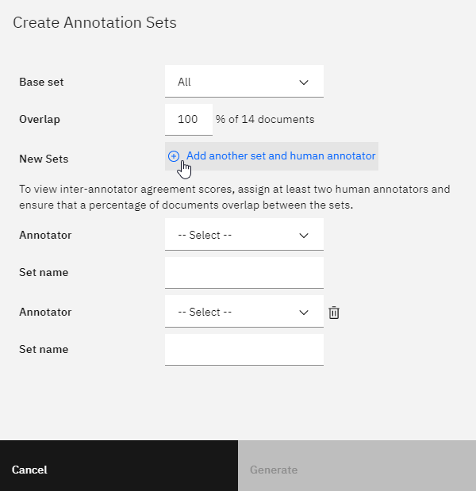
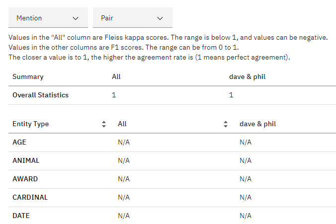
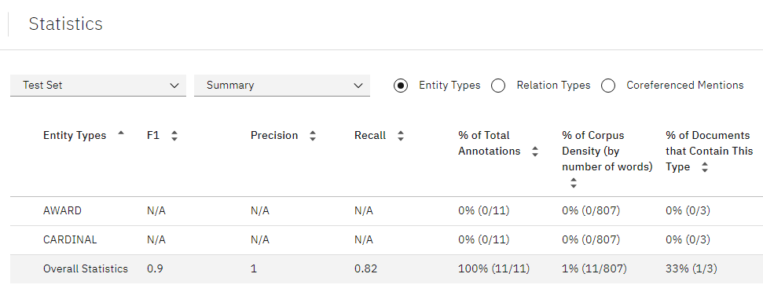

---

copyright:
  years: 2015, 2020
lastupdated: "2020-06-24"

subcollection: watson-knowledge-studio

---

{:shortdesc: .shortdesc}
{:external: target="_blank" .external}
{:deprecated: .deprecated}
{:important: .important}
{:note: .note}
{:tip: .tip}
{:preview: .preview}
{:beta: .beta}
{:pre: .pre}
{:codeblock: .codeblock}
{:screen: .screen}

This documentation is for {{site.data.keyword.knowledgestudiofull}} on {{site.data.keyword.cloud}}. To see the documentation for the previous version of {{site.data.keyword.knowledgestudioshort}} on {{site.data.keyword.IBM_notm}} Marketplace, [click this link](/docs/knowledge-studio?topic=knowledge-studio-wks_tutml_intro).
{: tip}

# Creating a machine learning model
{: #wks_tutml_intro}

This tutorial helps you understand the process for building a machine learning model that you can deploy and use with other {{site.data.keyword.watson}} services.
{: shortdesc}

## Learning objectives
{: #tcmm-obj}

After you complete the lessons in this tutorial, you will know how to perform the following tasks:

- Create document sets
- Pre-annotate documents
- Create tasks for human annotators
- Analyze inter-annotator agreement and adjudicate conflicts in annotated documents
- Create machine learning models

This tutorial takes approximately 60 minutes to finish. If you explore other concepts that are related to this tutorial, it might take longer to complete.

## Before you begin
{: #tcmm-pr}

- You're using a supported browser. See [Browser requirements](/docs/watson-knowledge-studio?topic=watson-knowledge-studio-system-requirements).
- You successfully completed [Getting started with {{site.data.keyword.knowledgestudioshort}}](/docs/watson-knowledge-studio?topic=watson-knowledge-studio-wks_tutintro), which covers creating a workspace, creating a type system, and adding a dictionary.
- You must have at least one user ID in either the Admin or Project Manager role.

    If possible, use multiple user IDs for the machine learning model tasks in this tutorial (one Admin or Project Manager user ID, and at least two Human Annotator user IDs). Using multiple user IDs provides the most realistic simulation of an actual {{site.data.keyword.knowledgestudiofull}} workspace, where a project manager must coordinate and adjudicate annotation that is performed by multiple human annotators. However, if you have access to only a single user ID, you can still simulate most parts of the process.
    {: tip}

    For information about user roles, see [User roles in {{site.data.keyword.knowledgestudioshort}}](/docs/watson-knowledge-studio?topic=watson-knowledge-studio-roles).

## Results
{: #tcmm-results}

After completing this tutorial, you will have a custom machine learning model that you can use with other {{site.data.keyword.watson}} services.

## Lesson 1: Adding documents for annotation
{: #tut_lessml1}

In this lesson, you will learn how to add documents to a workspace in {{site.data.keyword.knowledgestudioshort}} that can be annotated by human annotators.

### About this task
{: #tut_lessml1_about}

For more information about adding documents, see [Adding documents to a workspace](/docs/watson-knowledge-studio?topic=watson-knowledge-studio-documents-for-annotation#wks_projadd).

### Procedure
{: #tut_lessml1_procedure}

1.  Download the <a target="_blank" href="https://watson-developer-cloud.github.io/doc-tutorial-downloads/knowledge-studio/documents-new.csv" download>`documents-new.csv`</a> file to your computer. This file contains example documents suitable for uploading.
1.  Within your workspace, click **Assets** > **Documents**.
1.  On the Documents page, click **Upload Document Sets**.
1.  Upload the `documents-new.csv` file from your computer. The uploaded file is displayed in the table.

## Lesson 2: Pre-annotating with a dictionary-based annotator
{: #wks_tutless_ml3}

In this lesson, you will learn how to use a dictionary-based annotator to pre-annotate documents in {{site.data.keyword.knowledgestudioshort}}.

### About this task
{: #wks_tutless_ml3_about}

Pre-annotating documents is an optional step. However, it is a worthwhile step because it makes the job of human annotators easier later.

For more information about pre-annotation with dictionaries, see [Pre-annotating documents with a dictionary](/docs/watson-knowledge-studio?topic=watson-knowledge-studio-preannotation#wks_preannot).

### Procedure
{: #wks_tutless_ml3_procedure}

1. Within your workspace, click **Assets** > **Dictionaries**.

  The `Test dictionary` dictionary opens. The [Adding a dictionary](/docs/watson-knowledge-studio?topic=watson-knowledge-studio-wks_tutintro#wks_tutless4) lesson of the *Getting started with {{site.data.keyword.knowledgestudioshort}}* tutorial shows how to create this dictionary.

1. From the **Entity type** list, select the `ORGANIZATION` entity type to map it to the `Test dictionary` dictionary.

  The [Creating a type system](/docs/watson-knowledge-studio?topic=watson-knowledge-studio-wks_tutintro#wks_tutless3) lesson of the *Getting started with {{site.data.keyword.knowledgestudioshort}}* tutorial shows how to create the type system that contains the `ORGANIZATION` entity type.

1. On the **Machine Learning Model** > **Pre-annotation** > **Dictionaries** tab, click **Apply This Pre-annotator**.
1. Select the document set that you created in [Lesson 1](#tut_lessml1).
1. Click **Run**.

### Results
{: #wks_tutless_ml3_results}

The documents in the selected sets are pre-annotated by using the dictionary that you created. If you like, you can use the dictionary to pre-annotate document sets or annotation sets that you add later.

## Lesson 3: Creating an annotation task
{: #wks_tutless_ml2}

In this lesson, you will learn how to create annotation sets and use annotation tasks to track the work of human annotators in {{site.data.keyword.knowledgestudioshort}}.

### About this task
{: #wks_tutless_ml2_about}

An *annotation set* is a subset of documents from an uploaded document set that you assign to a human annotator. The human annotator annotates the documents in the annotation set. To later use inter-annotator scores to compare the annotations that are added by each human annotator, you must assign at least two human annotators to different annotation sets. You must also specify that some percentage of documents overlap between the sets.

In a realistic scenario, you would create as many annotation sets as needed, based on the number of human annotators who are working in the workspace. In this tutorial, you will create two annotation sets. If you do not have access to multiple user IDs, you can assign both annotation sets to the same user.
{: tip}

For more information about annotation sets and annotation tasks, see [Creating an annotation task](/docs/watson-knowledge-studio?topic=watson-knowledge-studio-annotate-documents#wks_hatask).

### Procedure
{: #wks_tutless_ml2_procedure}

1. Within your workspace, click **Machine Learning Model** > **Annotations**.
1. Click the **Annotation Tasks** tab, then click **Add Task**.
1. Specify the details for the task:

    - In the **Task name** field, enter `Test`.
    - In the **Deadline** field, select a date in the future.

1. Click **Create Annotation Sets**.

    The Create Annotation Sets window opens. By default, this window shows the base set, which contains all documents, and fields where you can specify the information for a new annotation set.

1. Click **Add another set and human annotator** to add fields for an additional annotation set. You can click to add as many annotation sets as you want to create. For this tutorial, you need only two annotation sets.

    

1. In the **Overlap** field, specify `100`. This value specifies that you want 100 percent of the documents in the base set to be included in all the new annotation sets so they can be annotated by all human annotators.
1. For each new annotation set, specify the required information.

    - In the **Annotator** field, select a human annotator user ID to assign to the new annotation set. In a realistic scenario, each annotation set is assigned to a different human annotator.

        If you have only a single administrator ID to use for the tutorial, assign that user to all annotation sets. In a realistic scenario, you would have multiple human annotators, but for the tutorial, the administrator can act as human annotator.
        {: tip}

    - In the **Set name** field, specify a descriptive name for the annotation set. For this tutorial, you can use the names, `Set 1` and `Set 2`.

1. Click **Generate**.
1. Click **Save**.
1. As human annotators begin annotating documents, you can open tasks to see their progress.

## Lesson 4: Annotating documents
{: #wks_tutless_ml5}

In this lesson, you will learn how to use the *ground truth editor* to annotate documents in {{site.data.keyword.knowledgestudioshort}}.

### About this task
{: #wks_tutless_ml5_about}

For more information about human annotation, see [Annotation with the ground truth editor](/docs/watson-knowledge-studio?topic=watson-knowledge-studio-user-guide#wks_hagte).

### Procedure
{: #wks_tutless_ml5_procedure}

1. Log in to {{site.data.keyword.knowledgestudioshort}} as a user who is assigned to the annotation task that you created in [Lesson 3](#wks_tutless_ml2).

    If you have access only to a single administrator ID for this tutorial, you can use that ID to perform human annotation. However, remember that in a realistic scenario, human annotation is performed by different users with the Human Annotator role.
    {: tip}

1. Open the `My workspace` workspace and click **Machine Learning Model** > **Annotations**.
1. Click the **Annotation Tasks** tab, then open the `Test` annotation task you created in [Lesson 3](#wks_tutless_ml2).
1. Click **Annotate** for one of the assigned annotation sets.

  Depending on how you set up the annotation tasks, you could have one or more annotation tasks assigned to the user ID you logged in with.

1. From the list of documents, find the *Technology - gmanews.tv* document and open it.

  Notice that the term `IBM` was already annotated with the `ORGANIZATION` entity type. This annotation was added by the dictionary pre-annotator that was applied in [Lesson 2](#wks_tutless_ml3). This pre-annotation is correct, so it does not need to be modified.

  

1. Annotate a mention:

    1. Click the Entity tab.
    1. In the document body, select the text `Thomas Watson`.
    1. In the list of entity types, click `PERSON`. The entity type `PERSON` is applied to the selected mention.

        

1. Annotate a relation:

    1. Click the Relation tab.
    1. Select the `Thomas Watson` and `IBM` mentions (in that order). To select a mention, click the entity type label above the text.
    1. In the list of relation types, click `founderOf`. The two mentions are connected with a `founderOf` relationship.

        

1. From the status menu, select **Completed**, and then click the **Save** button.
1. Click **Open document list** to return to the list of documents for this task and click **Submit All Documents** to submit the documents for approval.

    In a realistic situation, you would create many more annotations and complete all the documents in the set before submitting.
    {: tip}

1. Close this annotation set, and then open the other annotation set in the `Test` task.

   Depending on how you set up the annotation tasks and which users you assigned them to, you might need to log in to {{site.data.keyword.knowledgestudioshort}} as the user who is assigned to the other annotation set in the annotation task.

1. Repeat the same annotations in the *Technology - gmanews.tv* document, except this time, use the `employedBy` relation instead of the `founderOf` relation.

  Logging in as another user will help illustrate inter-annotator agreement in the next lesson. But if you have only one user, you can still complete the tutorial to get an understanding of how inter-annotator agreement works.

1. After you complete the annotations for the second annotation set, click **Submit All Documents**.

## Lesson 5: Analyzing inter-annotator agreement
{: #wks_tutless_ml6}

In this lesson, you will learn how to compare the work of multiple human annotators in {{site.data.keyword.knowledgestudioshort}}.

### About this task
{: #wks_tutless_ml6_about}

To determine whether different human annotators are annotating overlapping documents consistently, review the *inter-annotator agreement* (IAA) scores.

{{site.data.keyword.knowledgestudioshort}} calculates IAA scores by examining all overlapping documents in all document sets in the task, regardless of the status of the document sets. The IAA scores show how different human annotators annotated mentions, relations, and coreference chains. It is a good idea to check IAA scores periodically and verify that human annotators are consistent with each other.

In this tutorial, the human annotators submitted all the document sets for approval. If the inter-annotator agreement scores are acceptable, you can approve the document sets. If you reject a document set, it is returned to the human annotator for improvement.

For more information about inter-annotator agreement, see [Building the ground truth](/docs/watson-knowledge-studio?topic=watson-knowledge-studio-build-groundtruth).

### Procedure
{: #wks_tutless_ml6_procedure}

1. Log in to {{site.data.keyword.knowledgestudioshort}} as the administrator and select **Machine Learning Model** > **Annotations**. Click the **Annotation Tasks** tab, then click the `Test` task.

  In the **Status** column, you can see that the document sets are submitted.

1. Click **Calculate Inter-Annotator Agreement**.
1. View IAA scores for mention, relations, and coreference chains by clicking the first menu. You can also view agreement by pairs of human annotators. You can also view agreement by specific documents. In general, aim for a score of .8 out of 1, where 1 means perfect agreement. Because you annotated only two entity types in this tutorial, most of the entity type scores are `N/A` (not applicable), which means no information is available to give a score.

    *Figure 1. Reviewing inter-annotator scores with users named `dave` and `phil`*

    

1. After you review the scores, you can decide whether you want to approve or reject document sets that are in the `SUBMITTED` status. Take one of these actions:

    - If the scores are acceptable for an annotation set, select the check box and click **Accept**. Documents that do not overlap with other document sets are promoted to ground truth. Documents that do overlap must first be reviewed through adjudication so that conflicts can be resolved. For this tutorial, accept both document sets.
    - If the scores are not acceptable for an annotation set, select the check box and click **Reject**. The document set needs to be revisited by the human annotator to improve the annotations.

### Results
{: #wks_tutless_ml6_results}

When you evaluated the inter-annotator agreement scores, you saw how different pairs of human annotators annotated the same document. If the inter-annotator agreement score was acceptable, you accepted the document set.

## Lesson 6: Adjudicating conflicts in annotated documents
{: #wks_tutless_ml7}

In this lesson, you will learn how to adjudicate conflicts in documents that overlap between document sets in {{site.data.keyword.knowledgestudioshort}}.

### About this task
{: #wks_tutless_ml7_about}

When you approve a document set, only the documents that do not overlap with other document sets are promoted to ground truth. If a document is part of the overlap between multiple document sets, you must adjudicate any annotation conflicts before the document can be promoted to ground truth.

For more information about adjudication, see [Building the ground truth](/docs/watson-knowledge-studio?topic=watson-knowledge-studio-build-groundtruth).

### Procedure
{: #wks_tutless_ml7_procedure}

1. Log in to {{site.data.keyword.knowledgestudioshort}} as the administrator and select **Machine Learning Model** > **Annotations**. Click the **Annotation Tasks** tab, then click the `Test` task.
1. Verify that the two document sets are in an approved state.
1. Click **Check Overlapping Documents for Conflicts**.

    You can see the overlapping documents that were annotated by more than one human annotator.

1. Because the tutorial instructed you to create a conflicting relation for the *Technology - gmanews.tv* document, find that document in the list and click **Check for Conflicts**.
1. Select the two conflicting annotation sets and click **Check for Conflicts**.

    Adjudication mode opens. In adjudication mode, you can view overlapping documents, check for conflicts, and remove or replace annotations before you promote the documents to ground truth.

1. Select **Relation conflicts**, accept the `founderOf` relation, and reject the `employedBy` relation.
1. Click **Promote to Ground Truth**.

    Alternatively, you can promote a document to ground truth by clicking **Accept** on the Documents page.

### Results
{: #wks_tutless_ml7_results}

After you resolve the annotation conflicts and promote the documents to ground truth, you can use them to train the machine learning model.

## Lesson 7: Creating a machine learning model
{: #wks_tutless_ml8}

In this lesson, you will learn how to create a machine learning model in {{site.data.keyword.knowledgestudioshort}}.

### About this task
{: #wks_tutless_ml8_about}

When you create a machine learning model, you select the document sets that you want to use to train it. You also specify the percentage of documents that are to be used as training data, test data, and blind data. Only documents that became ground truth through approval or adjudication can be used to train the machine learning model.

For more information about the machine learning model, see [Training the machine learning model](/docs/watson-knowledge-studio?topic=watson-knowledge-studio-train-ml) and [Analyzing machine learning model performance](/docs/watson-knowledge-studio?topic=watson-knowledge-studio-evaluate-ml).

### Procedure
{: #wks_tutless_ml8_procedure}

1. Log in to {{site.data.keyword.knowledgestudioshort}} as the administrator.
1. Click **Machine Learning Model** > **Performance** > **Train and evaluate**.
1. Select **All**, and then click **Train & Evaluate**.

    Training might take more than ten minutes, or even hours, depending on the number of human annotations and the number of words in all the documents.
    {: tip}

1. After the machine learning model is trained, you can export it from the Version page, or you can view detailed information about its performance by clicking the **Detailed Statistics** links that are located above each of the graphs on the Performance page.
1. To view the Training / Test / Blind Sets page, click the **Train and evaluate** button.
1. To see the documents that human annotators worked on, click **View Ground Truth**.
1. To see the annotations that the trained machine learning model created on that same set of documents, click **View Decoding Results**.
1. To view details about the precision, recall, and F1 scores for the machine learning model, click the Performance page.
1. Click the **Detailed Statistics** links above each of the graphs. On these Statistics pages, you can view the scores for mentions, relations, and coreference chains by using the radio buttons.

    You can analyze performance by viewing a summary of statistics for entity types, relation types, and coreference chains. You can also analyze statistics that are presented in a *confusion matrix*. To see the matrix, change **Summary** to **Confusion Matrix**. The confusion matrix helps you compare the annotations that were added by the machine learning model to the annotations in the ground truth.

    In this tutorial, you annotated documents with only a single dictionary for organizations. Therefore, the scores you see are `0` or `N/A` for most entity types except `ORGANIZATION`. The numbers are low, but that is expected, because you did not do any human annotation or correction.
    {: tip}

    *Figure 2. Options on the Statistics page for a machine learning model*

    

1.  Click **Versions**. On the Versions page, you can take a snapshot of the model and the resources that were used to create it (except for dictionaries and annotation tasks). For example, you might want to take a snapshot before you retrain the model. If the statistics are poorer the next time you train it, you can promote the older version and delete the version that returned poorer results.

### Results
{: #wks_tutless_ml8_results}

You created a machine learning model, trained it, and evaluated how well it performed when annotating test data and blind data. By exploring the performance metrics, you can identify ways to improve the accuracy of the machine learning model.

## Tutorial summary
{: #wks_tutml_sum}

You created a machine learning model.

### Lessons learned
{: #tcm-ll}

By completing this tutorial, you learned about the following concepts:

- Document sets
- Machine learning models
- Human annotation tasks
- Inter-annotator agreement and adjudication
