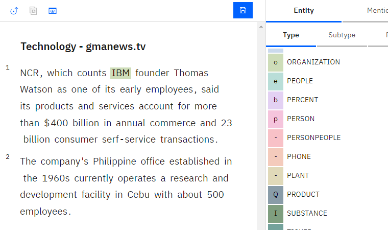
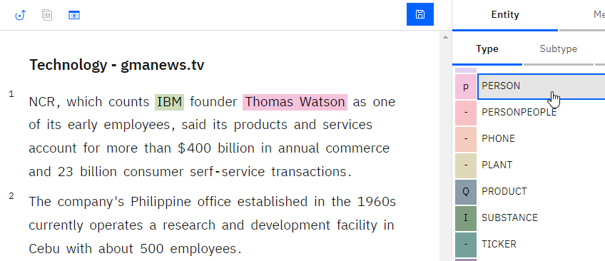
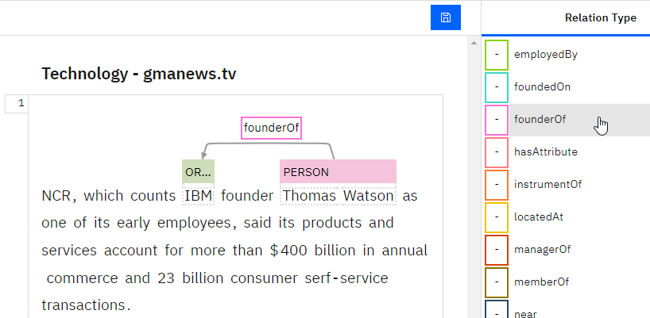

---

copyright:
  years: 2015, 2018
lastupdated: "2018-03-20"

---

{:shortdesc: .shortdesc}
{:new_window: target="_blank"}
{:tip: .tip}
{:pre: .pre}
{:codeblock: .codeblock}
{:screen: .screen}
{:javascript: .ph data-hd-programlang='javascript'}
{:java: .ph data-hd-programlang='java'}
{:python: .ph data-hd-programlang='python'}
{:swift: .ph data-hd-programlang='swift'}

This documentation is for {{site.data.keyword.knowledgestudiofull}} on {{site.data.keyword.cloud}}. To see the documentation for the previous version of {{site.data.keyword.knowledgestudioshort}} on {{site.data.keyword.IBM_notm}} Marketplace, [click this link ](https://console.bluemix.net/docs/services/knowledge-studio/tutorials-create-ml-model.html){: new_window}.
{: tip}

# Creating a machine learning model
{: #wks_tutml_intro}

This tutorial helps you understand the process for building a machine learning model that you can deploy and use with other {{site.data.keyword.watson}} services.
{: shortdesc}

## Learning objectives

After you complete the lessons in this tutorial, you will know how to perform the following tasks:

- Create document sets
- Pre-annotate documents
- Create tasks for human annotators
- Analyze inter-annotator agreement and adjudicate conflicts in annotated documents
- Create machine learning annotators

This tutorial should take approximately 60 minutes to finish. If you explore other concepts related to this tutorial, it could take longer to complete.

## Before you begin

- You're using a supported browser. For information, see [Browser requirements](/docs/services/watson-knowledge-studio/system-requirements.html).
- You successfully completed [Tutorial: Creating a workspace](/docs/services/watson-knowledge-studio/tutorials-create-project.html).
- You must have at least one user ID in either the Admin or ProjectManager role.

    > **Note:** If possible, use multiple user IDs for the machine learning model tasks in this tutorial (one Admin or ProjectManager user ID, and at least two HumanAnnotator user IDs). Using multiple user IDs provides the most realistic simulation of an actual {{site.data.keyword.IBM_notm}} {{site.data.keyword.watson}}™ {{site.data.keyword.knowledgestudioshort}} workspace, where a project manager must coordinate and adjudicate annotation performed by multiple human annotators. However, if you have access to only a single user ID, you can still simulate most parts of the process.

    For information about user roles, see [Assembling a team](/docs/services/watson-knowledge-studio/team.html).

## Results

After completing this tutorial, you will have a custom machine learning model that you can use with other {{site.data.keyword.watson}} services.

## Lesson 1: Adding documents for annotation
{: #tut_lessml1}

In this lesson, you will learn how to add documents to a workspace in {{site.data.keyword.knowledgestudioshort}} that can be annotated by human annotators.

### About this task

For more information about adding documents, see [Adding documents to a workspace](/docs/services/watson-knowledge-studio/documents-for-annotation.html#wks_projadd).

### Procedure

1. Download the <a target="_blank" href="https://watson-developer-cloud.github.io/doc-tutorial-downloads/knowledge-studio/documents-new.csv" download>`documents-new.csv`</a> file to your computer. This file contains example documents suitable for uploading.
1. Within your workspace, click **Documents** from the sidebar.
1. On the Documents page, click **Upload Document Sets**.
1. Select the `documents-new.csv` file from your computer and click **Upload**. The uploaded file is displayed in the table.

### What to do next

You can now divide the corpus into multiple document sets and assign the document sets to human annotators.

## Lesson 2: Creating annotation sets
{: #wks_tutless_ml2}

In this lesson, you will learn how to create annotation sets in {{site.data.keyword.watson}} {{site.data.keyword.knowledgestudioshort}}.

### About this task

An annotation set is a subset of documents from an uploaded document set that you assign to a human annotator. The human annotator annotates the documents in the annotation set. To later use inter-annotator scores to compare the annotations that are added by each human annotator, you must assign at least two human annotators to different annotation sets. You must also specify that some percentage of documents overlap between the sets.

> **Note:** In a real workspace, you would create as many annotation sets as needed, based on the number of human annotators working in the workspace. In this tutorial, you will create two annotation sets; if you do not have access to multiple user IDs, you can assign both annotation sets to the same user.

For more information about annotation sets, see [Creating and assigning annotation sets](/docs/services/watson-knowledge-studio/documents-for-annotation.html#wks_projdocsets).

### Procedure

1. Within your workspace, click **Documents** from the sidebar.
1. Click **Create Annotation Sets**.

    The Create Annotation Sets window opens. By default, this window shows the base set (containing all documents), as well as fields where you can specify the information for a new annotation set.

1. Click **Add another set and human annotator** to add fields for an additional annotation set. You can click to add as many annotation sets as you want to create; for this tutorial, you need only two.

    

1. In the **Overlap** field, specify `100`. This specifies that you want 100 percent of the documents in the base set to be included in all of the new annotation sets so they can be annotated by all human annotators.
1. For each new annotation set you are creating, specify the required information.

    - In the **Annotator** field, select a human annotator user ID to assign to the new annotation set. Each annotation set should be assigned to a different human annotator.

        > **Note:** If you have only a single administrator ID to use for the tutorial, assign that user to all annotation sets. In a real workspace, you would have multiple human annotators to assign, but for the tutorial, the administrator can act as human annotator.

    - In the **Set name** field, specify a descriptive name for the annotation set (such as `Set 1` or `DaveSet`).

1. Click **Generate**.

### Results

The new annotation sets are created and now appear in the **Annotation Sets** tab of the Documents page.

## Lesson 3: Pre-annotating with a dictionary-based annotator
{: #wks_tutless_ml3}

In this lesson, you will learn how to use a dictionary-based annotator to pre-annotate documents in {{site.data.keyword.knowledgestudioshort}}.

### About this task

Pre-annotating documents is an optional step. However, it is a worthwhile step because it makes the job of human annotators easier later.

For more information about pre-annotation with dictionary-based annotators, see [Pre-annotating documents with the Dictionary pre-annotator](/docs/services/watson-knowledge-studio/preannotation.html#wks_preannot).

### Procedure

1. Within your workspace, from the **Assets & Tools** > **Pre-annotators** sidebar, click **Manage Dictionaries**.

  The `Test dictionary` dictionary opens.

1. From the **Entity type** list, select **ORGANIZATION** to map the ORGANIZATION entity type to the `Test dictionary` dictionary you created in the [Adding a dictionary](/docs/services/watson-knowledge-studio/tutorials-create-project.html#wks_tutless4) lesson of the *Creating a workspace* tutorial.
1. Click the back arrow in the upper left to return to the Pre-annotators page, and click **Apply This Pre-annotator**
1. On the Run Annotator page, click the check boxes to select both of the annotation sets that you created earlier in the tutorial (not including the base set).
1. Click **Run**.

    

### Results

The documents in the selected sets are pre-annotated using the dictionary annotator you created. Later, you can use the same annotator to pre-annotate additional document sets by clicking **Apply This Pre-annotator**.

## Lesson 4: Creating an annotation task
{: #wks_tutless_ml4}

In this lesson, you will learn how to use annotation tasks to track the work of human annotators in {{site.data.keyword.knowledgestudioshort}}.

### About this task

For more information about annotation tasks, see [Creating an annotation task](/docs/services/watson-knowledge-studio/annotate-documents.html#wks_hatask).

### Procedure

1. Within your workspace, from the **Assets & Tools** > **Documents** sidebar, select the **Tasks** tab.
1. On the Tasks page, click **Add Task**.
1. Specify the details for the task:

    - In the **Task name** field, enter `Test`.
    - In the **Deadline** field, select a date in the future.

1. Click **Create**.
1. In the Add Annotation Sets to the Task window, click the check boxes to select both of the annotation sets that you created in [Lesson 3: Pre-annotating with a dictionary-based annotator](/docs/services/watson-knowledge-studio/tutorials-create-ml-model.html#wks_tutless_ml3). This specifies that both annotation sets must be annotated by their assigned human annotators as part of this task.
1. Click **Create Task**.
1. To see the progress of human annotation work in the future, you can click the task to open it.

## Lesson 5: Annotating documents
{: #wks_tutless_ml5}

In this lesson, you will learn how to use the Ground Truth Editor to annotate documents in {{site.data.keyword.knowledgestudioshort}}.

### About this task

For more information about human annotation, see [Annotation with the Ground Truth Editor](/docs/services/watson-knowledge-studio/user-guide.html#wks_hagte).

### Procedure

1. Log in to {{site.data.keyword.knowledgestudioshort}} as a human annotator who is assigned to the annotation task you created in [Lesson 4: Creating an annotation task](/docs/services/watson-knowledge-studio/tutorials-create-ml-model.html#wks_tutless_ml4).

    > **Note:** If you have access only to a single administrator ID for this tutorial, you can use that ID to perform human annotation. However, remember that in a real workspace, human annotation is performed by multiple different users with the HumanAnnotator role.

1. Open the `My workspace` workspace.
1. From the sidebar, click **Document Annotation** > **Relations**.
1. Open the `Test` annotation task you created in [Lesson 4: Creating an annotation task](/docs/services/watson-knowledge-studio/tutorials-create-ml-model.html#wks_tutless_ml4).
1. Scroll to the *Technology - gmanews.tv* document and click to open it for annotation. Notice that the term `IBM` has already been annotated with the ORGANIZATION entity type; this annotation was added by the dictionary pre-annotator in [Lesson 2: Creating annotation sets](/docs/services/watson-knowledge-studio/tutorials-create-ml-model.html#wks_tutless_ml2). This pre-annotation is correct, so it does not need to be modified.

    

1. Annotate a mention:

    1. Click the **Mentions** icon to begin annotating mentions.
    1. In the document body, select the text `Thomas Watson`.
    1. In the list of entity types, click **PERSON**. The entity type PERSON is applied to the selected mention.

        

1. Click **Document Annotation** > **Relations** from the sidebar to begin annotating relations.
1. Select the `Thomas Watson` and `IBM` mentions (in that order). To select a mention, click the entity-type label above the text.
1. In the list of relation types, click **founderOf**. The two mentions are connected with a founderOf relationship.

    

1. From the status menu, select **Completed**, and then click the **Save** button.
1. Return to the list of documents and click **Submit All Documents** to submit the documents for approval.

    > **Note:** In a real-life situation, you would create many more annotations and complete all the documents in the set before submitting.

1. Log in to {{site.data.keyword.knowledgestudioshort}} as the human annotator who is assigned to other document set in the annotation task.
1. Repeat the same annotations in the *Technology - gmanews.tv* document, except this time, use the employedBy relation instead of the founderOf relation.

  Logging in as another user will help to illustrate inter-annotator agreement in the next lesson. Complete the annotations and click **Submit All Documents**.

## Lesson 6: Analyzing inter-annotator agreement
{: #wks_tutless_ml6}

In this lesson, you will learn how to compare the work of multiple human annotators in {{site.data.keyword.knowledgestudioshort}}.

### About this task

To determine whether different human annotators are annotating overlapping documents consistently, review the inter-annotator agreement (`IAA`) scores.

{{site.data.keyword.knowledgestudioshort}} calculates IAA scores by examining all overlapping documents in all document sets in the task, regardless of the status of the document sets. The IAA scores show how different human annotators annotated mentions, relations, and coreference chains. It is a good idea to check IAA scores periodically and verify that human annotators are consistent with each other.

In this tutorial, the human annotators submitted all the document sets for approval. If the inter-annotator agreement scores are acceptable, you can approve the document sets. If you reject a document set, it is returned to the human annotator for improvement.

### Procedure

1. Log in to {{site.data.keyword.knowledgestudioshort}} as the administrator, select **Assets & Tools** > **Documents**, and click the `Test` task.

  In the **Status** column, you can see that the document sets are submitted.

1. Click **Calculate Inter-Annotator Agreement**.
1. View IAA scores for mention, relations, and coreference chains by clicking the first menu. You can also view agreement by pairs of human annotators. For example, you can compare all of Dave's annotations with all of Phil's annotations. You can also view agreement by specific documents. For example, you can view Dave's annotations on a document compared to Phil's annotations on the same document. In general, aim for a score of .8 out of 1, where 1 means perfect agreement. Because you annotated only two entity types in this tutorial, most of the entity type scores are N/A (not applicable), which means no information is available to give a score.

    *Figure 1. Reviewing inter-annotator scores with users named Dave and Phil*

    

1. After you review the scores, you can decide whether you want to approve or reject document sets that are in `Submitted` status. After a document set is submitted, a check box is displayed next to its name. Take one of these actions:

    - If the scores are acceptable for a document set, select the check box and click **Accept**. Documents that do not overlap with other document sets are promoted to ground truth. Documents that do overlap must first be reviewed through adjudication so that conflicts can be resolved. For this tutorial, accept both document sets.
    - If the scores are not acceptable for a document set, select the check box and click **Reject**. The document set needs to be revisited by the human annotator to improve the annotations.

### Results

When you evaluated the inter-annotator agreement scores, you saw how different pairs of human annotators annotated the same document. If the inter-annotator agreement score was acceptable, you accepted the document set.

## Lesson 7: Adjudicating conflicts in annotated documents
{: #wks_tutless_ml7}

In this lesson, you will learn how to adjudicate conflicts in documents that overlap between document sets in {{site.data.keyword.knowledgestudioshort}}.

### About this task

When you approve a document set, only the documents that do not overlap with other document sets are promoted to ground truth. If a document is part of the overlap between multiple document sets, you must adjudicate any annotation conflicts before the document can be promoted to ground truth.

### Procedure

1. Log in to {{site.data.keyword.knowledgestudioshort}} as the administrator, select **Assets & Tools** > **Documents**, and click the `Test` task.
1. Verify that the two document sets are in an approved state.
1. Click **Check Overlapping Documents for Conflicts**.

    You can see the overlapping documents that were annotated by more than one human annotator.

1. To see whether any conflicts exist in how they annotated the documents, click **Check for Conflicts**.
1. In adjudication mode, you can see how many annotations are in conflict and remove or replace annotations before you promote the documents to ground truth.
1. For this tutorial, assume that you corrected all conflicts and accepted the changes. Click **Promote to Ground Truth**. Repeat these steps to resolve conflicts in the second document set.

    Alternatively, you can promote a document to ground truth by clicking **Accept** on the Documents page.

### Results

After you resolve the annotation conflicts and promote the documents to ground truth, you can use them to train the machine learning model.

## Lesson 8: Creating a machine learning model
{: #wks_tutless_ml8}

In this lesson, you will learn how to create a machine learning model in {{site.data.keyword.knowledgestudioshort}}.

### About this task

When you create a machine learning model, you select the document sets that you want to use to train it. You also specify the percentage of documents that are to be used as training data, test data, and blind data. Only documents that became ground truth through approval or adjudication can be used to train the machine learning model.

### Procedure

1. Log in to {{site.data.keyword.knowledgestudioshort}} as the administrator.
1. From the **Model Management** > **Performance** sidebar, click **Train and evaluate**.
1. Select the document sets that you want to use for creating a machine learning model. Click the check mark next to each document set name.
1. Select the two annotation sets to create your testing, training, and blind data. Then, click **Train &amp; Evaluate**.

    > **Note:** Training might take more than ten minutes, or even hours, depending on the number of human annotations and the total number of words across documents.

1. After the machine learning model is trained, you can export it or you can view detailed information about its performance by clicking the **Detailed Statistics** links that are located above each of the graphs.
1. To view the Training / Test / Blind Sets page, click the **Train and evaluate** button.
1. To see the documents that human annotators worked on, click **View Ground Truth**.
1. To see the annotations that the trained machine learning model created on that same set of documents, click **View Decoding Results**.
1. To view details about the precision, recall, and F1 scores for the machine learning model, select the Performance page.
1. Click the **Detailed Statistics** links above each of the graphs. On these Statistics pages, you can view the scores for mentions, relations, and coreference chains by using the radio buttons.

    You can analyze performance by viewing a summary of statistics for entity types, relation types, and coreference chains. You can also analyze statistics that are presented in a confusion matrix by selecting **Confusion Matrix** from the menu that defaults to **Summary**. The *confusion matrix* helps you compare the annotations that were added by the machine learning model to the annotations in the ground truth.

    > **Note:** In this tutorial, you annotated documents with only a single dictionary for organizations. Therefore, the scores you see are `0` or `N/A` for most entity types except `ORGANIZATION`. The numbers are low, but that is expected, because you did not do any human annotation or correction.

    *Figure 2. Options on the Statistics page for a machine learning model*

    

1. From the sidebar, select **Model Management** > **Versions**. On the Versions page, you can take a snapshot of the model and the resources that were used to create it (except for dictionaries and annotation tasks). For example, you might want to take a snapshot before you retrain the model. If the statistics are poorer the next time you train it, you can promote the older version and delete the version that returned poorer results.

### Results

You created a machine learning model, trained it, and evaluated how well it performed when annotating test data and blind data. By exploring the performance metrics, you can identify ways to improve the accuracy of the machine learning model.

## Tutorial summary
{: #wks_tutml_sum}

While learning about {{site.data.keyword.knowledgestudioshort}}, you created a machine learning model.

### Lessons learned

By completing this tutorial, you learned about the following concepts:

- Document sets
- Machine learning models
- Human annotation tasks
- Inter-annotator agreement and adjudication
