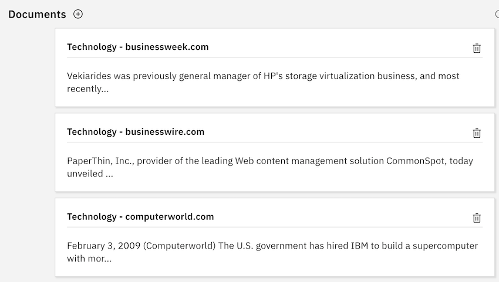
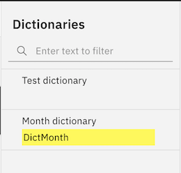
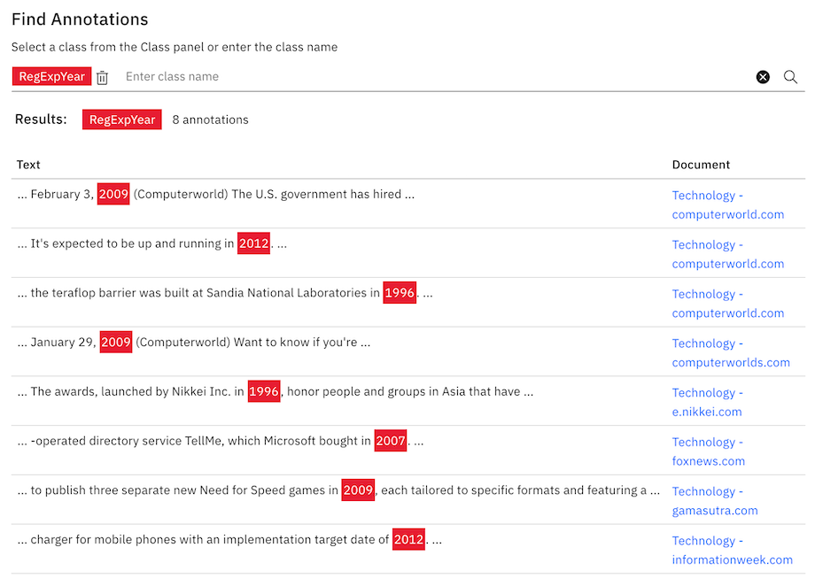
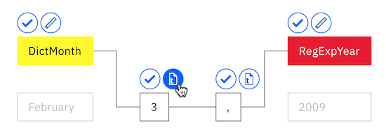

---

copyright:
  years: 2015, 2020
lastupdated: "2020-08-04"

subcollection: watson-knowledge-studio

---

{:shortdesc: .shortdesc}
{:external: target="_blank" .external}
{:deprecated: .deprecated}
{:important: .important}
{:note: .note}
{:tip: .tip}
{:preview: .preview}
{:beta: .beta}
{:pre: .pre}
{:codeblock: .codeblock}
{:screen: .screen}

# Creating a rule-based model (Experimental)
{: #wks_tutrule_intro}

This tutorial helps you understand how to create a rule-based model that you can use to find text patterns that you define in documents.
{: shortdesc}

Rule-based models are experimental and are not intended for use in production deployments. Support for the models might be discontinued with short notice.
{: note}

You will build a model that can find text in documents that matches the pattern `month day, year`. For example, the model would find the date reference *May 1, 2010*. Before you define the rule pattern itself, you will create artifacts that will help you build the pattern, including a dictionary class that recognizes month mentions and a regular expression class that recognizes year mentions in text.

## Learning objectives
{: #tcrm-obj}

After you complete this tutorial, you will know how to perform the following tasks:

- Create classes
- Add documents for defining rules
- Associate dictionaries with classes
- Define regular expressions to capture sequences of characters
- Define rules

This tutorial should take approximately 30 minutes to finish. If you explore other concepts related to this tutorial, it could take longer to complete.

## Before you begin
{: #tcrm-pr}

- You're using a supported browser. For more information, see [Browser requirements](/docs/watson-knowledge-studio?topic=watson-knowledge-studio-system-requirements).
- You successfully completed [Getting started with {{site.data.keyword.knowledgestudioshort}}](/docs/watson-knowledge-studio?topic=watson-knowledge-studio-wks_tutintro), which covers creating a workspace, creating a type system, and adding a dictionary.
- You must have at least one user ID in either the Admin or Project Manager role. For information about user roles, see [User roles in {{site.data.keyword.knowledgestudioshort}}](/docs/watson-knowledge-studio?topic=watson-knowledge-studio-roles).

## Results
{: #tcrm-results}

After you create the rule-based model, you can use it in one of the following ways to find text patterns in documents:

- [Pre-annotate your documents](/docs/watson-knowledge-studio?topic=watson-knowledge-studio-preannotation#wks_preannotrule) before you create a machine learning model.
- [Deploy or export the model](/docs/watson-knowledge-studio?topic=watson-knowledge-studio-wks_rule_publish) to other {{site.data.keyword.watson}} services or products.

## Lesson 1: Adding a dictionary of months
{: #wks_tutless_rule1}

In this lesson, you will learn how to add a dictionary to a workspace in {{site.data.keyword.knowledgestudioshort}}. The dictionary contains terms related to the months of the year.

### About this task
{: #wks_tutless_rule1_about}

In a later lesson, you will define a class based on this dictionary. When you create that class, all terms in this dictionary that are found in documents will be automatically annotated as a mention of the associated class type. For more information about dictionaries, see [Adding dictionaries to a workspace](/docs/watson-knowledge-studio?topic=watson-knowledge-studio-dictionaries#wks_projdictionaries).

### Procedure
{: #wks_tutless_rule1_procedure}

1. Download the <a target="_blank" href="https://watson-developer-cloud.github.io/doc-tutorial-downloads/knowledge-studio/dictionary-items-month.csv" download>`dictionary-items-month.csv` </a> file to your computer. This file contains dictionary terms in CSV format that are suitable for uploading into a {{site.data.keyword.knowledgestudioshort}} dictionary.
1. Click **Assets** > **Dictionaries**.
1. Click the **Create Dictionary** button to add a dictionary.
1. In the **Name** field, type `Month dictionary` and click **Save** to create the dictionary. The new dictionary is created and automatically opened for editing.
1. In the dictionary pane, click **Upload**.
1. Select the `dictionary-items-month.csv` file from your computer and click **Upload**.

    The terms from the file are imported into the dictionary.

## Lesson 2: Adding sample documents
{: #wks_tutless_rule2}

In this lesson, you will learn how to add documents with linguistic patterns that illustrate the types of rules you want to define.

### About this task
{: #wks_tutless_rule2_about}

For more information about adding documents, see [Adding documents for defining rules](/docs/watson-knowledge-studio?topic=watson-knowledge-studio-wks_rule_anno_add).

### Procedure
{: #wks_tutless_rule2_procedure}

1. Download the <a target="_blank" href="https://watson-developer-cloud.github.io/doc-tutorial-downloads/knowledge-studio/documents-new.csv" download>`documents-new.csv`</a> file to your computer. This file contains example documents suitable for uploading.
1. Click **Rule-based Model** > **Rules**.
1. Click the **Add a document** icon, which is next to the **Documents** page heading.
1. Click the **Upload CSV file** tab.
1. Click to browse for the `documents-new.csv` file that you downloaded to your computer earlier, and then click **Upload**.

    A set of documents is displayed in the main Documents page.

    

## Lesson 3: Creating classes
{: #wks_tutless_rule3}

In this lesson, you will learn how to define classes that you will use when you define a rule.

### About this task
{: #wks_tutless_rule3_about}

For more information about classes, see [Rules](/docs/watson-knowledge-studio?topic=watson-knowledge-studio-rule-annotator).

### Procedure
{: #wks_tutless_rule3_procedure}

1. From the **Rules** page of your workspace, click the **Add a class** icon next to the **Class** heading in the right side panel.
1. Enter `DictMonth` as the class name, and then click **Add**.

    The new class is displayed in the Class side panel.

## Lesson 4: Associating a dictionary with a class
{: #wks_tutless_rule4}

In this lesson, you will learn how to use a dictionary in the rule editor.

### Procedure
{: #wks_tutless_rule4_procedure}

1. Click **Rule-based Model** > **Rules**, and then click the **Dictionaries** tab.
1. Select **Month dictionary** that you created previously.
1. From the **Class** list, select `DictMonth` and then click **Save**.

    The class is associated with the dictionary.

    

### Results
{: #wks_tutless_rule4_results}

For documents that are associated with the rule editor, any references to terms in the dictionary are annotated as `DictMonth` class mentions. You will see proof that these references have been annotated in the next lesson.

## Lesson 5: Finding class annotations in documents
{: #wks_tutless_rule5}

In this lesson, you will learn how to find class annotations in rule editor documents.

### Procedure
{: #wks_tutless_rule5_procedure}

1. Select **Rule-based Model** > **Rules**.
1. From the Class panel, find the `DictMonth` class that you defined earlier, and click the **Search annotations in documents** icon that's next to it.

    The Find Annotations page is displayed and shows all the documents that contain text references to months.

1. Click the `Technology - computerworld.com` document to view the full document. Notice that the text `February` is highlighted, which means it was annotated as a mention of the `DictMonth` class.

## Lesson 6: Defining a regular expression
{: #wks_tutless_rule6}

In this lesson, you will learn how to define a regular expression.

### About this task
{: #wks_tutless_rule6_about}

You will define a regular expression that can find year patterns like `2009`.

For more information about defining regular expressions, see [Defining a rule](/docs/watson-knowledge-studio?topic=watson-knowledge-studio-wks_rule_creation).

### Procedure
{: #wks_tutless_rule6_procedure}

1. From the **Rules** page, click the **Add a class** icon  next to **Class** from the right side panel.
1. Enter `RegExpYear` as the class name, and click **Add**.
1. Click the **Regex** tab, and then click the **Create a regular expression** icon next to the **Regular Expressions** heading.
1. Click **Add Entry**.
1. In the **Regular Expression** field, enter the following expression, which finds years between `1900` and `2099`:

    ```
    (?:(?:19|20)[0-9]{2})
    ```
    {: screen}

1. Set **Minimum Word Tokens** to `1` and **Maximum Word Tokens** to `1`.
1. Click **Add** to save the regular expression entry.
1. Enter `MyYearExp` as the regular expression name, and then, from the **Class** menu, select the `RegExpYear` class that you defined earlier.
1. Click **Save**.

    After you save the regular expression, it is automatically applied to the sample documents. Any text strings that follow the pattern that you defined in the regular expression are annotated as mentions of the `RegExpYear` class.

1. To check whether the expression you defined is capturing time occurrences correctly, you can search for mentions. Click the **Search annotations in documents** icon next to the `RegExpYear` class in the Class panel.

    

    The Find Annotations page is displayed. Occurrences of year mentions are highlighted in the sample documents in which they occur.

    

## Lesson 7: Defining a rule
{: #unique_1166829415}

In this lesson, you will learn how to define a rule.

### About this task
{: #unique_1166829415_about}

You already defined a dictionary-based class for annotating month mentions. You also defined a regular expression that finds numeric values which represent a year. Now, you will define a rule that captures the sequence of a month followed by a number, a comma, and then a year. You will define a rule for date expressions like *September 21, 2016*.

For more information about defining rules, see [Defining a rule](/docs/watson-knowledge-studio?topic=watson-knowledge-studio-wks_rule_creation).

### Procedure
{: #unique_1166829415_procedure}

1. Select **Rule-based Model** > **Rules**, and open the `Technology - computerworld.com` document.
1. Select the text `February 3, 2009` in the document. Make sure you select the comma, too.

    

1. Click the **Add a rule** icon.

    The rule editor shows a depiction of the rule pattern that you identified.

    The text `February 3, 2009` is visible. A solid line that connects the cells in the depiction identifies which cells are currently part of the pattern.
    - The `DictMonth` class is part of the rule pattern instead of the text `February`. This selection is preferred because you want the model to find any month that is annotated by the `DictMonth` class as the first token in the date pattern instead of the text `February` only.
    - At the end of the rule, the year `2009` is already annotated as being a mention of the `RegExpYear` class. The `RegExpYear` class is part of the rule pattern instead of the number 2009. This selection is also preferred because you want the model to find any year that is annotated by the `RegExpYear` class as the last token in the date pattern instead of the specific text `2009` only.

    The number 3 and the comma (,) after it are shown as the second and third tokens in the pattern. As the pattern is currently specified, the model will find only occurrences of dates that specify the 3rd day of a month. We want the model to find dates that specify any day of the month, so next we will change the feature settings for the day token.

1. Above the day `3` cell, click the **Text** icon to open the feature settings for the token.

    

    Currently, the rule is set to match the exact text, `3`. Instead, we want it to match any number.

1. Change the feature setting to be numeric by selecting **Character Type : Numeric**, and then clearing the selection, **Text : 3**.

    

    You changed the definition for the number `3` cell.

    

    The **Character Type** icon indicates that instead of requiring the number to be equal to 3 exactly, it can be any number.

1. Do not change any settings for the comma token.

    We want the third token in the pattern to be a comma, so the current feature setting of **text : ,** is appropriate. In addition to a feature setting, each token has a repeat setting. The repeat setting specifies how many times the token can be repeated in the text for it to match the pattern. The current repeat setting of **Required (Exactly 1)** is appropriate.

    

1. Assign a class to represent the pattern `DictMonth + numeric token + comma + RegExpYear`.

    Notice the four empty cells that represent the four tokens that you selected from the document. To select all the cells, select the first cell, and then press Shift + click each additional cell. Enter `RuleDate` as the class name, and then click it to create the new class.

    

1. In the **Rule name** field, enter `MyDateRule` and click **Save**.

    After you save the rule, it is automatically applied to the sample documents. If the `Technology - computerworld.com` document is still open in the rule editor, you will see that the `February 3, 2009` text in the document is now annotated as a mention of the RuleDate class.

    

    You can search for all occurrences of `RuleDate` class mentions in the sample documents by clicking the **Search annotation in documents** icon  next to the `RuleDate` class from the Class panel. It is a good practice to check that all dates are captured properly to confirm that you defined the pattern correctly.

    

## Lesson 8: Creating a rule-based model
{: #wks_tutless_rule8}

In this lesson, you will learn how to create a rule-based model.

### About this task
{: #wks_tutless_rule8_about}

For more information about creating a rule-based model, see [Creating the rule-based model](/docs/watson-knowledge-studio?topic=watson-knowledge-studio-wks_rule_train).

### Procedure
{: #wks_tutless_rule8_procedure}

1. Select **Rule-based Model** > **Versions** and click the **Rule-based model type mapping** tab.

1. Map the `RuleDate` class to the `DATE` entity from the type system.

    1. Find the `DATE` entity, and click **Edit**.

        

    1. Choose the `RuleDate` class from the list and click **Save**.

        

1. To pre-annotate document sets or annotation sets with the rule-based model:
   - On the **Machine Learning Model** > **Pre-annotation** page, click **Run Pre-annotators**.
   - Select **Rule-based Model**, then click **Next**.
   - Select the document set that you added to the corpus, `documents-ml.csv`, and click **Run**.

   **Attention**: Run the rule-based model as a pre-annotator only on documents that were not already annotated by humans.

## Tutorial summary
{: #wks_tutrule_sum}

While learning about {{site.data.keyword.knowledgestudioshort}}, you created a rule-based model.

### Lessons learned
{: #tcrm-ll}

By completing this tutorial, you learned about the following concepts:

- Classes
- Regular expressions
- Rules
